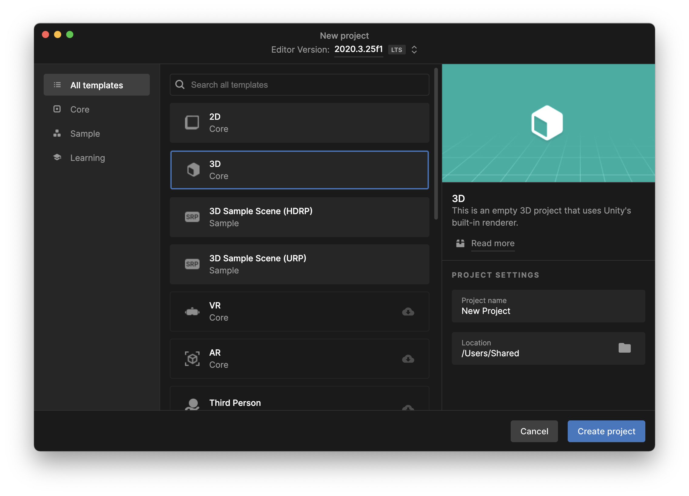

# Getting Started

## Pre-requisites

This SDK assumes that you have a basic understanding of Unity, ERC721 and EVM practices.

### Supported OS

This documentation currently supports WebGL, IOS and Android builds. Other platforms may work but there is no guarantee. We will extend our support to other platforms after we have stabilized our current architecture.

### Other Requirements

* **Mobile IDE**: If you want to test your Mobile Builds we recommend you to download a Mobile Development IDE with Device Simulation Capabilities such as Xcode.
* **DefiConnect**: [DefiConnect](https://chrome.google.com/webstore/detail/cryptocom-wallet-extensio/hifafgmccdpekplomjjkcfgodnhcellj) is required for the Login Example.
* **Assets**: Some of the scenes require assets to work properly. If you do not have any assets you can always use the Cronos Testnet and generate some ERC721 test assets. You can read more around integration methods [here](https://cronos.crypto.org/docs/resources/chain-integration.html#useful-links]).

### Download and install Unity

You can refer to the [Unity Download Section](https://unity.com/download)

### Unity Build Modules

Depending on your preferred build settings we recommend to install platform packages for `WebGL`, `IOS` and `Android` from your Unity build settings.

### Chain Overview

You can use the following RPC methods. By default, we use the mainnet rpc method.



* RPC Method: `https://evm-dev.cronos.org`
* Chain ID: **25**



* RPC Method: `https://evm-dev-t3.cronos.org`
* Chain ID: **338**




## Import ChainSafe Package

### Github

You can clone the following repository.

```bash
$ git clone git@github.com:ChainSafe/web3.unity.git
```

### Releases

Or you can download the latest [releases](https://github.com/ChainSafe/web3.unity/releases)

### Create a new Unity Project

Create a new project directly from your Unity Hub. In the next step Choose 3D as your project type. 

### Upload web3.unity Folders into Project

Now you have to import the content of the cloned repository (web3.unity) directly into your newly created project assets folder.

## Connect to Cronos Assets

To connect your Cronos Assets to your Unity project, you can add the following scripts to your assets. For your scripts to work, you will need the create as well a prefab and link it to the asset as seen in the following image.


### Get CRO Balance

* Script Path: `Assets/Web3Unity/Scripts/Prefabs/EVM/EVMBalanceOfCronos.cs`
* Prefab Path: `Assets/Web3Unity/Prefabs/EVM/EVMBalanceOfCronos.prefab`

```csharp
using System.Collections;
using System.Collections.Generic;
using UnityEngine;

public class EVMBalanceOfCronos : MonoBehaviour
{
    async void Start()
    {
        string chain = "cronos";
        string network = "mainnet"; 
        string account = "ACCOUNT_ADDRESS";
        string rpc = "https://evm-dev.cronos.org";
        
        string balance = await EVM.BalanceOf(chain, network, account, rpc);
        print(balance);
    }
}
```

Drag the prefab into the sample scene and play in order to run the script. The balance should be printed below in the Unity output.

### Get NFT Balance

* Script Path: `Assets/Web3Unity/Scripts/Prefabs/ERC721/ERC721BalanceOfCronos.cs`
* Prefab Path: `Assets/Web3Unity/Prefabs/ERC721/ERC721BalanceOfCronos.prefab`

```csharp
using System.Collections;
using System.Numerics;
using System.Collections.Generic;
using UnityEngine;

public class ERC721BalanceOfCronos : MonoBehaviour
{
    async void Start()
    {
        string chain = "cronos";
        string network = "mainnet";
        string contract = "CONTRACT_ADDRESS";
        string account = "ACCOUNT_ADDRESS";
        string rpc = "https://evm-dev.cronos.org";

        int balance = await ERC721.BalanceOf(chain, network, contract, account, rpc);
        print(balance);
    }
}
```

Drag the prefab into the sample scene and play in order to run the script. The balance should be printed below in the Unity output.

### Get NFT Owner

* Script Path: `Assets/Web3Unity/Scripts/Prefabs/ERC721/ERC721OwnerOfCronos.cs`
* Prefab Path: `Assets/Web3Unity/Prefabs/ERC721/ERC721OwnerOfCronos.prefab`

```csharp
using System.Collections;
using System.Collections.Generic;
using UnityEngine;

public class ERC721OwnerOfCronos : MonoBehaviour
{
    async void Start()
    {
        string chain = "cronos";
        string network = "mainnet"; 
        string contract = "CONTRACT_ADDRESS";
        string tokenId = "TOKEN_ID";
        string rpc = "https://evm-dev.cronos.org";

        string ownerOf = await ERC721.OwnerOf(chain, network, contract, tokenId, rpc);
        print(ownerOf);
    }
}
```

Drag the prefab into the sample scene and play in order to run the script. The owner address of the asset should be printed below in the Unity output.

### Import NFT Metadata

You can test this script by creating a random 3D Quad object in the SampleScene and add the following script to it.

* Script Path: `Assets/Web3Unity/Scripts/Prefabs/ERC721/ImportNFTTextureCronos.cs`
* Prefab Path: `Assets/Web3Unity/Prefabs/ERC721/ImportNFTTextureCronos.prefab`

```csharp
using System.Collections;
using System.Collections.Generic;
using System.Threading.Tasks;
using UnityEngine;
using UnityEngine.Networking;

public class ImportNFTTextureCronos : MonoBehaviour
{
    public class Response {
        public string image;
    }

    async void Start()
    {
        string chain = "cronos";
        string network = "mainnet"; 
        string contract = "CONTRACT_ADDRESS";
        string tokenId = "TOKEN_ID";
        string rpc = "https://evm-dev.cronos.org";

        // fetch uri from chain
        string uri = await ERC721.URI(chain, network, contract, tokenId, rpc);
        print("uri: " + uri);

        // fetch json from uri
        UnityWebRequest webRequest = UnityWebRequest.Get(uri);
        await webRequest.SendWebRequest();
        Response data = JsonUtility.FromJson<Response>(System.Text.Encoding.UTF8.GetString(webRequest.downloadHandler.data));

        // parse json to get image uri
        string imageUri = data.image;
        print("imageUri: " + imageUri);

        // fetch image and display in game
        UnityWebRequest textureRequest = UnityWebRequestTexture.GetTexture(imageUri);
        await textureRequest.SendWebRequest();
        this.gameObject.GetComponent<Renderer>().material.mainTexture = ((DownloadHandlerTexture)textureRequest.downloadHandler).texture;
    }
}
```

Drag the prefab into the sample scene and play in order to run the script. The Quad should take the form of the image fetched form the NFT metadata.
