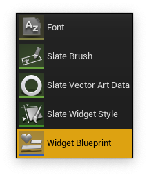
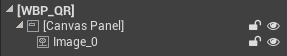
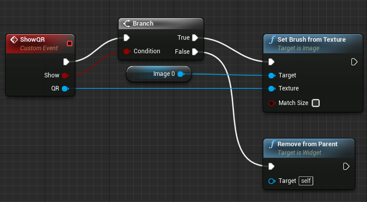

# Connect Wallets with QR Code

You can connect all WalletConnect-compatible wallets, including but not limited to Defi Wallet, Metamask, TrustWallet etc. with QR Code, with one function `ConnectWalletConnect`.

To connect with URI, please check


[connect-defi-wallet-with-uri.md](connect-defi-wallet-with-uri.md)


### Connect wallet via ConnectWalletConnect

Set the Connection Type of `ConnectWalletConnect` to: **Generate uri as a QR code 2D Texture**

### Create WBP\_QR Widget

To display QR Code in Unreal Engine, we provide a 2D Texture for users to embedding it into a Widget or HUD. In the following example, let's create a `WBP_QR` Wdiget for displaying the QR Code.

*   Select **Maps**, right click **Content Browser** > **User Interface** > **Widget Blueprint**

    <div>

    <figure><figcaption></figcaption></figure>

     

    <figure><figcaption></figcaption></figure>

    </div>
*   Rename the file as WBP\_QR.

    <figure><figcaption></figcaption></figure>
*   Double click WBP\_QR and open the Designer editor, drag **Panel** > **Canvas Panel** to viewport to create a Canvas Panel, then drag **Common** > **Image** to the canvas (named it as `Image_0`), update on **Details** tab as: **512** (Size X) x **512** (Size Y)

    <div>

    <figure><figcaption></figcaption></figure>

     

    <figure><figcaption></figcaption></figure>

    </div>
*   Click **Graph** and switch to Event Graph

    <figure><figcaption></figcaption></figure>
* Right click the graph, search and select **Add Custom Event...**, name it as **ShowQR** with two inputs
  * `Show`: Boolean (To control the QR code show or not)
  * `QR`: Texture 2D (The input QR code data)
*   We could control it to show or destroy `Image 0` like below

    <figure><figcaption></figcaption></figure>
* Back to level blueprint editor, instead of printing the URI
* **Compile** > **Save**

### Show QR Code On QRReady



Show the QR Code by **Creating WBP QR Widget**, then call **Show QR** function (`Show` should be True, `QR` should be the `Texture` of `OnQRReady_Event_0`), finally **Add to Viewport** like below:


#### Blueprint

<figure><figcaption></figcaption></figure>

#### Source Code

```
Begin Object Class=/Script/BlueprintGraph.K2Node_VariableGet Name="K2Node_VariableGet_3"
   VariableReference=(MemberName="PlayCppSdk",MemberGuid=0EE6007BA849B8FA08AE1897C9607494,bSelfContext=True)
   NodePosX=-208
   NodePosY=464
   NodeGuid=2E13C0B770472BC4B9D069BCE4D2C289
   CustomProperties Pin (PinId=B580BDDB1F449CBAB8ADFFBA953CA6C0,PinName="PlayCppSdk",Direction="EGPD_Output",PinType.PinCategory="object",PinType.PinSubCategory="",PinType.PinSubCategoryObject=Class'"/Script/CronosPlayUnreal.PlayCppSdkActor"',PinType.PinSubCategoryMemberReference=(),PinType.PinValueType=(),PinType.ContainerType=None,PinType.bIsReference=False,PinType.bIsConst=False,PinType.bIsWeakPointer=False,PinType.bIsUObjectWrapper=False,LinkedTo=(K2Node_VariableSet_1 7AE5FE0B7948E1B6C0D624BD020F426B,),PersistentGuid=00000000000000000000000000000000,bHidden=False,bNotConnectable=False,bDefaultValueIsReadOnly=False,bDefaultValueIsIgnored=False,bAdvancedView=False,bOrphanedPin=False,)
   CustomProperties Pin (PinId=34782A4F7846E811DA2BC88D4C04345D,PinName="self",PinFriendlyName=NSLOCTEXT("K2Node", "Target", "Target"),PinType.PinCategory="object",PinType.PinSubCategory="",PinType.PinSubCategoryObject=BlueprintGeneratedClass'"/Game/Tutorials/WalletConnect/ConnectWalletConnect.ConnectWalletConnect_C"',PinType.PinSubCategoryMemberReference=(),PinType.PinValueType=(),PinType.ContainerType=None,PinType.bIsReference=False,PinType.bIsConst=False,PinType.bIsWeakPointer=False,PinType.bIsUObjectWrapper=False,PersistentGuid=00000000000000000000000000000000,bHidden=True,bNotConnectable=False,bDefaultValueIsReadOnly=False,bDefaultValueIsIgnored=False,bAdvancedView=False,bOrphanedPin=False,)
End Object
Begin Object Class=/Script/UMGEditor.K2Node_CreateWidget Name="K2Node_CreateWidget_0"
   NodePosX=96
   NodePosY=576
   ErrorType=3
   NodeGuid=C5A0BA58DD4B1636FC30BEAFB72B3E74
   CustomProperties Pin (PinId=6DFBF30A5848BAE0426D8281832CF5AC,PinName="execute",PinType.PinCategory="exec",PinType.PinSubCategory="",PinType.PinSubCategoryObject=None,PinType.PinSubCategoryMemberReference=(),PinType.PinValueType=(),PinType.ContainerType=None,PinType.bIsReference=False,PinType.bIsConst=False,PinType.bIsWeakPointer=False,PinType.bIsUObjectWrapper=False,LinkedTo=(K2Node_CustomEvent_2 6529F680AC48C4DFC90E398E43961D0B,),PersistentGuid=00000000000000000000000000000000,bHidden=False,bNotConnectable=False,bDefaultValueIsReadOnly=False,bDefaultValueIsIgnored=False,bAdvancedView=False,bOrphanedPin=False,)
   CustomProperties Pin (PinId=8FC6218A804A6953F0E33EB22365ED66,PinName="then",Direction="EGPD_Output",PinType.PinCategory="exec",PinType.PinSubCategory="",PinType.PinSubCategoryObject=None,PinType.PinSubCategoryMemberReference=(),PinType.PinValueType=(),PinType.ContainerType=None,PinType.bIsReference=False,PinType.bIsConst=False,PinType.bIsWeakPointer=False,PinType.bIsUObjectWrapper=False,LinkedTo=(K2Node_CallFunction_12 0E040AEF2845CB4208991FA85CEF2F98,),PersistentGuid=00000000000000000000000000000000,bHidden=False,bNotConnectable=False,bDefaultValueIsReadOnly=False,bDefaultValueIsIgnored=False,bAdvancedView=False,bOrphanedPin=False,)
   CustomProperties Pin (PinId=5A3E1A824F4B98BDE9FAD48B485E72BB,PinName="Class",PinToolTip="User Widget Class Reference Class\nThe object class you want to construct",PinType.PinCategory="class",PinType.PinSubCategory="",PinType.PinSubCategoryObject=Class'"/Script/UMG.UserWidget"',PinType.PinSubCategoryMemberReference=(),PinType.PinValueType=(),PinType.ContainerType=None,PinType.bIsReference=False,PinType.bIsConst=False,PinType.bIsWeakPointer=False,PinType.bIsUObjectWrapper=False,DefaultObject="/Game/Tutorials/WalletConnect/WBP_QR.WBP_QR_C",PersistentGuid=00000000000000000000000000000000,bHidden=False,bNotConnectable=False,bDefaultValueIsReadOnly=False,bDefaultValueIsIgnored=False,bAdvancedView=False,bOrphanedPin=False,)
   CustomProperties Pin (PinId=16354DE13443ADA0BE46D091D4E530FA,PinName="ReturnValue",PinToolTip="WBP QR Object Reference Return Value\nThe constructed object",Direction="EGPD_Output",PinType.PinCategory="object",PinType.PinSubCategory="",PinType.PinSubCategoryObject=WidgetBlueprintGeneratedClass'"/Game/Tutorials/WalletConnect/WBP_QR.WBP_QR_C"',PinType.PinSubCategoryMemberReference=(),PinType.PinValueType=(),PinType.ContainerType=None,PinType.bIsReference=False,PinType.bIsConst=False,PinType.bIsWeakPointer=False,PinType.bIsUObjectWrapper=False,LinkedTo=(K2Node_CallFunction_11 8A8BBD81634F12ABC1C12585FB055013,K2Node_CallFunction_12 5A6D8E7605496975EFE13C97B483BAC6,K2Node_CallFunction_7 1CA8D8B1AC46229058D0CABD61E6C323,),PersistentGuid=00000000000000000000000000000000,bHidden=False,bNotConnectable=False,bDefaultValueIsReadOnly=False,bDefaultValueIsIgnored=False,bAdvancedView=False,bOrphanedPin=False,)
   CustomProperties Pin (PinId=D9C51F6996483AF0FDCA51BF39443184,PinName="OwningPlayer",PinToolTip="Player Controller Object Reference Owning Player\nThe player that \'owns\' the widget.",PinType.PinCategory="object",PinType.PinSubCategory="",PinType.PinSubCategoryObject=Class'"/Script/Engine.PlayerController"',PinType.PinSubCategoryMemberReference=(),PinType.PinValueType=(),PinType.ContainerType=None,PinType.bIsReference=False,PinType.bIsConst=False,PinType.bIsWeakPointer=False,PinType.bIsUObjectWrapper=False,PersistentGuid=00000000000000000000000000000000,bHidden=False,bNotConnectable=False,bDefaultValueIsReadOnly=False,bDefaultValueIsIgnored=False,bAdvancedView=False,bOrphanedPin=False,)
End Object
Begin Object Class=/Script/BlueprintGraph.K2Node_CallFunction Name="K2Node_CallFunction_11"
   FunctionReference=(MemberParent=Class'"/Script/UMG.UserWidget"',MemberName="AddToViewport")
   NodePosX=464
   NodePosY=528
   AdvancedPinDisplay=Hidden
   NodeGuid=1962439E3141EDD40ECF31B413CCF3DB
   CustomProperties Pin (PinId=BFD5331CEB4895B6702A8EB170DB3FB9,PinName="execute",PinToolTip="\nExec",PinType.PinCategory="exec",PinType.PinSubCategory="",PinType.PinSubCategoryObject=None,PinType.PinSubCategoryMemberReference=(),PinType.PinValueType=(),PinType.ContainerType=None,PinType.bIsReference=False,PinType.bIsConst=False,PinType.bIsWeakPointer=False,PinType.bIsUObjectWrapper=False,LinkedTo=(K2Node_CallFunction_12 DBE51D059242406539F905B7757F69C4,),PersistentGuid=00000000000000000000000000000000,bHidden=False,bNotConnectable=False,bDefaultValueIsReadOnly=False,bDefaultValueIsIgnored=False,bAdvancedView=False,bOrphanedPin=False,)
   CustomProperties Pin (PinId=1A681D25B04A605C771F19A10543997B,PinName="then",PinToolTip="\nExec",Direction="EGPD_Output",PinType.PinCategory="exec",PinType.PinSubCategory="",PinType.PinSubCategoryObject=None,PinType.PinSubCategoryMemberReference=(),PinType.PinValueType=(),PinType.ContainerType=None,PinType.bIsReference=False,PinType.bIsConst=False,PinType.bIsWeakPointer=False,PinType.bIsUObjectWrapper=False,LinkedTo=(K2Node_VariableSet_3 07021D9948401776A7B44CB34A7251B6,),PersistentGuid=00000000000000000000000000000000,bHidden=False,bNotConnectable=False,bDefaultValueIsReadOnly=False,bDefaultValueIsIgnored=False,bAdvancedView=False,bOrphanedPin=False,)
   CustomProperties Pin (PinId=8A8BBD81634F12ABC1C12585FB055013,PinName="self",PinFriendlyName=NSLOCTEXT("K2Node", "Target", "Target"),PinToolTip="Target\nUser Widget Object Reference",PinType.PinCategory="object",PinType.PinSubCategory="",PinType.PinSubCategoryObject=Class'"/Script/UMG.UserWidget"',PinType.PinSubCategoryMemberReference=(),PinType.PinValueType=(),PinType.ContainerType=None,PinType.bIsReference=False,PinType.bIsConst=False,PinType.bIsWeakPointer=False,PinType.bIsUObjectWrapper=False,LinkedTo=(K2Node_CreateWidget_0 16354DE13443ADA0BE46D091D4E530FA,),PersistentGuid=00000000000000000000000000000000,bHidden=False,bNotConnectable=False,bDefaultValueIsReadOnly=False,bDefaultValueIsIgnored=False,bAdvancedView=False,bOrphanedPin=False,)
   CustomProperties Pin (PinId=411282B5D040FA2E05DEF3972BFC4485,PinName="ZOrder",PinToolTip="ZOrder\nInteger\n\nThe higher the number, the more on top this widget will be.",PinType.PinCategory="int",PinType.PinSubCategory="",PinType.PinSubCategoryObject=None,PinType.PinSubCategoryMemberReference=(),PinType.PinValueType=(),PinType.ContainerType=None,PinType.bIsReference=False,PinType.bIsConst=False,PinType.bIsWeakPointer=False,PinType.bIsUObjectWrapper=False,DefaultValue="0",AutogeneratedDefaultValue="0",PersistentGuid=00000000000000000000000000000000,bHidden=False,bNotConnectable=False,bDefaultValueIsReadOnly=False,bDefaultValueIsIgnored=False,bAdvancedView=True,bOrphanedPin=False,)
End Object
Begin Object Class=/Script/BlueprintGraph.K2Node_CallFunction Name="K2Node_CallFunction_12"
   FunctionReference=(MemberParent=WidgetBlueprintGeneratedClass'"/Game/Tutorials/WalletConnect/WBP_QR.WBP_QR_C"',MemberName="ShowQR",MemberGuid=C3A616151345E4B34CB6919166C919A6)
   NodePosX=336
   NodePosY=816
   NodeGuid=9CF09A27C14A628BFF163D9610A8BA27
   CustomProperties Pin (PinId=0E040AEF2845CB4208991FA85CEF2F98,PinName="execute",PinToolTip="\nExec",PinType.PinCategory="exec",PinType.PinSubCategory="",PinType.PinSubCategoryObject=None,PinType.PinSubCategoryMemberReference=(),PinType.PinValueType=(),PinType.ContainerType=None,PinType.bIsReference=False,PinType.bIsConst=False,PinType.bIsWeakPointer=False,PinType.bIsUObjectWrapper=False,LinkedTo=(K2Node_CreateWidget_0 8FC6218A804A6953F0E33EB22365ED66,),PersistentGuid=00000000000000000000000000000000,bHidden=False,bNotConnectable=False,bDefaultValueIsReadOnly=False,bDefaultValueIsIgnored=False,bAdvancedView=False,bOrphanedPin=False,)
   CustomProperties Pin (PinId=DBE51D059242406539F905B7757F69C4,PinName="then",PinToolTip="\nExec",Direction="EGPD_Output",PinType.PinCategory="exec",PinType.PinSubCategory="",PinType.PinSubCategoryObject=None,PinType.PinSubCategoryMemberReference=(),PinType.PinValueType=(),PinType.ContainerType=None,PinType.bIsReference=False,PinType.bIsConst=False,PinType.bIsWeakPointer=False,PinType.bIsUObjectWrapper=False,LinkedTo=(K2Node_CallFunction_11 BFD5331CEB4895B6702A8EB170DB3FB9,),PersistentGuid=00000000000000000000000000000000,bHidden=False,bNotConnectable=False,bDefaultValueIsReadOnly=False,bDefaultValueIsIgnored=False,bAdvancedView=False,bOrphanedPin=False,)
   CustomProperties Pin (PinId=5A6D8E7605496975EFE13C97B483BAC6,PinName="self",PinFriendlyName=NSLOCTEXT("K2Node", "Target", "Target"),PinToolTip="Target\nWBP QR Object Reference",PinType.PinCategory="object",PinType.PinSubCategory="",PinType.PinSubCategoryObject=WidgetBlueprintGeneratedClass'"/Game/Tutorials/WalletConnect/WBP_QR.WBP_QR_C"',PinType.PinSubCategoryMemberReference=(),PinType.PinValueType=(),PinType.ContainerType=None,PinType.bIsReference=False,PinType.bIsConst=False,PinType.bIsWeakPointer=False,PinType.bIsUObjectWrapper=False,LinkedTo=(K2Node_CreateWidget_0 16354DE13443ADA0BE46D091D4E530FA,),PersistentGuid=00000000000000000000000000000000,bHidden=False,bNotConnectable=False,bDefaultValueIsReadOnly=False,bDefaultValueIsIgnored=False,bAdvancedView=False,bOrphanedPin=False,)
   CustomProperties Pin (PinId=F6F27483174624BF563E85B5677DC69F,PinName="Show",PinToolTip="Show\nBoolean",PinType.PinCategory="bool",PinType.PinSubCategory="",PinType.PinSubCategoryObject=None,PinType.PinSubCategoryMemberReference=(),PinType.PinValueType=(),PinType.ContainerType=None,PinType.bIsReference=False,PinType.bIsConst=False,PinType.bIsWeakPointer=False,PinType.bIsUObjectWrapper=False,DefaultValue="true",AutogeneratedDefaultValue="false",PersistentGuid=00000000000000000000000000000000,bHidden=False,bNotConnectable=False,bDefaultValueIsReadOnly=False,bDefaultValueIsIgnored=False,bAdvancedView=False,bOrphanedPin=False,)
   CustomProperties Pin (PinId=945804A48B4E0839127E1BB076860D01,PinName="QR",PinToolTip="QR\nTexture 2D Object Reference",PinType.PinCategory="object",PinType.PinSubCategory="",PinType.PinSubCategoryObject=Class'"/Script/Engine.Texture2D"',PinType.PinSubCategoryMemberReference=(),PinType.PinValueType=(),PinType.ContainerType=None,PinType.bIsReference=False,PinType.bIsConst=False,PinType.bIsWeakPointer=False,PinType.bIsUObjectWrapper=False,LinkedTo=(K2Node_CustomEvent_2 873D7D171042EA1FA15E36AD1849087B,),PersistentGuid=00000000000000000000000000000000,bHidden=False,bNotConnectable=False,bDefaultValueIsReadOnly=False,bDefaultValueIsIgnored=False,bAdvancedView=False,bOrphanedPin=False,)
End Object
Begin Object Class=/Script/UnrealEd.EdGraphNode_Comment Name="EdGraphNode_Comment_4"
   bCommentBubbleVisible_InDetailsPanel=False
   NodePosX=-368
   NodePosY=336
   NodeWidth=1040
   NodeHeight=704
   bCommentBubblePinned=False
   bCommentBubbleVisible=False
   NodeComment="Show QR"
   NodeGuid=B8D175D6C849ED367AA1408D1BFBACD9
End Object
Begin Object Class=/Script/BlueprintGraph.K2Node_CustomEvent Name="K2Node_CustomEvent_2"
   CustomFunctionName="OnQRReady_Event_0"
   NodePosX=-224
   NodePosY=608
   NodeGuid=C8B34FF8F04C08107E6AB9AE5F2EC1D6
   CustomProperties Pin (PinId=749A29A9C1458D5830207DB216452160,PinName="OutputDelegate",Direction="EGPD_Output",PinType.PinCategory="delegate",PinType.PinSubCategory="",PinType.PinSubCategoryObject=None,PinType.PinSubCategoryMemberReference=(MemberParent=BlueprintGeneratedClass'"/Game/Tutorials/WalletConnect/ConnectWalletConnect.ConnectWalletConnect_C"',MemberName="OnQRReady_Event_0",MemberGuid=C8B34FF8F04C08107E6AB9AE5F2EC1D6),PinType.PinValueType=(),PinType.ContainerType=None,PinType.bIsReference=False,PinType.bIsConst=False,PinType.bIsWeakPointer=False,PinType.bIsUObjectWrapper=False,LinkedTo=(K2Node_VariableSet_1 2A60A633014B3A368F422FA87D554BEB,),PersistentGuid=00000000000000000000000000000000,bHidden=False,bNotConnectable=False,bDefaultValueIsReadOnly=False,bDefaultValueIsIgnored=False,bAdvancedView=False,bOrphanedPin=False,)
   CustomProperties Pin (PinId=6529F680AC48C4DFC90E398E43961D0B,PinName="then",Direction="EGPD_Output",PinType.PinCategory="exec",PinType.PinSubCategory="",PinType.PinSubCategoryObject=None,PinType.PinSubCategoryMemberReference=(),PinType.PinValueType=(),PinType.ContainerType=None,PinType.bIsReference=False,PinType.bIsConst=False,PinType.bIsWeakPointer=False,PinType.bIsUObjectWrapper=False,LinkedTo=(K2Node_CreateWidget_0 6DFBF30A5848BAE0426D8281832CF5AC,),PersistentGuid=00000000000000000000000000000000,bHidden=False,bNotConnectable=False,bDefaultValueIsReadOnly=False,bDefaultValueIsIgnored=False,bAdvancedView=False,bOrphanedPin=False,)
   CustomProperties Pin (PinId=873D7D171042EA1FA15E36AD1849087B,PinName="Texture",Direction="EGPD_Output",PinType.PinCategory="object",PinType.PinSubCategory="",PinType.PinSubCategoryObject=Class'"/Script/Engine.Texture2D"',PinType.PinSubCategoryMemberReference=(),PinType.PinValueType=(),PinType.ContainerType=None,PinType.bIsReference=False,PinType.bIsConst=False,PinType.bIsWeakPointer=False,PinType.bIsUObjectWrapper=False,LinkedTo=(K2Node_CallFunction_12 945804A48B4E0839127E1BB076860D01,),PersistentGuid=00000000000000000000000000000000,bHidden=False,bNotConnectable=False,bDefaultValueIsReadOnly=False,bDefaultValueIsIgnored=False,bAdvancedView=False,bOrphanedPin=False,)
   CustomProperties UserDefinedPin (PinName="Texture",PinType=(PinCategory="object",PinSubCategoryObject=Class'"/Script/Engine.Texture2D"'),DesiredPinDirection=EGPD_Output)
End Object
Begin Object Class=/Script/BlueprintGraph.K2Node_VariableSet Name="K2Node_VariableSet_1"
   VariableReference=(MemberParent=Class'"/Script/CronosPlayUnreal.PlayCppSdkActor"',MemberName="OnQRReady")
   SelfContextInfo=NotSelfContext
   NodePosX=64
   NodePosY=416
   NodeGuid=5E7E8048044F45B5C846AE8E9008DD8C
   CustomProperties Pin (PinId=CD2A3840304396ADB1383786F88FD1C9,PinName="execute",PinType.PinCategory="exec",PinType.PinSubCategory="",PinType.PinSubCategoryObject=None,PinType.PinSubCategoryMemberReference=(),PinType.PinValueType=(),PinType.ContainerType=None,PinType.bIsReference=False,PinType.bIsConst=False,PinType.bIsWeakPointer=False,PinType.bIsUObjectWrapper=False,LinkedTo=(K2Node_CallFunction_1 B53167E7EB468AC01A2EB38725C29368,),PersistentGuid=00000000000000000000000000000000,bHidden=False,bNotConnectable=False,bDefaultValueIsReadOnly=False,bDefaultValueIsIgnored=False,bAdvancedView=False,bOrphanedPin=False,)
   CustomProperties Pin (PinId=42353C01944359763E13859AA9BEA0A9,PinName="then",Direction="EGPD_Output",PinType.PinCategory="exec",PinType.PinSubCategory="",PinType.PinSubCategoryObject=None,PinType.PinSubCategoryMemberReference=(),PinType.PinValueType=(),PinType.ContainerType=None,PinType.bIsReference=False,PinType.bIsConst=False,PinType.bIsWeakPointer=False,PinType.bIsUObjectWrapper=False,PersistentGuid=00000000000000000000000000000000,bHidden=False,bNotConnectable=False,bDefaultValueIsReadOnly=False,bDefaultValueIsIgnored=False,bAdvancedView=False,bOrphanedPin=False,)
   CustomProperties Pin (PinId=2A60A633014B3A368F422FA87D554BEB,PinName="OnQRReady",PinFriendlyName=NSLOCTEXT("", "0DFFBCF35D4B74EE91F81996A0657D6A", "On QRReady"),PinType.PinCategory="delegate",PinType.PinSubCategory="",PinType.PinSubCategoryObject=None,PinType.PinSubCategoryMemberReference=(MemberParent=Package'"/Script/CronosPlayUnreal"',MemberName="OnQRReady__DelegateSignature"),PinType.PinValueType=(),PinType.ContainerType=None,PinType.bIsReference=False,PinType.bIsConst=False,PinType.bIsWeakPointer=False,PinType.bIsUObjectWrapper=False,LinkedTo=(K2Node_CustomEvent_2 749A29A9C1458D5830207DB216452160,),PersistentGuid=00000000000000000000000000000000,bHidden=False,bNotConnectable=False,bDefaultValueIsReadOnly=False,bDefaultValueIsIgnored=False,bAdvancedView=False,bOrphanedPin=False,)
   CustomProperties Pin (PinId=6FDFC8B95F449C015FD5B6A171B8DB42,PinName="Output_Get",PinFriendlyName=NSLOCTEXT("", "6B8D8B9D3E4F842FCCED48B7B8BE3AE7", "On QRReady"),PinToolTip="Retrieves the value of the variable, can use instead of a separate Get node",Direction="EGPD_Output",PinType.PinCategory="delegate",PinType.PinSubCategory="",PinType.PinSubCategoryObject=None,PinType.PinSubCategoryMemberReference=(MemberParent=Package'"/Script/CronosPlayUnreal"',MemberName="OnQRReady__DelegateSignature"),PinType.PinValueType=(),PinType.ContainerType=None,PinType.bIsReference=False,PinType.bIsConst=False,PinType.bIsWeakPointer=False,PinType.bIsUObjectWrapper=False,PersistentGuid=00000000000000000000000000000000,bHidden=False,bNotConnectable=False,bDefaultValueIsReadOnly=False,bDefaultValueIsIgnored=False,bAdvancedView=False,bOrphanedPin=False,)
   CustomProperties Pin (PinId=7AE5FE0B7948E1B6C0D624BD020F426B,PinName="self",PinFriendlyName=NSLOCTEXT("K2Node", "Target", "Target"),PinType.PinCategory="object",PinType.PinSubCategory="",PinType.PinSubCategoryObject=Class'"/Script/CronosPlayUnreal.PlayCppSdkActor"',PinType.PinSubCategoryMemberReference=(),PinType.PinValueType=(),PinType.ContainerType=None,PinType.bIsReference=False,PinType.bIsConst=False,PinType.bIsWeakPointer=False,PinType.bIsUObjectWrapper=False,LinkedTo=(K2Node_VariableGet_3 B580BDDB1F449CBAB8ADFFBA953CA6C0,),PersistentGuid=00000000000000000000000000000000,bHidden=False,bNotConnectable=False,bDefaultValueIsReadOnly=False,bDefaultValueIsIgnored=False,bAdvancedView=False,bOrphanedPin=False,)
End Object
```



#### Source Code

```
Begin Object Class=/Script/BlueprintGraph.K2Node_VariableSet Name="K2Node_VariableSet_1"
   VariableReference=(MemberParent=Class'"/Script/CronosPlayUnreal.PlayCppSdkActor"',MemberName="OnQRReady")
   SelfContextInfo=NotSelfContext
   NodePosX=64
   NodePosY=416
   NodeGuid=5E7E8048044F45B5C846AE8E9008DD8C
   CustomProperties Pin (PinId=CD2A3840304396ADB1383786F88FD1C9,PinName="execute",PinType.PinCategory="exec",PinType.PinSubCategory="",PinType.PinSubCategoryObject=None,PinType.PinSubCategoryMemberReference=(),PinType.PinValueType=(),PinType.ContainerType=None,PinType.bIsReference=False,PinType.bIsConst=False,PinType.bIsWeakPointer=False,PinType.bIsUObjectWrapper=False,LinkedTo=(K2Node_CallFunction_1 B53167E7EB468AC01A2EB38725C29368,),PersistentGuid=00000000000000000000000000000000,bHidden=False,bNotConnectable=False,bDefaultValueIsReadOnly=False,bDefaultValueIsIgnored=False,bAdvancedView=False,bOrphanedPin=False,)
   CustomProperties Pin (PinId=42353C01944359763E13859AA9BEA0A9,PinName="then",Direction="EGPD_Output",PinType.PinCategory="exec",PinType.PinSubCategory="",PinType.PinSubCategoryObject=None,PinType.PinSubCategoryMemberReference=(),PinType.PinValueType=(),PinType.ContainerType=None,PinType.bIsReference=False,PinType.bIsConst=False,PinType.bIsWeakPointer=False,PinType.bIsUObjectWrapper=False,PersistentGuid=00000000000000000000000000000000,bHidden=False,bNotConnectable=False,bDefaultValueIsReadOnly=False,bDefaultValueIsIgnored=False,bAdvancedView=False,bOrphanedPin=False,)
   CustomProperties Pin (PinId=2A60A633014B3A368F422FA87D554BEB,PinName="OnQRReady",PinFriendlyName=NSLOCTEXT("", "0DFFBCF35D4B74EE91F81996A0657D6A", "On QRReady"),PinType.PinCategory="delegate",PinType.PinSubCategory="",PinType.PinSubCategoryObject=None,PinType.PinSubCategoryMemberReference=(MemberParent=Package'"/Script/CronosPlayUnreal"',MemberName="OnQRReady__DelegateSignature"),PinType.PinValueType=(),PinType.ContainerType=None,PinType.bIsReference=False,PinType.bIsConst=False,PinType.bIsWeakPointer=False,PinType.bIsUObjectWrapper=False,LinkedTo=(K2Node_CustomEvent_2 749A29A9C1458D5830207DB216452160,),PersistentGuid=00000000000000000000000000000000,bHidden=False,bNotConnectable=False,bDefaultValueIsReadOnly=False,bDefaultValueIsIgnored=False,bAdvancedView=False,bOrphanedPin=False,)
   CustomProperties Pin (PinId=6FDFC8B95F449C015FD5B6A171B8DB42,PinName="Output_Get",PinFriendlyName=NSLOCTEXT("", "6B8D8B9D3E4F842FCCED48B7B8BE3AE7", "On QRReady"),PinToolTip="Retrieves the value of the variable, can use instead of a separate Get node",Direction="EGPD_Output",PinType.PinCategory="delegate",PinType.PinSubCategory="",PinType.PinSubCategoryObject=None,PinType.PinSubCategoryMemberReference=(MemberParent=Package'"/Script/CronosPlayUnreal"',MemberName="OnQRReady__DelegateSignature"),PinType.PinValueType=(),PinType.ContainerType=None,PinType.bIsReference=False,PinType.bIsConst=False,PinType.bIsWeakPointer=False,PinType.bIsUObjectWrapper=False,PersistentGuid=00000000000000000000000000000000,bHidden=False,bNotConnectable=False,bDefaultValueIsReadOnly=False,bDefaultValueIsIgnored=False,bAdvancedView=False,bOrphanedPin=False,)
   CustomProperties Pin (PinId=7AE5FE0B7948E1B6C0D624BD020F426B,PinName="self",PinFriendlyName=NSLOCTEXT("K2Node", "Target", "Target"),PinType.PinCategory="object",PinType.PinSubCategory="",PinType.PinSubCategoryObject=Class'"/Script/CronosPlayUnreal.PlayCppSdkActor"',PinType.PinSubCategoryMemberReference=(),PinType.PinValueType=(),PinType.ContainerType=None,PinType.bIsReference=False,PinType.bIsConst=False,PinType.bIsWeakPointer=False,PinType.bIsUObjectWrapper=False,LinkedTo=(K2Node_VariableGet_3 B580BDDB1F449CBAB8ADFFBA953CA6C0,),PersistentGuid=00000000000000000000000000000000,bHidden=False,bNotConnectable=False,bDefaultValueIsReadOnly=False,bDefaultValueIsIgnored=False,bAdvancedView=False,bOrphanedPin=False,)
End Object
```


