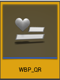

# WalletConnect

## Get the WalletConnect Standard URI

First, we create a variable `PlayCppSdkActor` that references `BP Play Cpp Sdk`. It will be used to reference objects/instances of the **Blueprint Play Cpp Sdk** class, which provides WalletConnect functions.

<figure><figcaption></figcaption></figure>

Then, use Spawn Actor from Class to spawn from `BP Play Cpp Sdk`, and set the return value to variable `PlayCppSdkActor` for later easy access.&#x20;

<figure><figcaption></figcaption></figure>

Call `InitializeWalletConnect` function from `PlayCppSdkActor` with the following inputs:

* `Description`: Defi WalletConnect example.
* `Url`: [http://localhost:8080/](http://localhost:8080/)
* `Name`: Defi WalletConnect Web3 Example
* `Icon Urls`: Connect with Make Array

<figure><figcaption></figcaption></figure>

Drag Pin Out from function `InitializeWalletConnect`, search and **select Add Custom Event...**

<figure><figcaption></figcaption></figure>

Connect the `Succeed` result to the `Condition` of a node **Branch**

<figure><figcaption></figcaption></figure>

If the callback return True, then call `SetupCallback` and `GetConnectionString` as below, finally print the connection string in the Game.

<figure><figcaption></figcaption></figure>

In Android, launch the WalletConnect Deep link as below:

<figure><figcaption></figcaption></figure>

The full blueprint demo:

<figure><figcaption></figcaption></figure>

## Display URI using QR Code

To display QR Code in Unreal Engine, a function `GenerateQrCode` could be used. The return value of `GenerateQrCode` is `Texture2D` which could be displayed on a Widget or HUD, for example.

* To show the QR Code on a Widget, select **Maps**, right click **Content Browser** > **User Interface** > **Widget Blueprint**&#x20;

<figure><figcaption></figcaption></figure>

<figure><figcaption></figcaption></figure>

* Rename the file as WBP\_QR.

<figure><figcaption></figcaption></figure>

* Double click WBP\_QR and open the Designer editor, drag **Common** > **Image** to the canvas (it is named as `Image 0`),  update on **Details** tab as: **512** (Size X) x **512** (Size Y)&#x20;

<figure><figcaption></figcaption></figure>

* Click **Graph** and switch to Event Graph

<figure><figcaption></figcaption></figure>

*   Right click the graph, search and select **Add Custom Event...**, name it as **ShowQR** with two inputs

    * `Show`: Boolean (To control the QR code show or not)
    * `QR`: Texture 2D (The input QR code data)

* We could control it to show or destroy `Image 0` like below

<figure><figcaption></figcaption></figure>

* **Compile** > **Save**
* Back to level blueprint editor, instead of printing the URI, we connect `Output` of `GetConnectionString` to function `GenerateQrCode`&#x20;

<figure><figcaption></figcaption></figure>

* Finally, show the QR Code by **Creating WBP QR Widget**, Calling **Show QR** function (`Show` should be True, `QR` should be the `Return Value` of `GenerateQrCode`), and **Add to Viewport** like so:

<figure><figcaption></figcaption></figure>

