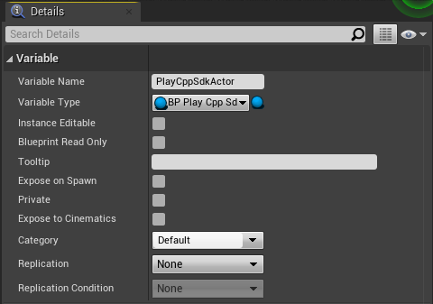
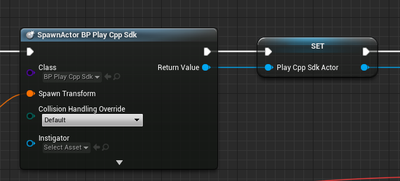
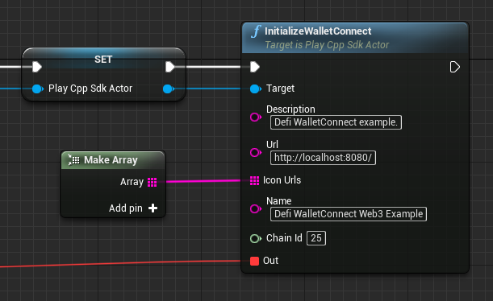
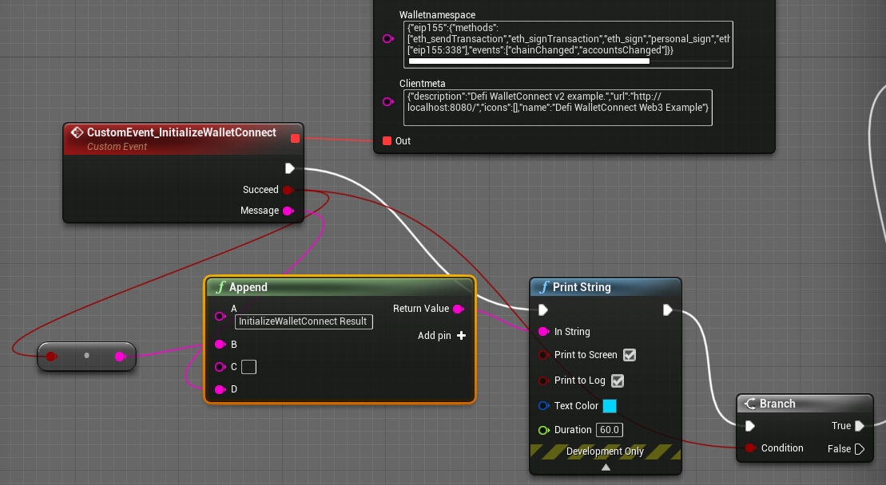
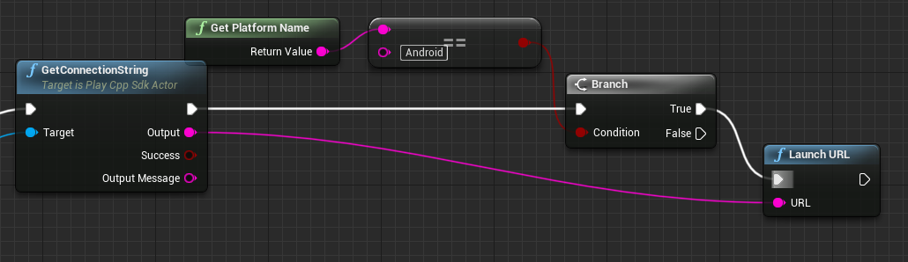
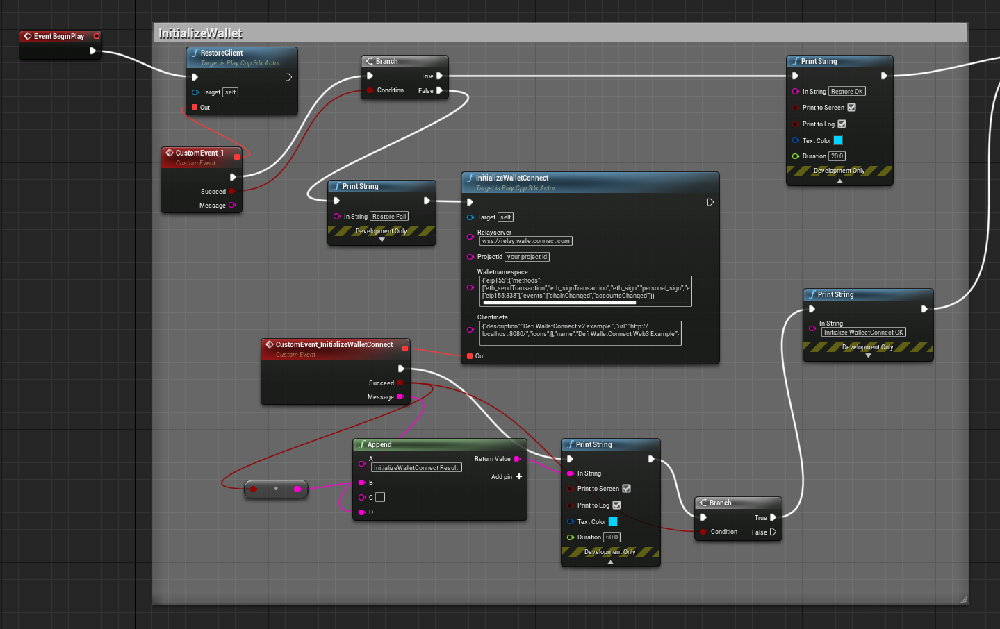

# Connect WalletConnect Step by Step

Although `ConnectWalletConnect` is convenient, it hides details of the WalletConnect Session. If you want to keep track of the wallet connect connection status, session information, connected chain ID, or connected address, you should connect WalletConnect step by step.

## Get the WalletConnect Standard URI

First, we create a variable `PlayCppSdkActor` that references `BP Play Cpp Sdk`. It will be used to reference objects/instances of the **Blueprint Play Cpp Sdk** class, which provides WalletConnect functions.

<figure><figcaption></figcaption></figure>

Then, use Spawn Actor from Class to spawn from `BP Play Cpp Sdk`, and set the return value to variable `PlayCppSdkActor` for later easy access.

<figure><figcaption></figcaption></figure>

Call `InitializeWalletConnect` function from `PlayCppSdkActor` with the following inputs:

* `Description`: Defi WalletConnect example.
* `Url`: [http://localhost:8080/](http://localhost:8080/)
* `Name`: Defi WalletConnect Web3 Example
* `Icon Urls`: Connect with Make Array
* `Chain Id`: 25

<figure><figcaption></figcaption></figure>

Drag Pin Out from function `InitializeWalletConnect`, search and **select Add Custom Event...**

<figure><figcaption></figcaption></figure>

Connect the `Succeed` result to the `Condition` of a node **Branch**

<figure><figcaption></figcaption></figure>

If the callback return True, then call `SetupCallback` and `GetConnectionString` as below, finally print the connection string in the Game.

<figure><figcaption></figcaption></figure>

In Android, launch the WalletConnect Deep link as below:

<figure><figcaption></figcaption></figure>

The full blueprint demo:

<figure><figcaption></figcaption></figure>

## Display URI using QR Code

To display QR Code in Unreal Engine, a function `GenerateQrCode` could be used. The return value of `GenerateQrCode` is `Texture2D` which could be displayed on a Widget or HUD, for example.

* To show the QR Code on a Widget, select **Maps**, right click **Content Browser** > **User Interface** > **Widget Blueprint**

<figure><figcaption></figcaption></figure>

<figure><figcaption></figcaption></figure>

* Rename the file as WBP\_QR.

<figure><figcaption></figcaption></figure>

* Double click WBP\_QR and open the Designer editor, drag **Panel** > **Canvas Panel** to viewport to create a Canvas Panel, then drag **Common** > **Image** to the canvas (named it as `Image_0`), update on **Details** tab as: **512** (Size X) x **512** (Size Y)

<figure><figcaption></figcaption></figure>

<figure><figcaption></figcaption></figure>

* Click **Graph** and switch to Event Graph

<figure><figcaption></figcaption></figure>

* Right click the graph, search and select **Add Custom Event...**, name it as **ShowQR** with two inputs
  * `Show`: Boolean (To control the QR code show or not)
  * `QR`: Texture 2D (The input QR code data)
* We could control it to show or destroy `Image 0` like below

<figure><figcaption></figcaption></figure>

* **Compile** > **Save**
* Back to level blueprint editor, instead of printing the URI, we connect `Output` of `GetConnectionString` to function `GenerateQrCode`

<figure><figcaption></figcaption></figure>

* Finally, show the QR Code by **Creating WBP QR Widget**, Calling **Show QR** function (`Show` should be True, `QR` should be the `Return Value` of `GenerateQrCode`), and **Add to Viewport** like so:

<figure><figcaption></figcaption></figure>

## Get Session Status

After the QR Code is shown on the screen, we could call `EnsureSessionBlocking` from **Play Cpp Sdk Actor** to get the session status (Addresses and Chain Id) from the `Out` callback.

* Create variable
  * `Address`, Variable Type is **Wallet Connect Address**
  * `ChainID`, Variable Type is **Integer64**
* Get the first address from the `Session Result Addresses` and set it to `Address`
* Get the `Session Result Chain Id` and set it to `ChainID`
* Finally, destroy the QR Code (uncheck `Show` variable of `Show QR` node)

<figure><figcaption></figcaption></figure>
