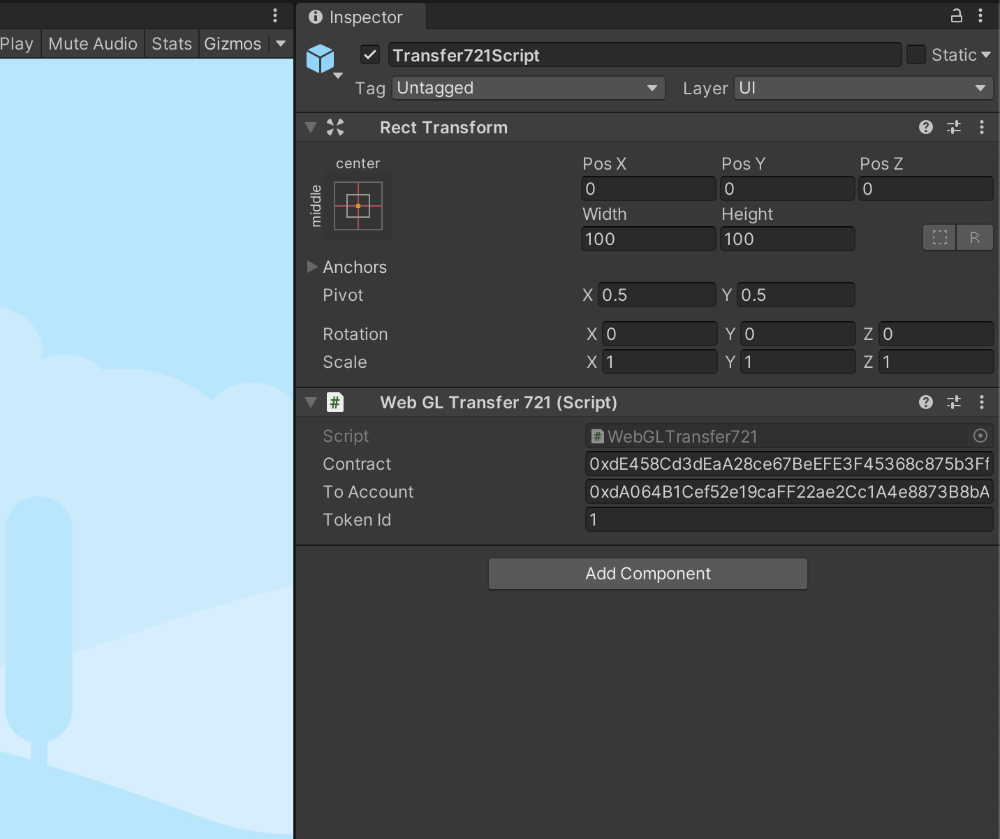
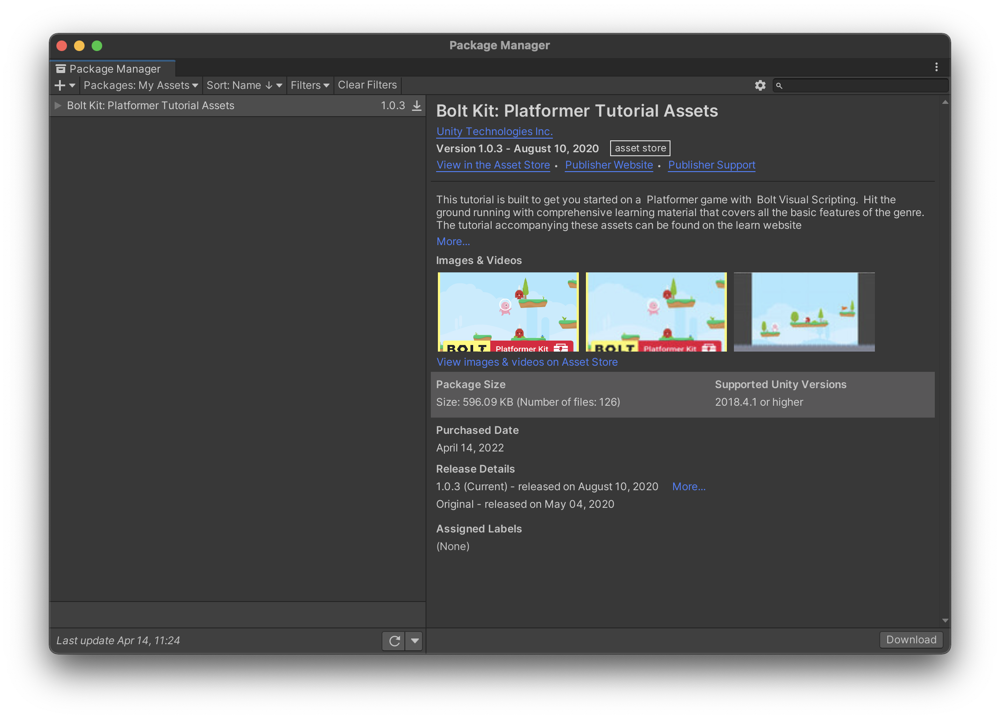
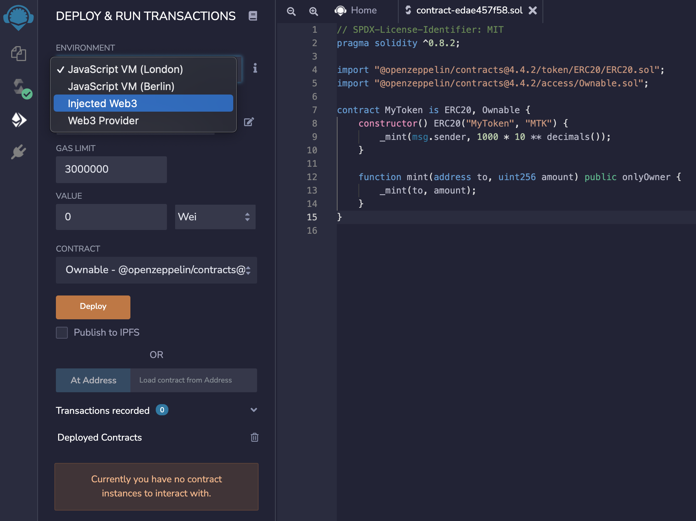
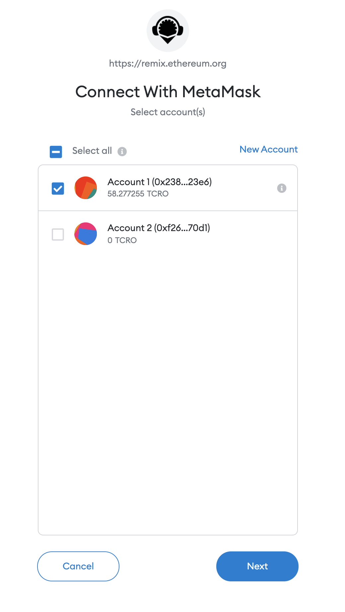
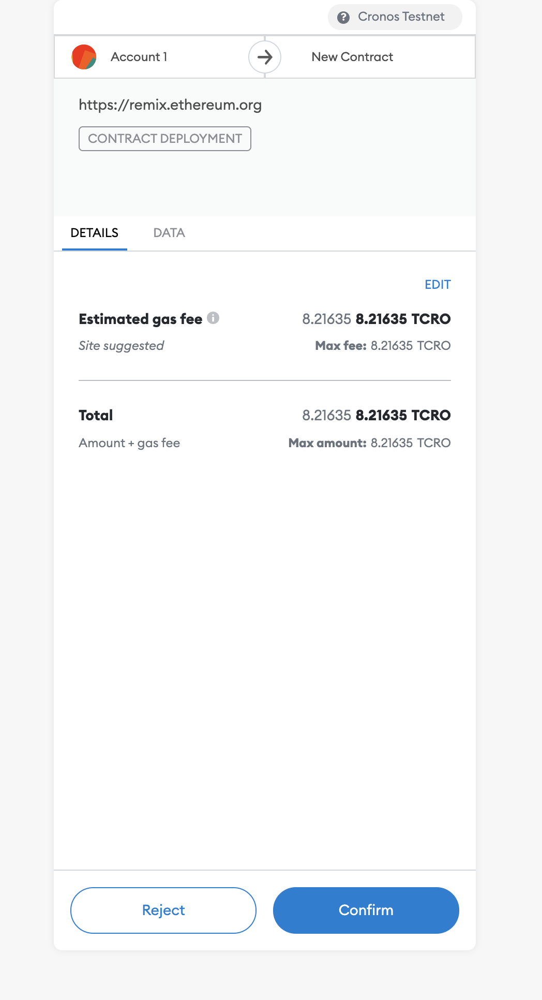
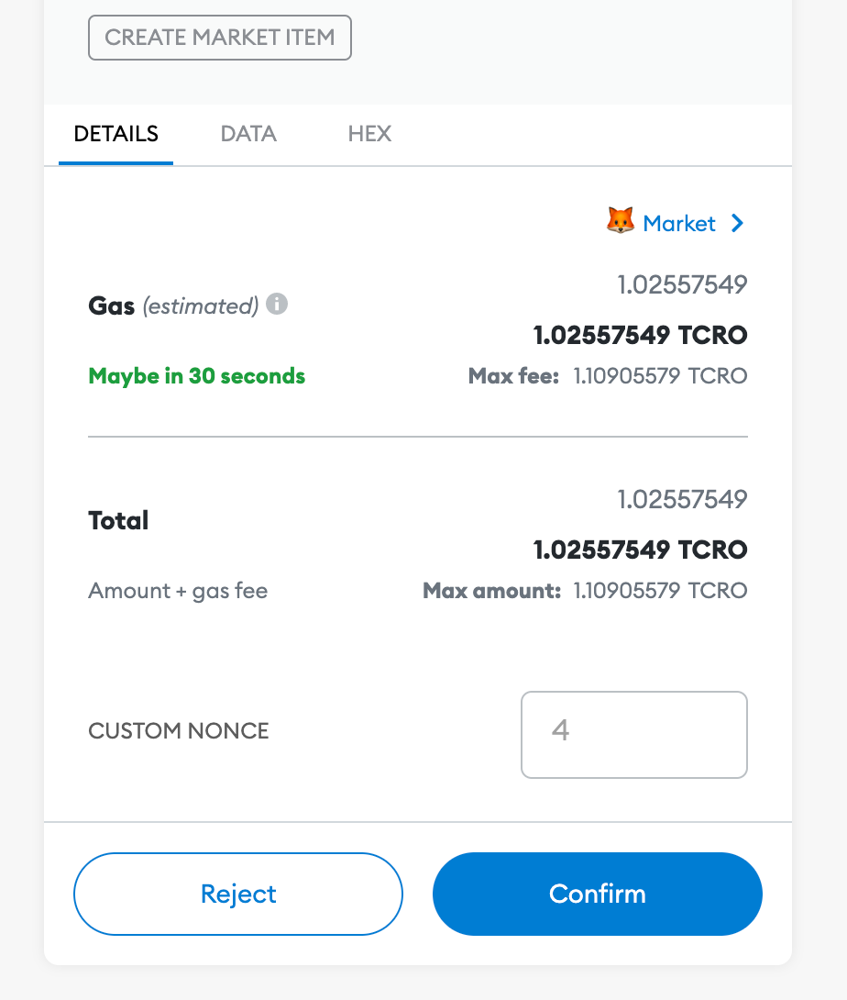
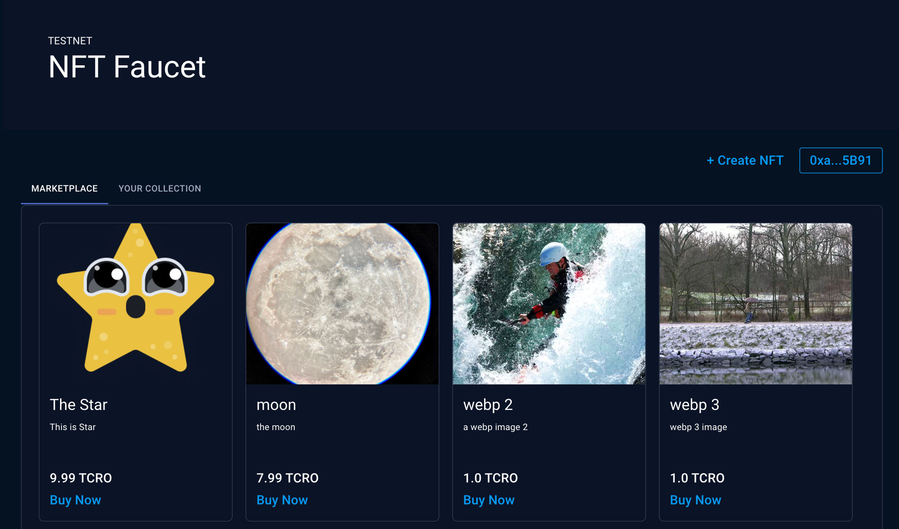

# Unity Integration example

### Overview

This section showcase the Cronos play Gaming SDK integration with the Cronos chain, aiming to bring Unity games into the Cronos ecosystem. In particular, we will show how to do a basic integration of the Cronos play with the Cronos chain including:

* Connecting to Cronos networks;
* Installaiton of the SDK;
* Obtaining a sample NFT and;
* Import Sample package from Unity Asset Store

### Pre-requisites

1. [Unity](https://unity3d.com/get-unity/download) (Version 2020.3.25f1 or later)
2. [ChainSafe SDK](https://github.com/ChainSafe/web3.unity/releases)
3. [Metamask browser extension](https://metamask.io/download/)



Network Name: **Cronos Mainnet Beta**

* New RPC URL: **https://evm-dev.cronos.org/**
* Chain ID: **25**
* Currency Symbol: **CRO**
* Block Explorer URL: **https://cronoscan.com/**



Network Name: **Cronos Testnet**

* New RPC URL: **https://evm-dev-t3.cronos.org/**
* Chain ID: **338**
* Currency Symbol: **TCRO**
* Block Explorer URL: **https://testnet.cronoscan.com**



* Sufficient fund on deployer address
  * [Testnet Faucet](https://cronos.crypto.org/faucet/)
* For Crypto.com DeFi Wallet integration, please refer to our [documentation](https://docs.cronos.org/getting-started/gamefi-sdk.md#enable-deficonnect-and-walletconnect).

## Integration guide for Cronos

### Create a new project

* Download the tutorial bolt kit from [Unity](https://assetstore.unity.com/packages/essentials/tutorial-projects/bolt-kit-platformer-tutorial-assets-168067) and import the assets into the blank new project. Below are the steps of importing Tutorial Projects - Bolt Kit from Unity. See [Reference #1](play.md#reference).

### Download the latest ChainSafe SDK and import into the project.

* For a detailed explanation, please refer to [ChainSafe official documentation](https://chainsafe.github.io/game-docs/)

### Prefabs interaction

* Step 3a. \[Unity] Double click the `Level1` scene under `Assets/Scenes` directory


#### Transfer721 Example

* Drag the `Transfer721` prefab under `Assets/Web3Unity/Prefabs/WebGL` dir into the scene.


* Update the `Contract` address under `Transfer721Script` object inspector
* Update the `To Account` address to your desired wallet address



***

\* For acquiring the NFT, you can create your own (see [Reference #2](play.md#\_2-smart-contract)), or mint an ERC721 NFT at our [Cronos NFT faucet](https://cronos.org/nft-faucet) (see [Reference #3](play.md#\_3-nft-faucet)).

***

### Build and Run

1. Switch to WebGL platform


1. Click the `Player Setting` button
2. Select `Web3GL-2020` under `Resolution and Presentation` tab


1. Set `Compression Format` to `Disabled` under `Publishing Settings` tab


1. After that, click `Build and Run` button and you are ready to play.


## What's next

The above guideline documentation only highlights the basic integration between ChainSafe and Cronos chain. You can download the full source code of the above sample game [here](https://github.com/crypto-org-chain/cronos-docs/blob/master/docs/getting-started/assets/cronos-chainsafe-unity-sample.unitypackage.zip). For other ERC protocol methods, please refer to the [ChainSafe Documentation](https://chainsafe.github.io/game-docs/).

## Reference

### Import Sample package from Unity Asset Store

#### 1a. Click to add the asset and sign in to your Unity account


#### 1b. Create a new project in Unity


#### 1c. Open the Package Manager window in Unity and under "My Assets" download the Bolt Kit.



#### 1d. Select `Bolt Kit: Platformer Tutorial Assets` and click Import


***

### Smart contract

#### 2a. Create an ERC standard smart contract

* ERC20 example

```javascript
// SPDX-License-Identifier: MIT
pragma solidity ^0.8.2;

import "@openzeppelin/contracts@4.4.2/token/ERC20/ERC20.sol";
import "@openzeppelin/contracts@4.4.2/access/Ownable.sol";

contract MyToken is ERC20, Ownable {
    constructor() ERC20("MyToken", "MTK") {
        _mint(msg.sender, 1000 * 10 ** decimals());
    }

    function mint(address to, uint256 amount) public onlyOwner {
        _mint(to, amount);
    }
}
```

* ERC721 example

```javascript
// SPDX-License-Identifier: MIT
pragma solidity ^0.8.2;

import "@openzeppelin/contracts@4.4.2/token/ERC721/ERC721.sol";
import "@openzeppelin/contracts@4.4.2/access/Ownable.sol";
import "@openzeppelin/contracts@4.4.2/utils/Counters.sol";

contract MyNFT is ERC721, Ownable {
    using Counters for Counters.Counter;

    Counters.Counter private _tokenIdCounter;

    constructor() ERC721("MyNFT", "MNFT") {}

    function _baseURI() internal pure override returns (string memory) {
        return "https://opensea-creatures-api.herokuapp.com/api/creature/";
    }

    function safeMint(address to) external onlyOwner {
        uint256 tokenId = _tokenIdCounter.current();
        _tokenIdCounter.increment();
        _safeMint(to, tokenId);
    }
}
```

* ERC1155 example

```javascript
// SPDX-License-Identifier: MIT
pragma solidity ^0.8.2;

import "@openzeppelin/contracts@4.4.2/token/ERC1155/ERC1155.sol";
import "@openzeppelin/contracts@4.4.2/access/Ownable.sol";

contract My1155Token is ERC1155, Ownable {
    constructor()
        ERC1155("https://opensea-creatures-api.herokuapp.com/api/creature/")
    {}

    function setURI(string memory newuri) public onlyOwner {
        _setURI(newuri);
    }

    function mint(address account, uint256 id, uint256 amount, bytes memory data)
        public
        onlyOwner
    {
        _mint(account, id, amount, data);
    }

    function mintBatch(address to, uint256[] memory ids, uint256[] memory amounts, bytes memory data)
        public
        onlyOwner
    {
        _mintBatch(to, ids, amounts, data);
    }
}
```

#### 2b. Deploy Smart Contract via [Remix IDE](https://remix.ethereum.org/)

```
-  Switch the chain network to Cronos Testnet via Metamask extension or other similar provider
-  Select the `Injected Web3` under ENVIRONMENT tab
```



```
-  Approve the connection
```



```
-  Select your contract name under CONTRACT tab
```


```
-  Approve the transaction after clicking `Deploy` button
```



```
-  Copy the contract address
```

***

### NFT Faucet

* 1\. Connect your wallet via metamask or walletconnect


* 2\. Click `Create NFT` under `YOUR COLLECTION` tab


* 3\. Create and sign the transaction after uploading the image


* 4\. Copy the contract address and image URL from the NFT modal


* 5\. Paste into the corresponding input box inside Unity inspector


***

### (Optional) List NFT for sale in marketplace faucet

* 1\. Fill in the price at list item modal and confirm


* 2\. Sign approval and create item transaction

 

* 3\. View the listed item in Marketplace tab


