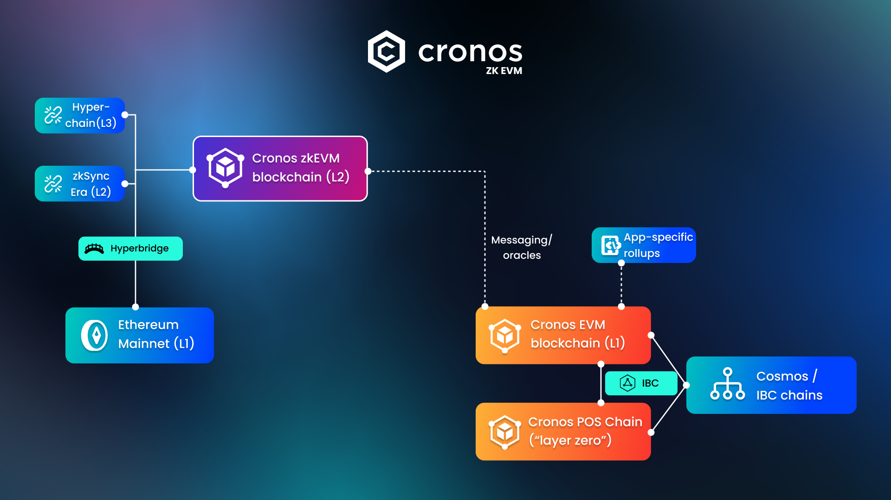
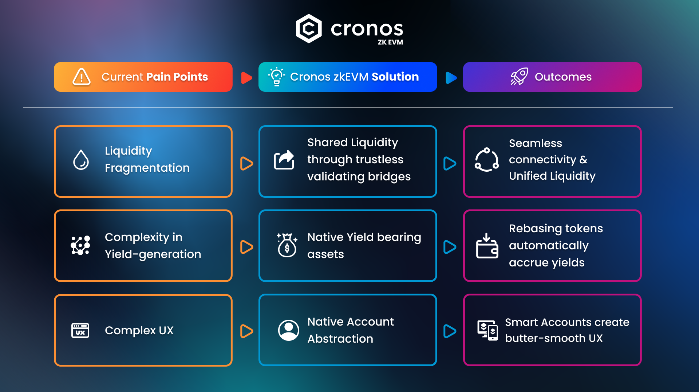
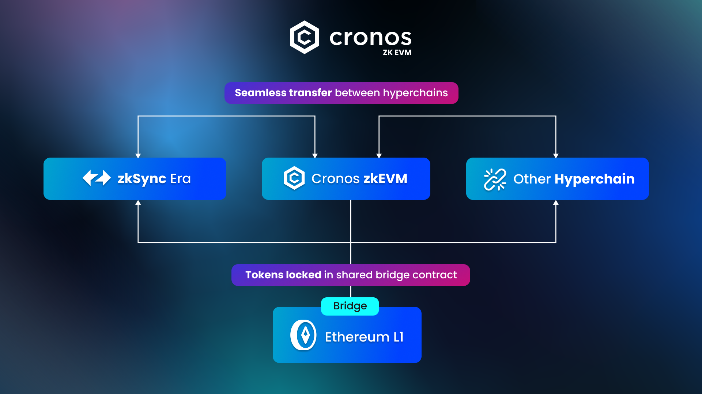
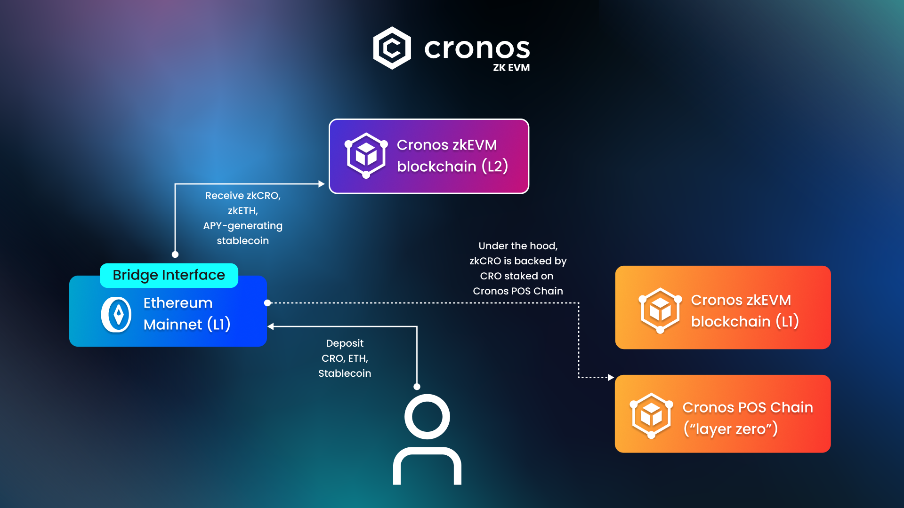

# zkEVM Litepaper v1.0

## Executive Summary

The value creation potential of cryptocurrency is as compelling today as it has ever been. Decentralized financial rails based on open-source blockchain technology have continued to innovate and demonstrate their robustness during some of the most challenging years experienced by the world economy in recent history, marked by a global pandemic, record inflation and intense geopolitical conflicts. Progress within self-custodial DeFi has transformed it from a complex and cumbersome ecosystem to one that is increasingly user-centric. Yet the space is still nascent and shows significant room for optimization and simplification.

The Cronos ecosystem is a prime example of this evolution. During the last several years, the Cronos and Cronos POS blockchain networks have demonstrated their safety and reliability, while building up a passionate user community and a vibrant universe of decentralized applications. It is now time for this ecosystem to prepare for the next level of mainstream and institutional  adoption, leveraging its strengths and learning from the bottlenecks and pain points experienced by crypto users.

Driving this evolution is Cronos zkEVM, incubated by Cronos Labs, which aims to further transition liquidity from the control of centralized platforms to a decentralized, on-chain ecosystem. This approach directly addresses some of DeFi's most pressing concerns: the fragmentation of liquidity, the complexity of generating yield, and the cumbersome user experience associated with managing blockchain transactions.

Cronos zkEVM explores the latest frontiers of zero-knowledge layer 2 technology and modular data availability in order to increase transaction speed and reduce transaction costs while delivering strong security. Additionally, the network is set apart by three key features that respond to DeFi's challenges:

1. Shared Liquidity: It enables asset fluidity across hyperchains (which are Ethereum Layer 2s and Layer 3s powered by ZK Stack), addressing liquidity fragmentation.
2. Yield-bearing Assets: Assets such as ETH, CRO, and certain stablecoins natively produce yield on Cronos zkEVM, which simplifies the process for users.&#x20;
3. Native Account Abstraction: The introduction of Smart Accounts and Paymasters facilitates easier transactions, enhancing the overall user experience.

Leveraging Matter Labs' ZK Stack framework, Cronos zkEVM operates alongside the Cronos blockchain (EVM Layer 1) as a Layer 2 solution that benefits from the security of the Ethereum network. Cronos zkEVM represents a measured step forward in the maturation of the DeFi sector, aiming to address key issues and prepare the ecosystem for sustainable growth and broader adoption.

Cronos zkEVM mainnet will use zkCRO, a yield-generating version of $CRO, as its protocol token, further enhancing the utility of $CRO and leveraging its global addressable user base of more than 80 million #CROFam members.

## Vision

In today’s financial landscape, centralized platforms are known for their efficiency but suffer from trust-based vulnerabilities, while DeFi presents a promising yet sometimes complex alternative. Cronos zkEVM envisions a transformative shift, recentering liquidity from large centralized entities to self-governing decentralized organizations, creating a secure and simple platform that doesn't compromise on user experience.

Cronos zkEVM's vision is underpinned by several core principles:

* Empowering Financial Independence: By promoting self-custody solutions, Cronos zkEVM aims to reduce risks associated with centralized entities, giving users full control over their assets.
* Promoting Fairness and Transparency: Countering the opaque practices of traditional financial entities, it emphasizes transparency based on public, open-source protocols.
* Transforming the Liquidity Landscape: The goal is to shift power from traditional entities to decentralized, self-governing organizations.

To achieve this, scalability in DeFi remains a significant challenge. Zero Knowledge layer-2 networks are posited as a solution, enabling off-chain data and computation execution while maintaining data integrity on the main chain. Cronos zkEVM aims to leverage this technology as a zk-enabled layer-2 built on Ethereum's robust, secure platform. Through utilizing Matter Labs’ ZK Stack framework, Cronos zkEVM is its own sovereign blockchain with seamless connectivity, aligning with our aspiration to provide a trustworthy, scalable, and user-centric blockchain solution.

On another front, parallel execution EVM has emerged as one potential solution for a more sustainable way to achieve scalability. It involves processing multiple transactions simultaneously, rather than the sequential method in traditional blockchain. This is achieved by identifying and concurrently executing transactions that are independent of each other, thereby significantly boosting throughput. For instance, transactions that don’t share common dependencies can be processed in parallel, optimizing the use of network resources. Cronos zkEVM is exploring the integration of parallel execution within its EVM as one of the potential solutions. By exploring this innovative approach, Cronos zkEVM aims to marry the efficiency of centralized systems with the trust and security of decentralized ones, paving the way for scalable, high-performance DeFi applications.

## Mission

Cronos zkEVM embarks on a mission to advance DeFi by tackling its fragmentation and complexity, setting a new standard for efficient, and user-centric decentralized finance. Overall, Cronos zkEVM’s raison d'etre comprises three key goals:&#x20;

* Unifying fragmented liquidity - A significant pain point in today’s DeFi is fragmented liquidity. Traditionally, liquidity is dispersed across an array of blockchains, leading to a splintered market with inefficiencies at every turn. This results in higher slippage, diminished returns for liquidity providers, and a complex workflow for users who navigate. Cronos zkEVM capitalizes on the interoperability of ZK Stack-based hyperchains, and consolidates scattered liquidity.
* Simplifying Yield Generation - Another layer of complexity arises when users seek to generate yield on their crypto assets. The current process often requires engaging with multiple protocols, each introducing its own set of risks. This cumbersome process not only complicates the yield generation but also poses a barrier to entry for the average user. Our approach simplifies yield generation, making it not only more user-friendly but also safer.
* Intuitive Account Management - Cumbersome user experience in DeFi has been a barrier for mass adoption. For new users, the technicalities of blockchain—such as understanding gas fees, managing wallet addresses, and ensuring transaction security—can be daunting. Native account abstraction on Cronos zkEVM represents a leap forward in user experience. It introduces the possibility for users to interact with DeFi through alternative signature schemes and automated transactions. This not only simplifies the process but also opens the doors to a broader audience, paving the way for a more inclusive DeFi landscape.

## Architecture

Cronos zkEVM operates at a strategic juncture across blockchain networks, enhancing scalability and efficiency. Overall Cronos zkEVM is uniquely positioned among 3 ecosystems:

1. Ethereum ecosystem
2. Hyperchain ecosystem, based on zkSync's ZK Stack
3. Cronos ecosystem&#x20;

Integrated within the ZK Stack Hyperchain Ecosystem, it connects to the Ethereum Mainnet via a shared bridge, tapping into Ethereum's user base and security while incorporating zkSync's features for secure and efficient cross-chain interactions. As part of the wider Cronos ecosystem, Cronos zkEVM works in tandem with the Cronos blockchain (Layer 1 EVM) and the Cronos POS Chain.&#x20;

The Cronos blockchain supports diverse DApps with a Proof-of-Authority (POA) model, and can even support optimistic rollups operated for app-specific use cases, while the Cronos POS Chain, formerly named Crypto.org, secures assets and oversees $CRO token issuance. Furthermore, Cosmos SDK’s Inter Blockchain Communication (IBC) protocol facilitates interoperability within the Cosmos network.

The introduction of Cronos zkEVM does not render the existing Cronos chain obsolete. Instead, the current Cronos chain continues to serve a wide variety of general use cases, including gaming, DeFi, and NFTs, and remains an integral part of the Cosmos ecosystem.

Cronos zkEVM, on the other hand, is designed to address high-performance and high-throughput DeFi use cases, meeting the demands of sophisticated retail and institutional investors with its future-proof performance. Envisioned as a liquidity hub, it aims to simplify transactions between Cronos, the Ethereum mainnet, and other Layer 2s, thereby unifying the liquidity across the blockchain ecosystems and leveling the playing field.

<figure><figcaption>
Overview of Cronos ecosystem and connected networks
</figcaption></figure>

## Core Proposition

Cronos zkEVM targets key DeFi challenges by offering solutions for liquidity fragmentation, yield-generation complexity, and user experience barriers.

It establishes shared liquidity with trustless bridges, simplifies earning with native yield-bearing assets, and improves usability through account abstraction. These solutions set the stage for a future of unified liquidity, passive yield accrual, and intuitive wallet management.

<figure><figcaption>
Value proposition
</figcaption></figure>

### Shared Liquidity

Shared Liquidity in Cronos zkEVM addresses the critical issue of liquidity fragmentation in DeFi. This feature ensures that assets, while distributed across various hyperchains, are consistently secured by Ethereum's robust consensus. Our goal is to simplify the process of asset transfer and withdrawal, making it more cost-effective for users.&#x20;

In this ecosystem, Shared Liquidity means that assets are pooled in a shared bridge contract on Layer 1, creating a centralized pool. This structure is key to enhancing interoperability and efficiency within the network. It's a direct solution to the fragmentation issue, presenting Cronos zkEVM as a more integrated and streamlined platform for DeFi transactions.

The hyperbridge architecture, a network of smart contracts, underpins this system by offering trustless validating transactions across chains. Initially Cronos zkEVM will support the transfer of Ether and ERC20 tokens, with plans to expand to ERC721 and ERC1155 assets.

Shared Liquidity is a fundamental aspect of Cronos zkEVM's strategy to address market fragmentation and improve the DeFi experience.&#x20;

<figure><figcaption>
Hyperbridge overview
</figcaption></figure>

### Yield Bearing Assets

In today's DeFi, assets such as ETH offer a 3-4% yield through staking on Layer 1, serving as a form of risk-free rate in the ecosystem. Yet, this earning potential is often lost when assets are locked in bridges and moved to Layer 2 platforms like Optimism or Arbitrum. This forfeited yield is akin to losing value due to the inflation of the network, resulting in loss in purchasing power. Similarly, stablecoins typically do not generate yield on either layer, leading to a missed opportunity.&#x20;

Within the Cronos zkEVM network, the native token CRO, along with ETH and various stablecoins, will inherently produce yield and accrue APY for holders. To be more specific, iInstead of holding and trading CRO, ETH and DAI/USDC/USDT, Cronos zkEVM users will have the option to bridge, hold and trade the following yield-bearing assets:

* zkCRO, a yield-bearing version of CRO, used as the protocol token on Cronos zkEVM. zkCRO is backed by LCRO (Veno's liquid staked CRO) which represents CRO staked on the Cronos POS chain.
* zkETH, a yield-bearing version of ETH, backed by ETH committed to Ethereum's proof of stake protocol. zkETH is similar to Veno's existing LETH token.
* zkUSD, a yield-bearing stablecoin, backed by investments into yield-generating lending protocols on Ethereum mainnet.

For technical reasons, zkCRO, zkETH and zkUSD will be available as auto compounding tokens, meaning tokens whose value increases over time relative to the underlying cryptocurrency in order to reflect accumulated gains. Depending on user demand and developer use cases, it may be possible for users to wrap these tokens into rebase tokens as well (for which the user balance increases over time).

This fosters a dynamic ecosystem where dApps are built around and benefit from yield-bearing tokens, enabling them to remain competitive in a market where yield optimization is key. This offers dApps a simplified approach for revenue-generation from user assets. By making minor adjustments, dApps can utilize Cronos zkEVM's native yield capabilities to improve their value proposition to users.

The yield generation within Cronos zkEVM will be facilitated through strategic partnerships with decentralized protocol Veno Finance, which currently provides liquid staking solutions for CRO, ETH and ATOM, and additional tokens in the future. This approach is part of a larger strategy to weave yield-generating features directly into the network's structure, enhancing utility for both users and developers.&#x20;

<figure><figcaption>
Yield bearing tokens
</figcaption></figure>

### Native Account Abstraction

Native Account Abstraction (AA) in Cronos zkEVM is designed to transform how users interact with their accounts, offering enhanced functionalities like bundled transactions, key recovery options, and alternative token payments for gas fees. By leveraging the ZK Stack, Cronos zkEVM simplifies its account structure, adopting a single account type compared to Ethereum's dual model of Externally Owned Accounts (EOAs) and contract accounts.&#x20;

While Account Abstraction itself isn't new, its integration into blockchains has been slow, especially when transferring existing liquidity to AA-enabled wallets. Cronos zkEVM utilizes AA to allow seamless fund deposits and interactions with dApps, eliminating the need for network switching.

Using AA, most of the dApps on Cronos zkEVM can make it easy for users to transact even if they don't own enough protocol token to pay for gas. Additionally, users can create off-chain signatures from any EVM-compatible chain or through familiar social logins. With dApps on Cronos zkEVM expected to natively support AA, dApps can manage transaction relays and even cover gas costs for users, further simplifying the experience.

The introduction of Native Account Abstraction in Cronos zkEVM marks a significant step toward making blockchain technology more user-friendly and accessible. It not only enhances the security and efficiency of user interactions but also fosters a more welcoming environment for broader adoption.

## Security & Governance&#x20;

From day one, Cronos zkEVM relies on the security of the underlying Ethereum network, one of the most decentralized and robust blockchains, for transaction settlement and finality. The hyperbridge, a cross-chain messaging protocol that binds together all hyperchains as part of the ZK Stack, is secured by Ethereum as well. Finally, the use of validity proofs powered by zero-knowledge technology enables crypto users to withdraw their assets from the Layer 2 to the Layer 1 at any time, if these assets have been originally bridged from the Layer 1. These enhancements are game changers for retail and institutional crypto holders, compared with the occasional chain and/or bridge failures that have plagued the DeFi sector in 2022 and 2023.

Modular data availability is an important area of research and development for layer-2 blockchains, unlocking significant savings in transaction fees. Cronos zkEVM will utilize these new developments as they become available.

The Cronos zkEVM protocol engineering team is committed to participating actively in the development of the open-source ZK Stack over time, and Cronos zkEVM will aim to participate in the governance of the broader stack.

The longer term vision of this stack includes the development of decentralized validator networks at the Layer 2 level, which will further enhance the censorship resistance of the network.

## Path Forward

Cronos zkEVM is embarking on an ambitious journey to reshape DeFi, mapped out in strategic phases designed to build upon each other.

**Phase 0: Testnet**

* Cronos zkEVM Testnet optimization and upgrades.
* (Soon) Testnet quests and proof of participation for early adopters.

**Phase 1: Foundation and Infrastructure**

* Initiate with the beta launch of Cronos zkEVM mainnet, laying the foundational infrastructure.
* Connection readiness with ZKStack hyperchains to ensure shared liquidity.
* Integration with liquid staking protocol to enable yield bearing assets on Cronos zkEVM.
* Foundational elements for Native AA to improve user interaction workflow.
* Onboard key DeFi protocols offering essential services like money market and DEXs (spot & perpetual).
* Launch mainnet quests & point system in preparation of airdrop waves, in partnership with participating dApps.

**Phase 2: Solidifying the Ecosystem as a Liquidity Hub**

* Prioritize VM optimizations and proof size reductions to enhance efficiency and cost-effectiveness.
* Enrich the DeFi suite by expanding into high-capacity spot and perpetual trading systems and liquidity management solutions, particularly those based on order books, real word assets, and artificial intelligence.
* Invest in use cases that take further advantage of the connectivity between hyperchains and the composability of crypto assets supported by shared liquidity.

**Phase 3: Continuous Development**

* Broaden the ecosystem's utility to include more ambitious use cases, such as payments, synthetic assets, and asset & yield management solutions.
* Continue to optimize gas fee mechanisms and gradually transition towards a community-driven governance structure.
* Experiment and test decentralized validator networks to enhance censorship resistance.
* Investigate adopting parallel execution to increase transaction throughput and efficiency.

As we continue to forge ahead with the development of Cronos zkEVM, we are committed to keeping our community informed and engaged. Detailed updates on the roadmap's progress will be released in due course. We understand the importance of transparency and collaboration and are working diligently to bring these innovative solutions to fruition.&#x20;

To stay up-to-date with the latest developments and insights, [follow Cronos on X](https://twitter.com/cronos\_chain), and [subscribe to the blog](https://blog.cronos.org) for news and updates. Your engagement and support propel #CROFam forward, and we look forward to continuing this journey with you as we collectively shape the future of DeFi.

