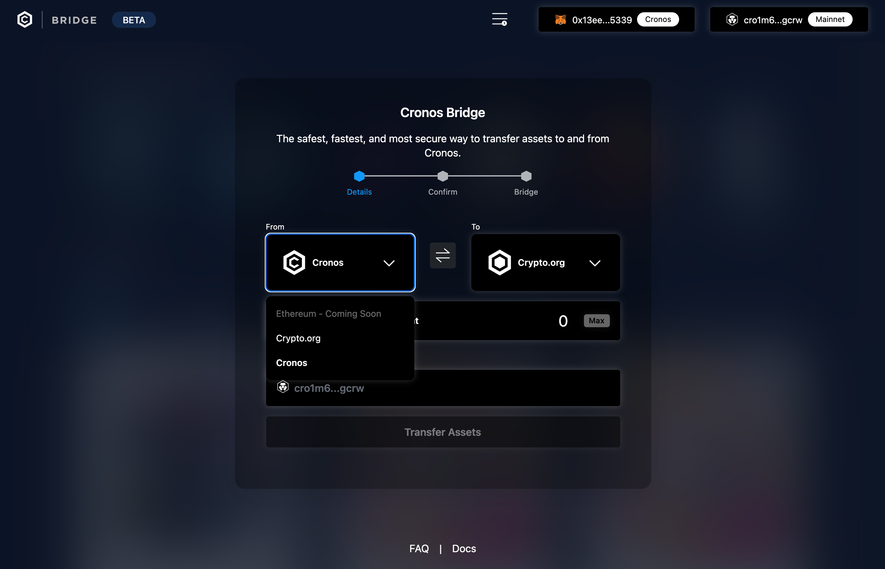
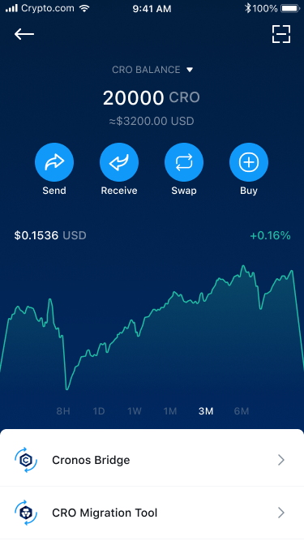
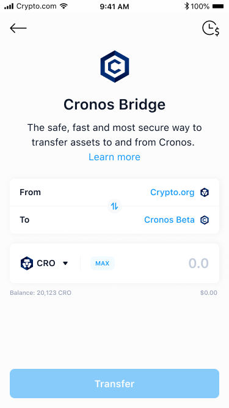
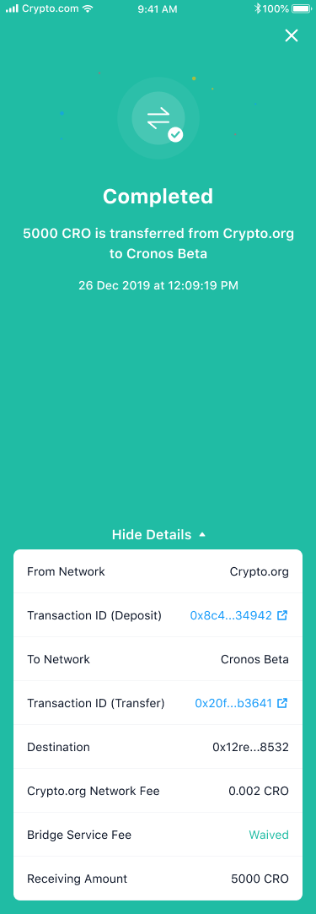
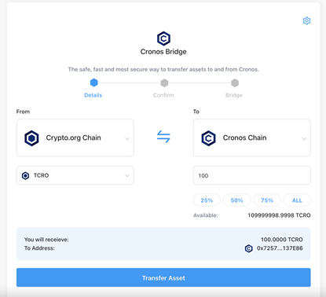

# From other chains

## Via Cronos Bridge Web App

### Transfer assets from Crypto.org Chain using Cronos Bridge Web App

### Introduction

The Cronos bridge’s goal is to support a seamless transfer of assets between blockchains to foster interoperability and for users to enjoy the best Dapps and earnings no matter the chain.

The Cronos Bridge (Beta) can be found at [https://cronos.org/bridge](https://cronos.org/bridge)

Our bridge is a fully decentralized protocol built on the open-source projects of [IBC](https://ibcprotocol.org/) and [Gravity Bridge](https://github.com/cosmos/gravity-bridge).

Please read the guide carefully and review the project documentation as misuse may cause incorrect transfer or even loss of assets. We recommend transferring a small amount first to get yourself acquainted with the bridge before moving significant amounts.

#### Currently supported networks:

- Crypto.org <=> Cronos;
- Cosmos <=> Cronos;
- Terra <=> Cronos;
- Akash <=> Cronos.

#### Currently supported tokens:

- CRO;
- ATOM;
- LUNA;
- AKT.

#### Currently supported wallets:

- Metamask, Keplr, Crypto.com DeFi Wallet

#### Coming Soon:

- Ethereum <=> Cronos [Coming Soon]
- ETH, WETH, WBTC, USDC, USDT, DAI

We are constantly working on adding new tokens and chain support. If you have any feedback and issues, please drop us an email at product.bridge@crypto.org.

### How to use the Cronos Bridge [Web Dapp]

### 1. Connect your wallet

Click the “Connect Wallet’ button to connect your desktop or browser extension wallet. We currently support browser-compatible versions of the Metamask, Keplr, and Crypto.com DeFi Wallet.
Once a connection request is sent, look for a popup from your wallet interface or click into the wallet extension to give consent.

Note 1: If you are bridging assets from or to Crypto.org, you may specify the destination wallet by pasting the address directly or connecting a second wallet to avoid manual errors.

Note 2: Currently, Terra ⇔ Cronos only support Keplr wallet. Learn how to add your Terra station wallet to Keplr wallet, please click [here](#add-your-terra-station-wallet-to-keplr-wallet).

### 2. Select Network and Token

Select the origin chain on the left and the destination chain on the right in the bridge interface. We will do our best to auto-suggest your wallet network to match the desired transfer parameter. However, a manual adjustment on your end may be needed to set your wallet to match the selected network.

If you are transferring from or to Crypto.org, you need to specify the destination address by inputting the address manually or connecting a second wallet to receive your funds.

Once the networks are chosen, select the asset you would like to transfer.

### 3. Enter the amount

Once the network and asset have been chosen, insert and confirm the amount you would like to transfer.

Our decentralized bridge protocol does not impose a minimum and maximum amount.
However, bridging a very small amount may have a high gas fee in proportion to the amount transferred.

After the amount is entered, the bridge network fees will be calculated accordingly. The bridge itself and Crypto.org do not charge an additional fee.

During the promotional launch period, the network fee incurred by the bridge will be waived. You will still be liable to pay a gas fee directly on your preferred wallet charged by the source network.

Before bridging a large amount, we encourage testing a transfer of a minor amount first to ensure all the settings are correct.

### 4. Confirm the transaction

Once all transfer settings have been confirmed, a transaction confirmation page will pop up summarizing the transaction.

This will send a transaction request to your wallet; please confirm on your wallet screen to ultimately authorize the transfer.

Please note that after bridging the tokens, they will be converted into the destination blockchain-supported tokens. See [FAQ](#faq) for more information

### 5. Bridging assets

After the transaction is confirmed from the wallet, the bridge operation will commence.
First, we will initiate and wait for the deposit of the assets on the origin chain.
Once the deposit is confirmed, we will initiate the transfer in the destination chain to your desired receiving wallet address.
Both transactions will include an external link to view and monitor the transaction on-chain via scanning utilities such as Cronos, and Crypto.org explorer.

Even if you dismiss, quit, or refresh the page, a small popup reminder will be available to indicate an in-progress transaction.
A “transfer completed” message will finally confirm that the transaction has been completed successfully. You may also see a full record of past transactions tied to your wallet in the History tab.

Thank you for using the Cronos bridge and supporting the Crypto.org ecosystem!

### Add your Terra station wallet to Keplr wallet

1. Create and log in to your Keplr wallet

2. Click the button on the top right corner. Then, click “+ Add Account”

3. Select “import existing account”

4. Input the Mnemonic of your Terra station wallet and name your account, then click "Next"

5. Go back to your Keplr account, click the button on the top right again. You will see your imported Terra station account here.

6. Select your imported Terra station account. Then, click the arrow on the top, and select "Terra".

7.  You can now use your Terra station wallet on Keplr!

### FAQ

### What are the fees involved?

-The bridge service itself is free and does not charge any additional service fees. The fees displayed are network gas fees which the blockchain infrastructure charges itself to process the transactions and vary depending on the network.

- For any bridge transaction, network gas fees are incurred on two chains: origin and destination.
  - For the origin chain gas fee, this will be displayed and settled directly on your wallet extension.
  - For the destination chain gas fee (“Bridge network fee”), our decentralized bridge is tasked to collect the appropriate gas fee and pay the network.

### How does the Bridge network fee waiver work?

- The following transactions are eligible for a fee waiver:
  - Crypto.org => Cronos;
  - Cronos => Crypto.org;
  - Cosmos => Cronos;
  - Terra => Cronos;
  - Akash => Cronos.
- The fee waived is the bridge network transaction fee on the destination chain. However, you are still liable to pay for the origin chain gas fee directly on your wallet extension.
- This is a promotional waiver; we reserve the right to modify and terminate the promotion at any time

### How fast is the transfer?

- IBC Transfers will generally take around 1 minute to complete.

### Can I transfer assets to a different wallet than my own?

- For transfers between Cronos and Crypto.org, we support either connecting a second compatible wallet or inputting the wallet address string.
  - If possible, we recommend connecting the second wallet to avoid manual typing and potential malware risks such as clipboard attacks.

### What are the support blockchains and tokens?

- The networks supported are:
  - Cronos;
  - Cosmos;
  - Terra;
  - Akash;
  - Coming Soon: Ethereum

### What are the supported wallets?

- The initially supported wallets will be Crypto.com DeFi Wallet, Metamask, and Keplr.
- Please ensure to set the correct active network on your Wallet if it is supported.

### Can I complete multiple transfers in one go?

- While it is possible to have multiple ongoing transactions, we recommend having one transaction at a time, even if there is some waiting time to avoid issues and duplication.

### Where can I report bugs and provide product feedback?

For any bug reports, or feedback please contact contact.bridge@crypto.org. This is for the web Cronos bridge only. For Crypto.com app, exchange, and DeFi wallet, contact directly https://help.crypto.com/en/

### How do I find my missing funds?

- Please check the transaction history table for your past transactions. If your transactions are not on the list, it was likely not initiated at all.
- If you believe you still have missing funds, please contact us at product.bridge@crypto.org.

### Is transferring tokens across blockchains safe?

- As with any decentralized application, there is a degree of risk related to code exploits and hacking.
- Our bridge code is publicly available. We leverage open-source code from the [IBC protocol](https://ibcprotocol.org/) and [Gravity Bridge](https://github.com/cosmos/gravity-bridge) projects.

## Via Crypto.com DeFi Wallet

### Transfer assets from Crypto.org Chain using Crypto.com DeFi Wallet in-built Cronos bridge UI 

Crypto.com DeFi Wallet has integrated with the Cronos Bridge and has provided a front-end UI to allow all of its wallet users to seamlessly transfer assets over to Cronos straight from the DeFi Wallet. Here’s how you can do so:

### Step-by-step Walkthrough

**Step 1**:  Accessing the Cronos Bridge on the DeFi Wallet

You can access the Cronos Bridge either on the DeFi Wallet homepage or directly in your CRO balance page

**Step 2**: Select “From” Crypto.org Chain as the origination chain and “To” Cronos as the destination chain

Only the `Crypto.org Chain <=> Cronos bridge` will be available on Day 1. The `Ethereum <=> Cronos` bridge will not be available till the Cronos Gravity Bridge goes live. As a user of the Crypto.com DeFi wallet, you will automatically have a Crypto.org Chain wallet address and Cronos chain wallet address created for you. These wallet addresses will automatically be detected by the Cronos bridge.  

**Step 3**: Enter the amount of asset you want to transfer

Once you have selected the token you want to transfer (CRO), you will have to enter the amount you want to transfer. The balance of CRO tokens you have on the Crypto.org Chain will automatically be detected. 

During the promotional launch period, the network fee incurred by the bridge will be waived. You will still be liable to pay a gas fee directly on your preferred wallet charged by the source network.

**Step 4**: Confirm the transaction

Upon clicking “Transfer CRO”, a confirmation page will appear showcasing the Network Fee and Bridge Fee. Click “Confirm to Transfer” to proceed with the transfer.

**Step 5**: Await for Bridge confirmation 

Once you click confirm, you will be taken to an overview page showcasing the status of your bridge transfer. The bridging process typically takes around 1 minute to complete. 

**Step 6**: Bridge transfer completed!

A “Completed” message will be displayed confirming that the transaction has been completed successfully. You should now see the corresponding value of CRO that you transferred from your Crypto.org Chain wallet on your Cronos wallet. You may click on the transaction IDs which will link you to the explorer for more information regarding the transfer. 
 
Alternatively, you may view your transaction history on the upper right hand corner of the DeFi Wallet’s Cronos Bridge landing page to check the status of any pending transactions or details of past transactions.

## Via Crypto.org Chain Desktop Wallet

### Transfer assets from Crypto.org Chain using Crypto.org Chain Desktop Wallet

Crypto.org Chain Desktop Wallet has integrated with the Cronos Bridge to allow all of its wallet users to seamlessly transfer assets over to Cronos straight from the Crypto.org Chain Desktop Wallet. Here’s how you can do so:

### Step-by-step Walkthrough

**Step 1**: Select the Cronos Bridge option on the left hand panel

**Step 2**: Select “From” Crypto.org Chain as the origination chain and “To” Cronos Chain as the destination chain

Only the `Crypto.org Chain <=> Cronos` route will be available on Day 1. The `Ethereum <=> Cronos` route will not be available till the Cronos Gravity Bridge goes live. As a user of the Crypto.org Chain Desktop Wallet, you will automatically have a Crypto.org Chain wallet address and Cronos Chain wallet address created for you. These wallet addresses will automatically be detected by the Cronos bridge.

**Step 3**: Enter the amount of CRO you want to transfer and click “Transfer Asset”

You will be able to verify the amount that you will receive and your Cronos address after entering the amount of CRO that you want to transfer. Click “Transfer Asset” and enter your Password to proceed.
 

**Step 4**: Confirm the transaction

You will be given an overview of the bridge transaction, including the network fees that you will have to pay for the transaction.Once you have confirmed the CRO amount and the destination address, click “Confirm” to proceed.

Please note that once you’ve clicked the “Confirm” button, there will be no going back.

**Step 5**: Await for Bridge confirmation 

After the transfer is initiated, the CRO will be bridged from the Crypto.org Chain to the Cronos Chain. The bridging process typically takes about a few minutes to complete. Once it’s done, you will see an updated balance in your receiving Cronos address.

Additionally, you will be able to view the Transaction in further details by clicking the transaction hash which directs you to the Crypto.org Chain explorer.And you can always review your latest bridge transfer history by clicking the icon at the top-right corner. 

