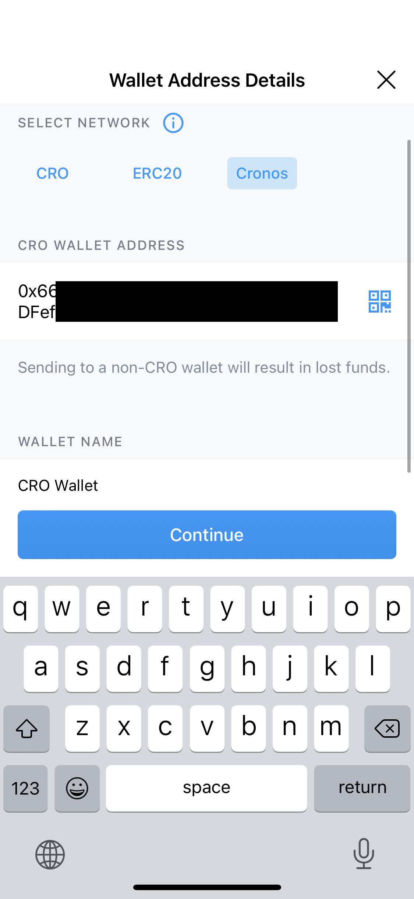

# From Crypto.com App

## Transfer assets using Crypto.com App

The Crypto.com App will be able to seamlessly transfer selected assets over to Cronos on Day 1. The withdrawal process will be exactly the same as how you would transfer funds to a separate chain.

**Supported assets on Day 1**: CRO, USDT, USDC, DAI, ETH, WBTC

### Step-by-step Walkthrough

**Step 1**:
Select the token that you want to withdraw from your Crypto Wallet
Only selected tokens mentioned at the top of this article will be available for withdrawal intro Cronos.

**Step 2**: Click on “Transfer” and “Withdraw”

**Step 3**: Select “External wallet” and whitelist your Cronos wallet address 

**Step 4**: Select Cronos Network and paste in your Cronos wallet address
You should have a Cronos wallet address ready at this point (Either on Metamask, Crypto.com DeFi Wallet or any other wallet supporting the Cronos chain). No memo is required to withdraw your funds to Cronos. Once you have confirmed that your Cronos wallet address is accurate, click “Continue”

**Step 5**: Select your newly whitelisted Cronos wallet address and input the amount of assets that you wish to withdraw
After entering the amount that you wish to withdraw, click the “Withdraw” button. Once you click Withdraw, you will be prompted to enter your Password and 2FA (If enabled).

**Step 6**: Confirm your Transfer and click confirm
