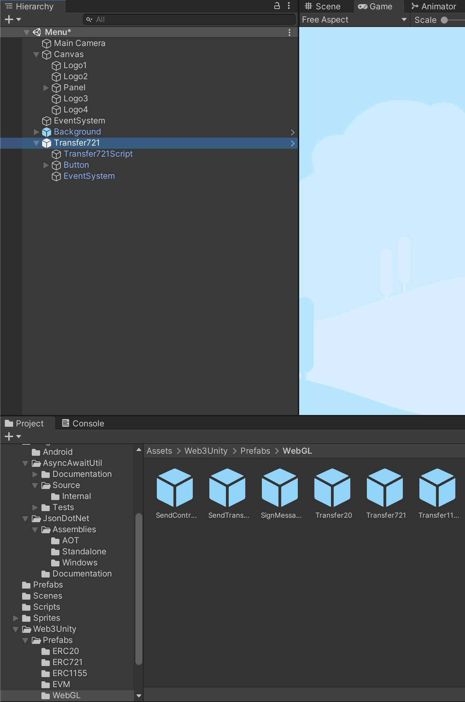
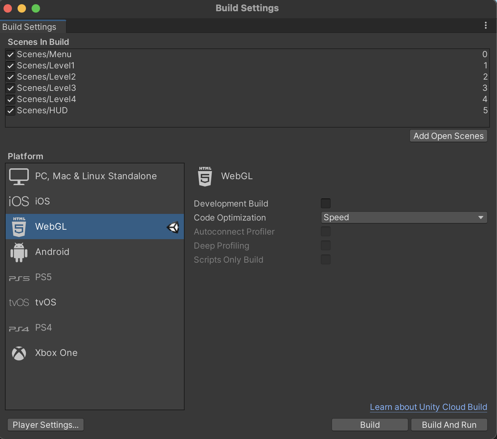
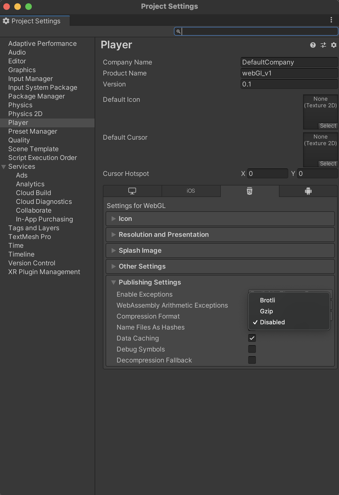

# Unity Integration Documentation

This section showcase the Chainsafe integration with Cronos chain, aiming to bring Unity games into the blockchain. Create your in game NFTs.

## Useful Links

- [Cronos official website](https://cronos.crypto.org/)
- [ChainSafe official website](https://chainsafe.github.io/)
- [Unity official website](https://unity.com/)
- [Openzeppelin](https://docs.openzeppelin.com/)
- [Remix IDE](https://remix.ethereum.org/)
- [Cronos-ChainSafe-Unity-sample](./assets/cronos-chainsafe-unity-sample.unitypackage.zip)

## Integration guide for Cronos

## Pre-requisites
1. Unity (Version 2020.3.25f1 or later)
   - You may refer to [Unity official site](https://unity3d.com/get-unity/download)
2. [Metamask browser extension](https://metamask.io/download/)
   - For Cronos mainnet, you may refer to our [metamask integration documentation](https://cronos.crypto.org/docs/getting-started/metamask.html#connecting-to-the-cronos-mainnet-beta)
   - Below is the configuration for Cronos Testnet
     - Network Name: **Cronos Testnet**
     - New RPC URL: **https://cronos-testnet-3.crypto.org:8545**
     - Chain ID: **338**
     - Currency Symbol: **TCRO**
     - Block Explorer URL: **https://cronos.crypto.org/explorer/testnet3**
   - Sufficient fund on deployer address
     - [Testnet Faucet](https://cronos.crypto.org/faucet/)

## Get Started

### Step 1. [Download the ChainSafe SDK (v1.0.14 release)](https://github.com/ChainSafe/web3.unity/releases/tag/v1.0.14)

### Step 2. [Unity] Create a new project or open an existing project in Unity
- You can also download the tutorial bolt kit from [Unity](https://assetstore.unity.com/packages/essentials/tutorial-projects/bolt-kit-platformer-tutorial-assets-168067) and import into the blank new project


### Step 3. [Unity] Drag and drop the ChainSafe SDK unity package into the root directory


  \* Remove the `Assets/Plugins/JsonDotNet/Assemblies/Standalone/Newtonsoft.Json.dll` if encountering the below error

### Step 4. [IDE] Create an ERC standard smart contract
- ERC20 example

```
// SPDX-License-Identifier: MIT
pragma solidity ^0.8.2;

import "@openzeppelin/contracts@4.4.2/token/ERC20/ERC20.sol";
import "@openzeppelin/contracts@4.4.2/access/Ownable.sol";

contract MyToken is ERC20, Ownable {
    constructor() ERC20("MyToken", "MTK") {
        _mint(msg.sender, 1000 * 10 ** decimals());
    }

    function mint(address to, uint256 amount) public onlyOwner {
        _mint(to, amount);
    }
}
```
- ERC721 example

```
// SPDX-License-Identifier: MIT
pragma solidity ^0.8.2;

import "@openzeppelin/contracts@4.4.2/token/ERC721/ERC721.sol";
import "@openzeppelin/contracts@4.4.2/access/Ownable.sol";
import "@openzeppelin/contracts@4.4.2/utils/Counters.sol";

contract MyNFT is ERC721, Ownable {
    using Counters for Counters.Counter;

    Counters.Counter private _tokenIdCounter;

    constructor() ERC721("MyNFT", "MNFT") {}

    function _baseURI() internal pure override returns (string memory) {
        return "https://opensea-creatures-api.herokuapp.com/api/creature/";
    }

    function safeMint(address to) external onlyOwner {
        uint256 tokenId = _tokenIdCounter.current();
        _tokenIdCounter.increment();
        _safeMint(to, tokenId);
    }
}

```
- ERC1155 example

```
// SPDX-License-Identifier: MIT
pragma solidity ^0.8.2;

import "@openzeppelin/contracts@4.4.2/token/ERC1155/ERC1155.sol";
import "@openzeppelin/contracts@4.4.2/access/Ownable.sol";

contract My1155Token is ERC1155, Ownable {
    constructor()
        ERC1155("https://opensea-creatures-api.herokuapp.com/api/creature/")
    {}

    function setURI(string memory newuri) public onlyOwner {
        _setURI(newuri);
    }

    function mint(address account, uint256 id, uint256 amount, bytes memory data)
        public
        onlyOwner
    {
        _mint(account, id, amount, data);
    }

    function mintBatch(address to, uint256[] memory ids, uint256[] memory amounts, bytes memory data)
        public
        onlyOwner
    {
        _mintBatch(to, ids, amounts, data);
    }
}

```
  
### Step 5. [Browser] Deploy Smart Contract via [Remix IDE](https://remix.ethereum.org/)
1. Switch the chain network to Cronos Testnet via Metamask extension or other similar provider
   
2. Select the `Injected Web3` under ENVIRONMENT tab


3. Approve the connection


4. Select your contract name under CONTRACT tab


5. Approve the transaction after clicking `Deploy` button


6. Copy the contract address

### Step 6. [Unity] Drag and drop the corresponding prefabs into the game scene

- ### ERC721
  - For example: The transfer method of ERC721 protocol. `Assets/Web3Unity/Prefabs/WebGL/Transfer721.prefab`


  - Update the `Contract` address under `Transfer721Script` object inspector  
  - Update the `To Account` address to your desired wallet address


### Step 7. [Unity] Update script to connect Cronos
  1. Update `network.js`
      - Comment out `window.infuraKey`
      - Add `window.web3NetworkId` and `window.rpc`, point to corresponding network
```
/* Mainnet */
// window.infuraKey = "2d0062a43e9e4086829df115488b45a8"
window.web3NetworkId = 25;
window.rpc = {
  25: "https://evm-cronos.crypto.org"
}
```

```
/* Testnet */
// window.infuraKey = "2d0062a43e9e4086829df115488b45a8"
window.web3NetworkId = 338;
window.rpc = {
  338: "https://cronos-testnet-3.crypto.org:8545"
}
```
  2. Update `main.xxxx.chunck.js` file under `Assets/WebGLTemplates/Web3GL-2020/static/js` directory
     - Change all `infuraKey:window.infuraKey` to `rpc:window.rpc`

### Step 8. [Unity] Build and Run
  1. Switch to WebGL platform

   
  2. Click the `Player Setting` button

  3. Select `Web3GL-2020` under `Resolution and Presentation` tab


  4. Set `Compression Format` to `Disabled` under `Publishing Settings` tab


  5. After that, click `Build and Run` button and you are ready to play


## What's next
The above guideline documentation only highlights the basic integration between ChainSafe and Cronos chain. You can download the full source code of the above sample game [here](./assets/cronos-chainsafe-unity-sample.unitypackage.zip). For other ERC protocol methods, please refer to the [ChainSafe Documentation](https://chainsafe.github.io/game-docs/).