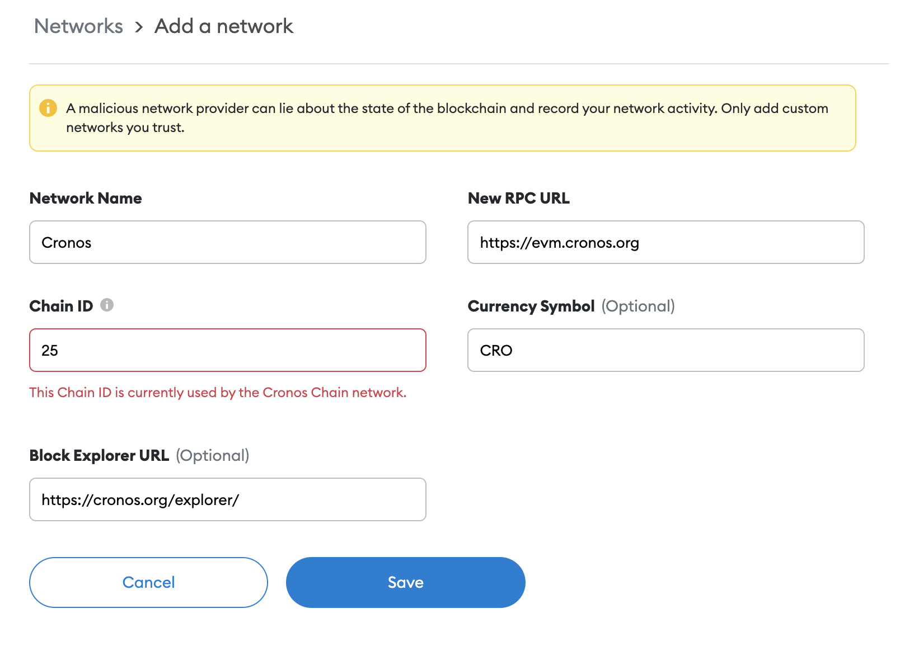

In the following step-by-step guide, you will learn how to use the Metamask chrome extension to send/receive and interact with the Cronos testnet.


## Using metamask

First of all we would need to connect the metamask with the Cronos testnet network: 

Hit the my account button in the top right corner, under **"Settings"**, select **"Networks"** 


In the **"Networks"** page, click "Add Network":


Insert the network name, for example "ethermint" ; for RPC URL put `http://localhost:8545/` and `2` for chain-id 



After saving the network config, we can move to the next step and import the key

### Export privKey

We can export the private key by using the `unsafe-export-eth-key` command, for example:

```
ethermintd keys unsafe-export-eth-key mykey --keyring-backend test
```

It will show your private, we can copy it for the next step.  

Then hit my account button in the top right corner again, select "Import Account" under "My account" on your metamask:


Paste the private from the former step here and click "Import". 


Once it has been connect, you should see the balance and may start performing transactions via metamask! 


## Address conventions 

Note that the address format in ethermint is in there form of bech32 `eth...` , we can use `ethermintd debug addr` to convert an address between hex and bech32, for example:

```
$ ethermintd keys list --keyring-backend test
  - name: mykey
    type: local
    address: eth12uqc42yj77hk64cdr3vsnpkfs6k0pllln7rudt
    pubkey: '{"@type":"/ethermint.crypto.v1alpha1.ethsecp256k1.PubKey","key":"Azy1tg0wZKRdQ7sd9mICzteCstGThiodZtQqlVT9Amlc"}'
    mnemonic: ""

$ ethermintd debug addr eth12uqc42yj77hk64cdr3vsnpkfs6k0pllln7rudt
    Address: [87 1 138 168 146 247 175 109 87 13 28 89 9 134 201 134 172 240 255 255]
    Address (hex): 57018AA892F7AF6D570D1C590986C986ACF0FFFF
    Bech32 Acc: eth12uqc42yj77hk64cdr3vsnpkfs6k0pllln7rudt
    Bech32 Val: ethvaloper12uqc42yj77hk64cdr3vsnpkfs6k0pllldvagr4

$ ethermintd debug addr 57018AA892F7af6D570D1c590986c986aCf0fFff
    Address: [87 1 138 168 146 247 175 109 87 13 28 89 9 134 201 134 172 240 255 255]
    Address (hex): 57018AA892F7AF6D570D1C590986C986ACF0FFFF
    Bech32 Acc: eth12uqc42yj77hk64cdr3vsnpkfs6k0pllln7rudt
    Bech32 Val: ethvaloper12uqc42yj77hk64cdr3vsnpkfs6k0pllldvagr4
```


## Importing private key to metamask
