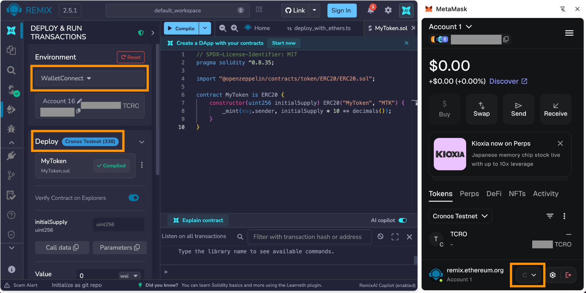

# ✈️ 5-Minute Quick Start with Remix IDE

This guide walks you through deploying a smart contract on Cronos EVM using[ Remix IDE](https://remix.ethereum.org), no local setup required.

### Prerequisites

Before proceeding, ensure the following:

* A browser wallet (e.g. MetaMask): Installed and configured. To add Cronos mainnet, visit https://docs.cronos.com/for-users/metamask#connecting-with-metamask.
* Remix IDE: Accessible via[ Remix Ethereum IDE](https://remix.ethereum.org/).
* A small amount of CRO: To pay for gas fees. (For testnet TCRO, use the faucet at[ https://faucet.cronos.com/](https://faucet.cronos.com/).)

### Step 1. Open Remix IDE

Go to[ https://remix.ethereum.org](https://remix.ethereum.org).

In the File Explorer tab, you will see a contracts/ folder with some sample files. You can use one of these or create a new file.

### Step 2. Create and write your contract

Click the New File icon and name it MyToken.sol. Paste in the following example, a simple ERC-20 token using OpenZeppelin:

```solidity
// SPDX-License-Identifier: MIT
pragma solidity ^0.8.35;

import "@openzeppelin/contracts/token/ERC20/ERC20.sol";

contract MyToken is ERC20 {
    constructor(uint256 initialSupply) ERC20("MyToken", "MTK") {
        _mint(msg.sender, initialSupply * 10 ** decimals());
    }
}
```

Remix resolves the OpenZeppelin import automatically, no manual installation needed.

### Step 3. Compile the contract

1. Click the Solidity Compiler tab in the left sidebar.
2. Set the compiler version to the latest stable version (or match the pragma in your file).
3. Click Compile MyToken.sol.

<figure><figcaption></figcaption></figure>

A green checkmark confirms the compilation succeeded. Errors and warnings will appear below the compile button.

### Step 4. Connect Remix to Cronos

1. Click the Deploy & Run Transactions tab.
2. In the Environment, select WalletConnect, and choose your browser wallet.
3. Approve the connection in the browser wallet when prompted.
4. Set the network in the browser wallet, and confirm the network information shown in Deploy.



### Step 5. Deploy the contract

1. In the Deploy section, select MyToken.
2. Enter the initial token supply (e.g. 1000000 for 1,000,000 tokens) and other information.
3. Click Deploy.
4. A MetaMask transaction will pop up, review the transaction data and click Confirm.
5. Once confirmed, the deployed contract address will appear under Deployed Contracts in Remix.


### Step 6. Check on Cronos Explorer

Copy the contract address from Remix and look it up on[ Cronos Explorer](https://explorer.cronos.com/) to confirm the deployment, view transactions, and inspect contract state.

### Step 7. Interact with your contract

Expand the deployed contract in Remix to see its functions:

* `balanceOf`: enter a wallet address to check its token balance.
* `transfer`: send tokens to another address.
* `totalSupply`: view the total token supply.
