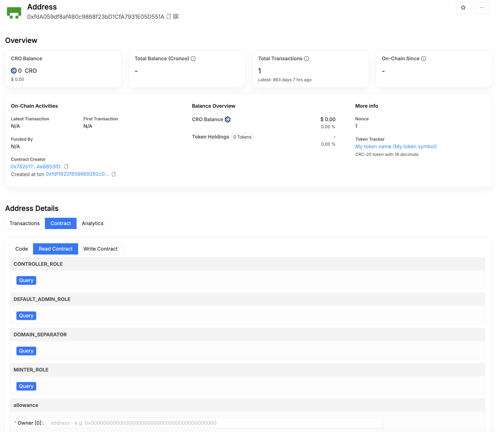

# ⚖️ Contract Verification

In order to enable users and fellow developers to do their own research, it is imperative that you publish your smart contract code on Cronos Explorer. This is called verifying your contracts.

The new Cronos Explorer supports smart contract verification either through the web interface or programmatically via Hardhat (we recommend to use Hardhat).

<figure><figcaption><p>Cronos Explorer screenshot</p></figcaption></figure>

#### **Contract Verification Via Explorer Interface:**

For verification via the web interface, visit the following URLs:

* Mainnet: [https://explorer.cronos.com/verifyContract](https://explorer.cronos.com/verifyContract)
* Testnet: [https://explorer.cronos.com/testnet/verifyContract](https://explorer.cronos.com/testnet/verifyContract)

After the contract verification is complete, the Cronos Explorer will display details about your smart contract code like shown below.

<figure><figcaption><p>Cronos Explorer screenshot</p></figcaption></figure>

#### Contract Verification Via Explorer API:

[Cronos Explorer](https://explorer.cronos.com/) is powered by [Blockscout](https://github.com/blockscout/blockscout) and supports contract verification via the Blockscout Etherscan-compatible API. This allows you verify contracts programmatically as part of your deployment script, without using the UI.

**Step 1: Get an API key**

An API key is required to use the verification API.

1. Register an account at [Cronos Explorer Account Registration](https://explorer.cronos.com/register).
2. Verify your email address.
3. Sign in and go to your account dashboard.
4. Click **My API Keys** to view your default API key, which is assigned automatically on registration.

**Step 2: Prepare your contract details**

Before calling the API, gather the following from your deployment:

* **Contract address**: the deployed contract address on Cronos EVM.
* **Contract name**: the name of the contract (e.g. `MyContract`).
* **Compiler version**: the version used to compile the contract (e.g. `0.8.23`).
* **Constructor arguments**: ABI-encoded constructor arguments, if any.
* **Standard JSON input**: the JSON input used to compile the contract. See the [Solidity documentation](https://docs.soliditylang.org/en/latest/using-the-compiler.html#input-description) for the format. For Hardhat projects, the Standard JSON input is in `artifacts/build-info/*.json`.

**Step 3: Submit verification via API**

**Endpoint**

* Mainnet

```
POST https://explorer-api.cronos.org/mainnet/api/v2?apikey={apikey}
```

* Testnet

```
POST https://explorer-api.cronos.org/testnet/api/v2?apikey={apikey}
```

**Parameters**

* `module` (required): set to `contract`.
* `action` (required): set to `verifysourcecode`.
* `contractname` (required): contract name.
* `contractaddress` (required): deployed contract address.
* `compilerversion` (required): compiler version (e.g. `0.8.23`).
* `constructorArguments` (optional): ABI-encoded constructor arguments.
* `codeformat` (required): set to `solidity-standard-json-input`.
* `sourceCode` (required): the Standard JSON input as a string.

**Example**


```shell
curl --location 'https://explorer-api.cronos.org/mainnet/api/v2?apikey={apikey}' \
 --header 'Content-Type: application/x-www-form-urlencoded' \
 --data-urlencode 'module=contract' \
 --data-urlencode 'action=verifysourcecode' \
 --data-urlencode 'contractname={contractname}' \
 --data-urlencode 'contractaddress={contractaddress}' \
 --data-urlencode 'compilerversion={compilerversion}' \
 --data-urlencode 'constructorArguments={constructorArguments}' \
 --data-urlencode 'codeformat=solidity-standard-json-input' \
 --data-urlencode 'sourceCode={"language":"Solidity","sources":{"contracts/test.sol":{"content":"..."}},"settings":{"viaIR":true,"optimizer":{"enabled":true,"runs":1},"evmVersion":"paris","outputSelection":{"*":{"*":["evm.bytecode","evm.deployedBytecode","devdoc","userdoc","metadata","abi"]}}}}'
```


A successful response returns a GUID for checking the verification status:

```json
{
  "status": "1",
  "message": "OK",
  "result": "a1c52885-740d-4de5-9068-22001bde8307"
}
```

**Check verification status**


```shell
curl --request GET 'https://explorer-api.cronos.org/mainnet/api/v2?module=contract&action=checkverifystatus&guid={guid}&apikey={apikey}'
```


Possible responses:

* `Pending in queue`: the request is still being processed.
* `Pass - Verified`: the contract has been verified successfully.
* `Fail - Unable to verify`: verification failed. Check your source code and compilation settings.
* `Unknown UID`: the GUID was not recognised. Check that you are using the correct GUID from the verification response.

#### **Contract Verification Via Remix and Explorer:**

For contracts developed in Remix, developers can follow the steps below to verify them on the Explorer:

1. Compile the contract.
2. Download the JSON file under `artifacts/build-info/` , and please ensure the file follows this [format](https://docs.soliditylang.org/en/latest/using-the-compiler.html#input-description).
3. Go to the Explorer Contract Verifier introduced in the previous section, fill in the required information, upload the JSON file and verify it on Cronos Explorer.

#### **Contract Verification Via Foundry:**


[foundry-integration.md](framework-integration/foundry-integration.md)


#### **Contract Verification Via Hardhat 3:**


[hardhat-3-integration.md](framework-integration/hardhat-3-integration.md)


#### **Contract Verification Via Hardhat 2:**


[hardhat-2-integration.md](framework-integration/hardhat-2-integration.md)

