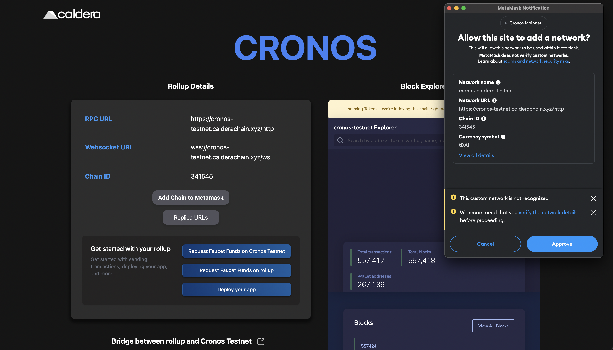
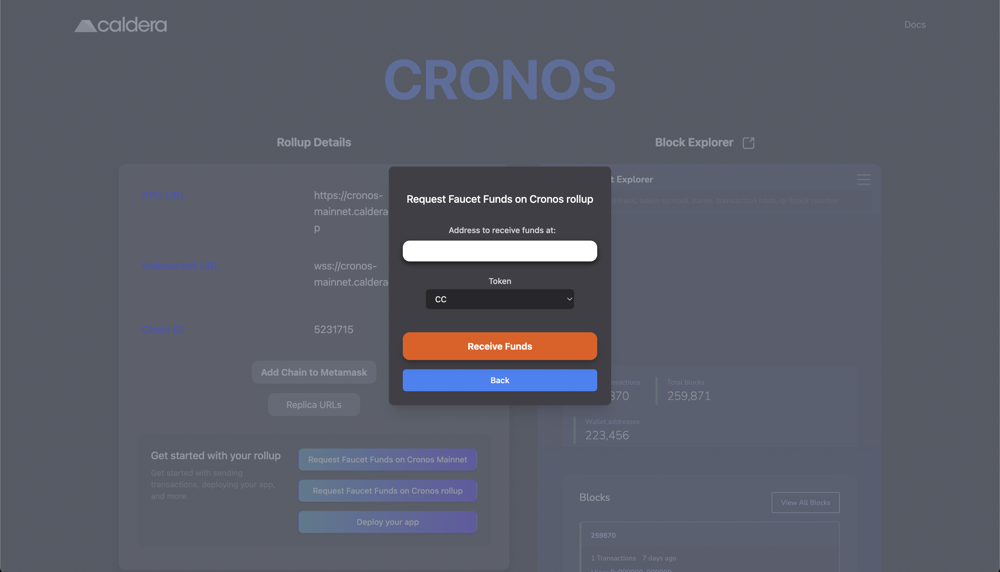
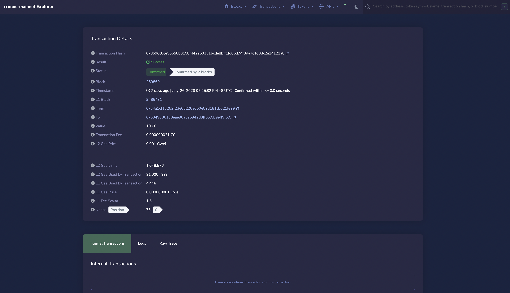

# Caldera

## What does Caldera do?&#x20;

Caldera specializes in building high-performance, customizable, and application-specific layer-two blockchains. These custom-built blockchains **(Caldera Chains)** offer high throughput, low latency, and customizable features for optimizing the performance and user experience of decentralized applications, with the ability to process hundreds of transactions per second and sub-second confirmation times.

## How does Caldera do it?

We create _**Caldera Chains**_ which are custom-built optimistic rollups. These rollups are:

1. **Fast:** Process hundreds of transactions per second with sub-second confirmation times
2. **Highly Customizable:** Features such as address whitelist or sustainable revenue generation.
3. **Ethereum Compatible:** Runs standard Ethereum smart contract code without modification

For more info on how Caldera works visit, the [Caldera docs](https://calderaxyz.gitbook.io/caldera-documentation/getting-started/overview)

## Getting Started with Caldera L2 Testnet

Let's take a look at how we can start using Caldera L2 Testnet, which is a rollup on the Cronos Testnet.

1. Visit: [https://cronos.caldera.dev/](https://cronos.caldera.dev/)
2. Add chains to metamask via the "add to metamask button"

<figure><figcaption></figcaption></figure>

3. Request testnet tokens via the faucet. \
   If you want to send transactions on Caldera, then choose **"Request Faucet funds on rollup"**, \
   if you want to send from Cronos to Caldera, then choose **"Request Faucet funds on Cronos "** \
   Now type in your address you wish to receive funds on and click "**receive Funds"**

<figure><figcaption></figcaption></figure>

4. When you send transactions via Metamask on the Caldera explorer, you can view these transactions using the caldera explorer: [https://cronos-testnet.calderaexplorer.xyz/](https://cronos-testnet.calderaexplorer.xyz/).\
   \
   For example the Faucet Transaction, which you may recognize is a similar interface to what other EVM blockscout explorers use:

<figure><figcaption></figcaption></figure>

5. From here on you can start building just like you would on another L2 optimistic rollup. You can deploy your application onto a Caldera Chain via the same means as any Ethereum-compatible blockchain. For more tutorials on how to deploy on Caldera, visit the [Caldera docs](https://calderaxyz.gitbook.io/caldera-documentation/getting-started/deploy-on-a-caldera-chain)\

6. In order to deploy on mainnet, you can use:

* &#x20;[https://cronos-mainnet.caldera.dev/](https://cronos-mainnet.caldera.dev/)
* [https://cronos-mainnet.calderaexplorer.xyz/](https://cronos-mainnet.calderaexplorer.xyz/)\
  \
