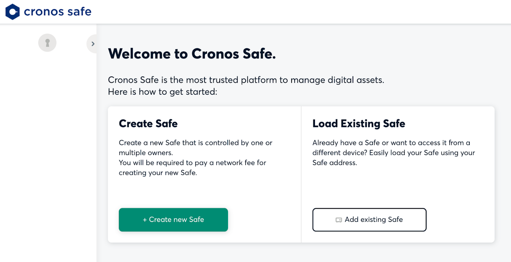
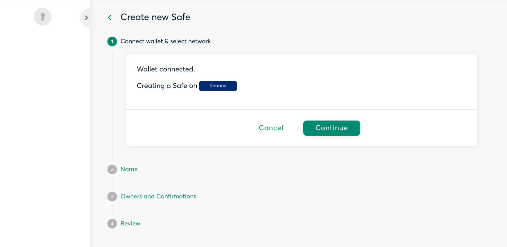
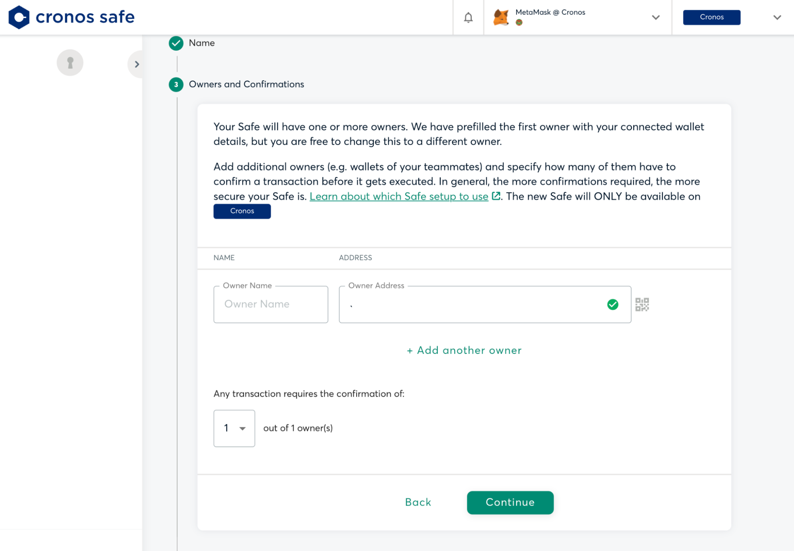
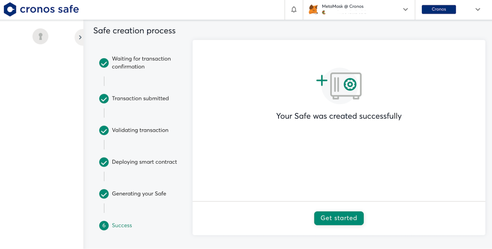
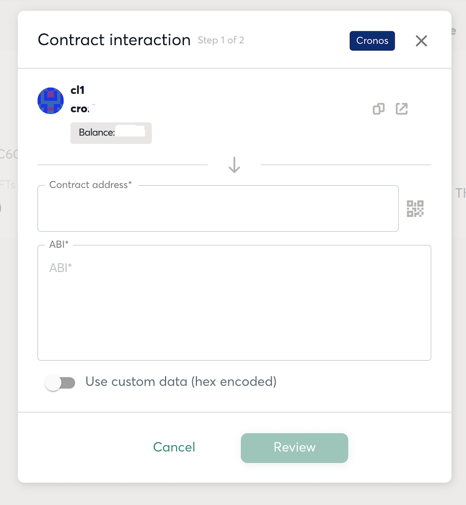

# Cronos Safe

## Introduction

DApp developers can protect themselves against the potentially disastrous consequences of the compromise of a single private key, by assigning a multi-signature smart contract wallet as the owner and admin of a dApp. With the open-source community support from Protofire, Cronos Safe offers an easy-to-use implementation of the “Safe” Multisig Wallet user interface and smart contracts on the Cronos chain, which is a perfect tool for DApp developers to Enhance the Security of your dApps. While you can verify independently that the Cronos Safe smart contracts are identical to the official Safe smart contracts, please note that you are using them at your own risk. Cronos Safe is not officially supported by Cronos or Cronos Labs.

## Design the Governance of the Wallet

Each Safe wallet is going to require a set of owners, and a transaction approval policy:

1\) The owner set is the list of wallet addresses who are authorized to sign confirmations for any transaction emanating from the Safe wallet. 2) The transaction approval policy specifies how many confirmations are needed to authorize a transaction. For example, the policy may specify that 3 confirmations out of 5 owners are needed in order to authorize a transaction.

It is important to be thoughtful about the approval policy and the operational measures in place in order to safeguard the security of the private keys of each of the owner addresses.

## Setting up a Cronos Safe wallet

You can visit Cronos Safe (cronos-safe.org) to access the user interface of the Safe deployment on Cronos chain.

Click “Create Safe”, connect your wallet, and follow the instructions. You can connect to the Cronos Safe dApp with MetaMask, or with the Crypto.com DeFi Wallet via WalletConnect.

<figure><figcaption></figcaption></figure>

<figure><figcaption></figcaption></figure>

<figure><figcaption></figcaption></figure>

<figure><figcaption></figcaption></figure>

In the next step, you will review the details of your Safe on Cronos and will have to confirm a transaction with your currently connected wallet. The creation will cost approximately 2.58267 CRO. The exact amount will be determined by your wallet.

<figure><figcaption></figcaption></figure>

<figure><figcaption></figcaption></figure>

Now you would be able to use the newly created Safe on Cronos. If you send assets on other networks to this address, you will not be able to access them.

As an additional safety measure, please make sure that you check the addresses of the smart contracts that you are interacting with when you are asked to sign transactions.

## **Integrate the Safe with your dApp**

The Cronos Safe dashboard shows the Cronos address and balance of your newly created Safe.

<figure><figcaption></figcaption></figure>

Test a few small transfers on your end to verify that you are able to control the Safe wallet. You can now send more funds to this address, or assign this address as owner/admin of your dApp smart contracts as required. When you click on “New transaction” the Safe user interface allows you to send CRO, ERC20 tokens or NFTs. You can also call smart contract methods by declaring the ABI of your smart contract:

<figure><figcaption></figcaption></figure>

<figure><figcaption></figcaption></figure>

## **Cronos Safe smart contracts**

Cronos Safe smart contracts were deployed using a deterministic deployment proxy factory and create2 op\_code. The address of each smart contract is calculated based on the proxy address and the contract bytecode. As a result, Cronos Safe contract addresses are the same as on the other chains that have Gnosis Safe deployments, which means that their bytecodes are identical.

The addresses of deployed contracts can be found in Gnosis Safe deployments repository (https://github.com/safe-global/safe-deployments/tree/main/src/assets/v1.3.0). The smart contracts deployed to Cronos mainnet have been verified on Cronoscan.

***

## Resources

Here are several additional resources related to Cronos Safe:

* [Cronos Safe Twitter account](https://twitter.com/cronossafe)
* [Gnosis Safe deployments repository](https://github.com/safe-global/safe-deployments/tree/main/src/assets/v1.3.0)
