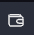
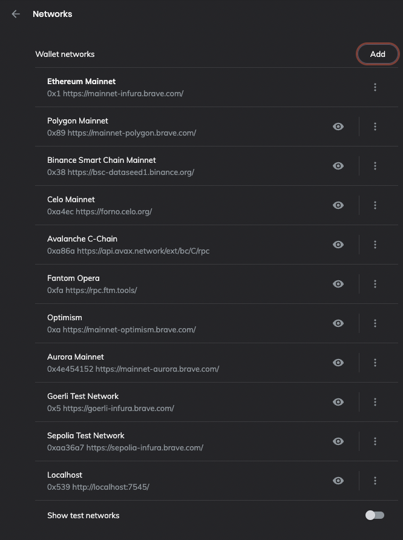
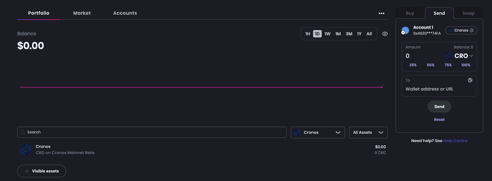

# 🦁 Brave Wallet

In this guide, you will learn how to use the Brave Wallet on Brave to interact with the Cronos network.

## Add Cronos to the Brave Wallet

Let's connect your Brave Wallet to the Cronos network:

* **Step 1** \
  On the top right side of the Brave browser, click the  (Wallet) icon. \
  If you don’t see it? Click **Update** in the toolbar for the latest version of Brave. \

* **Step 2**\
  Now follow the wizard to either **create a new wallet** or **import an existing wallet.** Once you have your wallet ready, click the **three dots** in the upper right corner of your wallet view and go to "**settings".** \
  \

* **Step 3**\
  In the settings page, under the"**Wallet"** tab**,** click **"Networks".**  Alternatively, you can visit `brave://settings/wallet/networks` in the browser URL.

<figure><figcaption></figcaption></figure>

* **Step 4**\
  Now in the list of networks, click "**Add**" in the top right corner to add a Cronos network.\


<figure><figcaption></figcaption></figure>

* **Step 5**\
  A new window to add config for a new network will pop up. \
  Under "**Search network**", select "**25  Cronos Network"** from the drop-down menu for Cronos Mainnet or "**338 Testnet"** for testnet.  Now, most fields should be pre-populated, as shown below:

<figure><figcaption></figcaption></figure>

* In order to display the Cronos logo, set the "**Icon URLs**" field to[ ](https://cronos.org/favicon.png)

```
https://cronos.org/favicon.png 
```

and click **"Submit".**\


* **Step 6**\
  Congratulations, we should now be able to see the Cronos network in the wallet view.&#x20;

<figure><figcaption></figcaption></figure>


