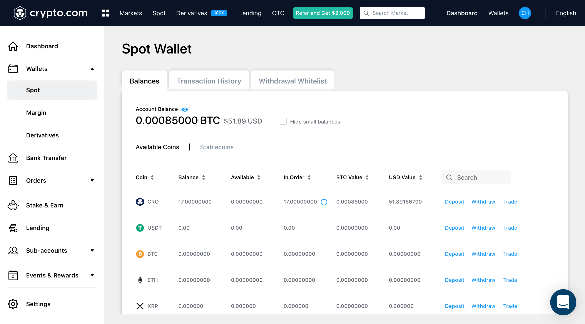
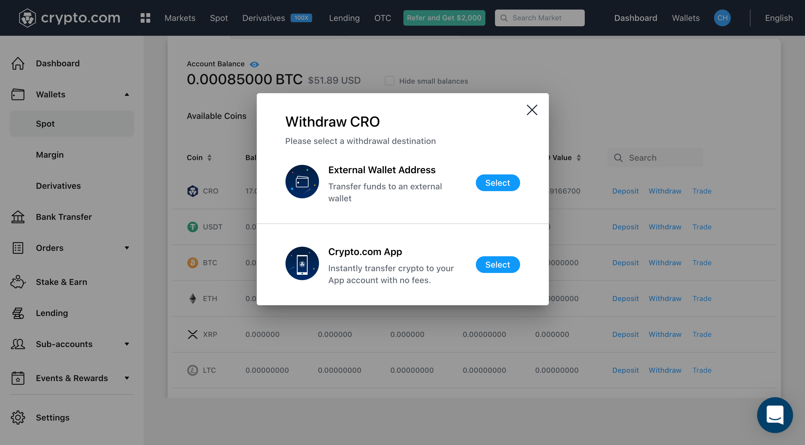
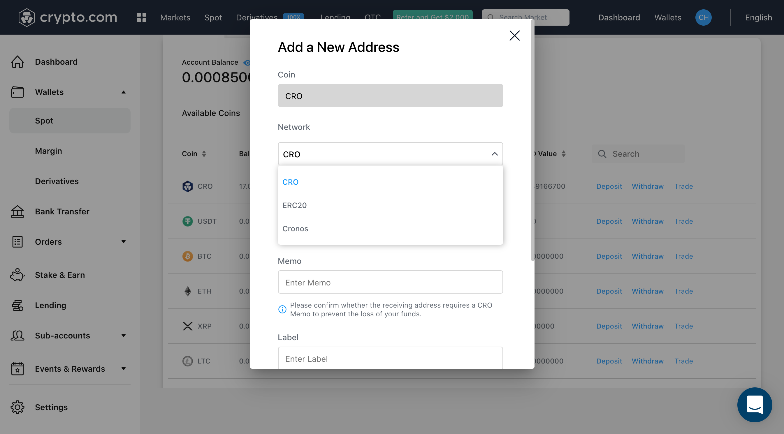

# From the Crypto.com Exchange

## Transfer assets using the Crypto.com Exchange

### Step-by-step walkthrough

**Step 1**: Select the asset that you would like to bridge in your Spot Wallet and click "**Withdraw**".

**Step 2**: Select “**External Wallet Address**”

**Step 3**: Select “**Add Withdrawal Address**”

**Step 4**: Select the Cronos Network, add your Cronos wallet address, and save it

**Step 5**: Select the Cronos wallet address that you have whitelisted and input the withdrawal amount

**Step 6**: Review your withdrawal information and click “**Review Withdrawal”**. You will then be taken to another page for you to confirm your withdrawal information and type in your 2FA code to finalise your withdrawal. Your assets will appear in your Cronos wallet within a few minutes of withdrawal confirmation.
