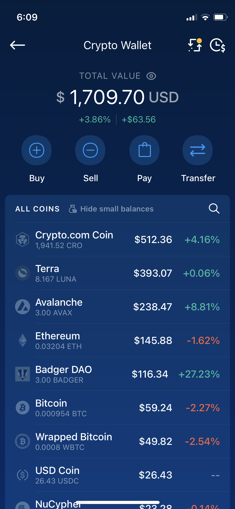
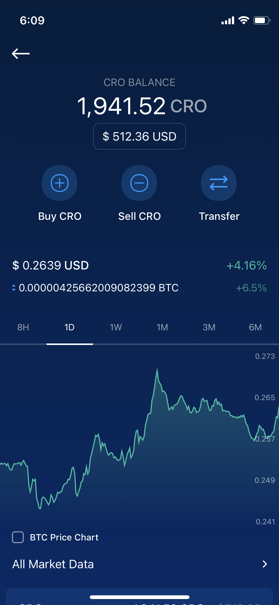
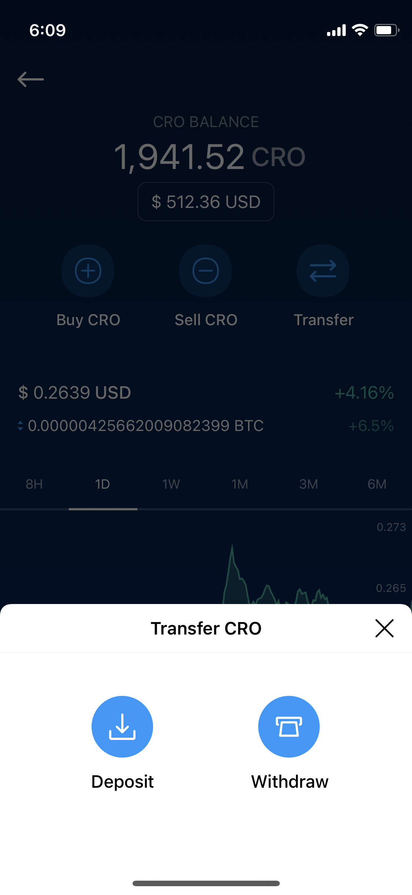
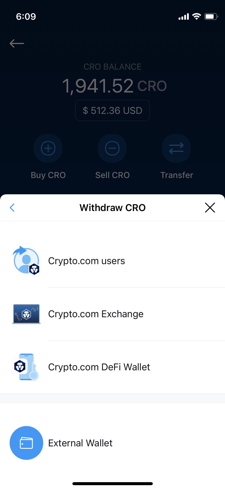
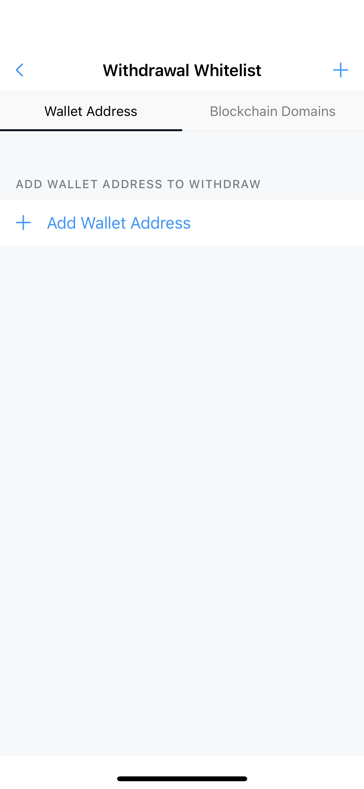
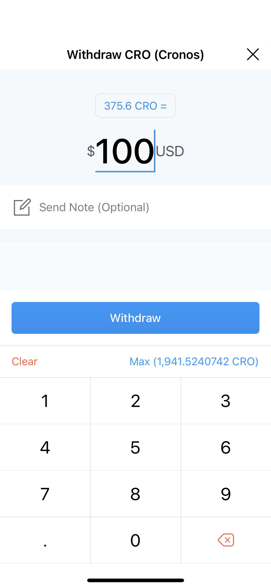

# From Crypto.com App

## Transfer assets using Crypto.com App

The Crypto.com App will be able to seamlessly transfer selected assets over to Cronos on Day 1. The withdrawal process will be exactly the same as how you would transfer funds to a separate chain.

**Supported assets on Day 1**: CRO, USDT, USDC, DAI, ETH, WBTC

Only selected tokens mentioned above will be available for withdrawal into Cronos on Day 1 of Cronos Mainnet.

### Step-by-step Walkthrough

**Step 1**: Select the token that you want to withdraw from your Crypto Wallet Only selected tokens mentioned above will be available for withdrawal into Cronos on Day 1 of Cronos Mainnet. 

**Step 2**: Click on “Transfer” and “Withdraw”

 

**Step 3**: Select “External wallet” and whitelist your Cronos wallet address  

**Step 4**: Select Cronos Network and paste in your Cronos wallet address

You should have a Cronos wallet address ready at this point (Either on Metamask, Crypto.com DeFi Wallet or any other wallet supporting the Cronos chain). No memo is required to withdraw your funds to Cronos. Once you have confirmed that your Cronos wallet address is accurate, click “Continue” 

**Step 5**: Select your newly whitelisted Cronos wallet address and input the amount of assets that you wish to withdraw After entering the amount that you wish to withdraw, click the “Withdraw” button. Once you click Withdraw, you will be prompted to enter your Password and 2FA (If enabled). 

**Step 6**: Confirm your Transfer and click confirm
