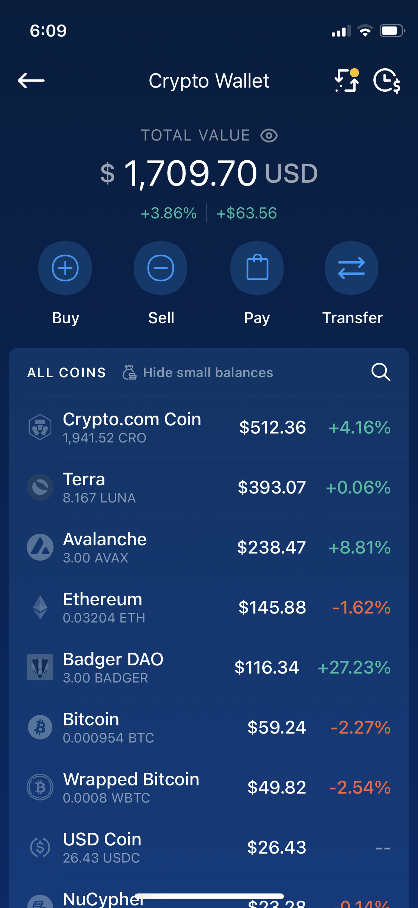
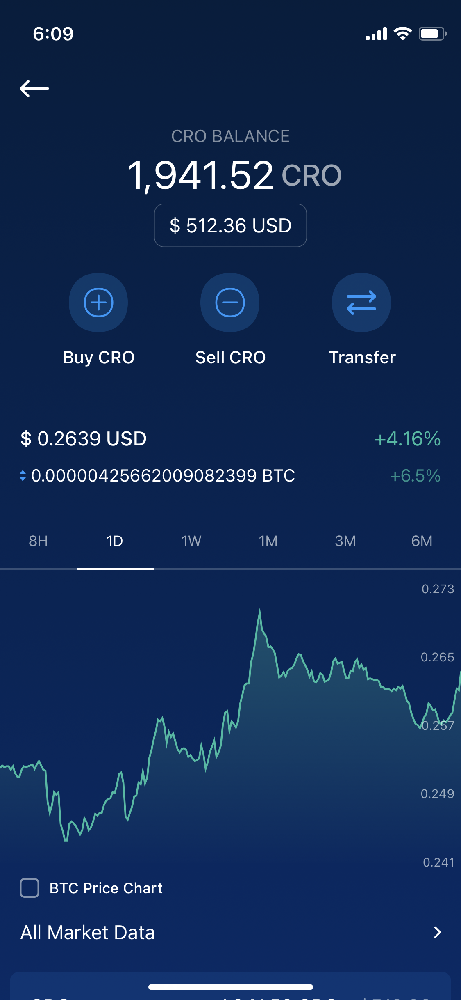
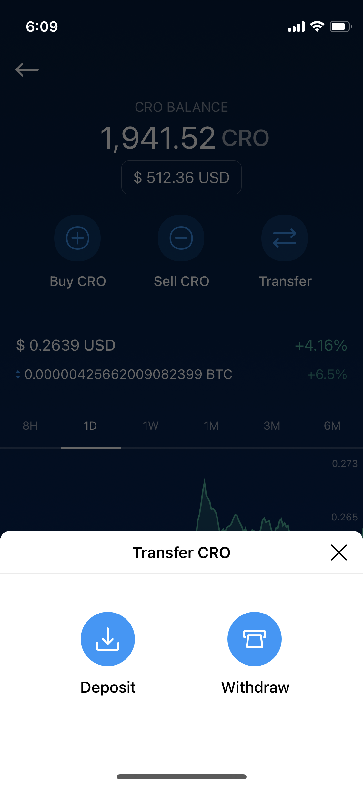
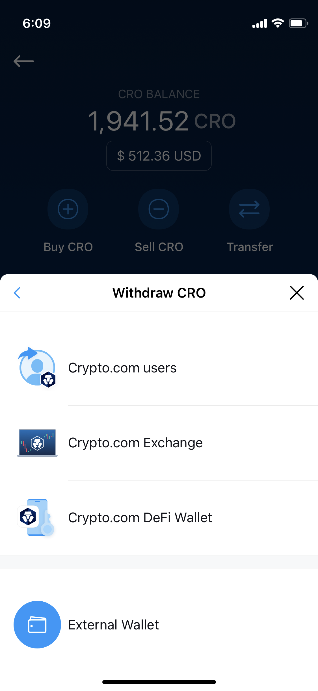
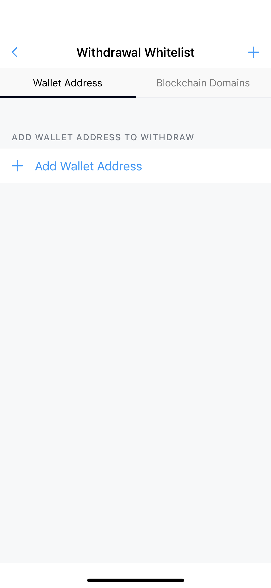
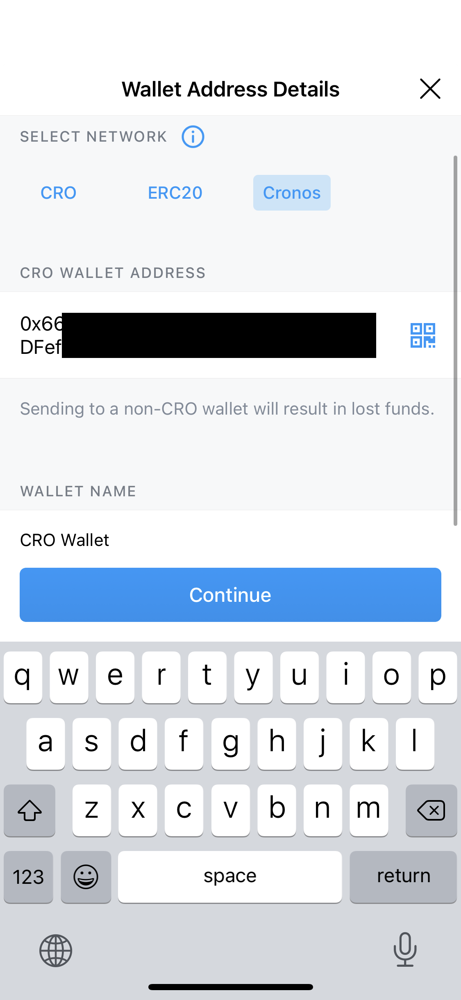
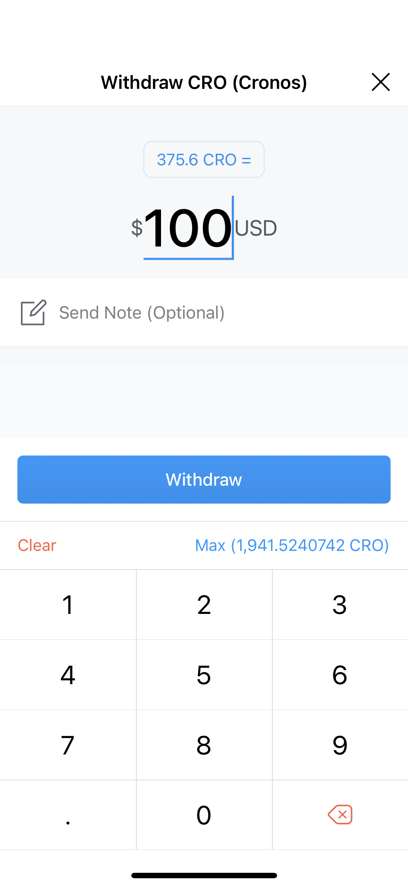

# Centralized Exchanges: Crypto.com App Deposit & Withdrawal

Within the Crypto.com App, you can withdraw $CRO or any of dozens of cryptocurrencies to your self-custodial cryptocurrency wallet on the Cronos (CRC20) blockchain.

For a complete list of available assets to withdraw, please refer to the Help Centre [help page](https://help.crypto.com/en/articles/5978017-what-should-i-know-about-cryptocurrency-deposits-and-withdrawals).

## Transfer assets using the Crypto.com App

### Step-by-step walkthrough

**Step 1**: Select the token that you would like to withdraw from your Crypto Wallet.

**Step 2**: Click on “**Transfer**”, then “**Withdraw**”

 

**Step 3**: Select “**External Wallet**” and whitelist your Cronos wallet address.

 

**Step 4**: Select the Cronos network and paste your Cronos wallet address .

You should have a Cronos wallet address ready at this point (either on MetaMask, Crypto.com Onchain Wallet, or any other wallet supporting Cronos). No memo is required to withdraw your funds to Cronos. Once you have confirmed that your Cronos wallet address is accurate, tap “**Continue**”.

**Step 5**: Select your newly whitelisted Cronos wallet address and input the amount of tokens that you wish to withdraw. After entering the amount, tap “**Withdraw**”. You will then be prompted to enter your password and 2FA code (if enabled).

**Step 6**: Tap '**Confirm**' to make the transfer
