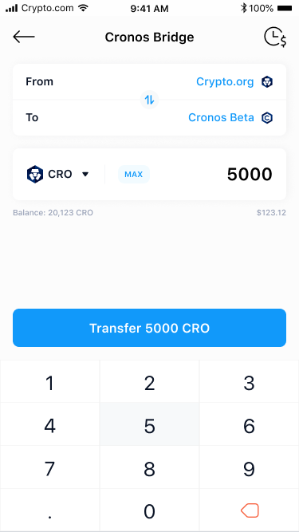

# From Crypto.org Chain (Crypto.com DeFi Wallet)

## Transfer assets from Crypto.org Chain using Crypto.com DeFi Wallet in-built Cronos bridge UI

Crypto.com DeFi Wallet has integrated with the Cronos Bridge and has provided a front-end UI to allow all of its wallet users to seamlessly transfer assets over to Cronos straight from the DeFi Wallet. Here’s how you can do so:

### Step-by-step Walkthrough

**Step 1**: Accessing the Cronos Bridge on the DeFi Wallet

You can access the Cronos Bridge either on the DeFi Wallet homepage or directly in your CRO balance page

 

**Step 2**: Select “From” Crypto.org Chain as the origination chain and “To” Cronos as the destination chain

Only the `Crypto.org Chain <=> Cronos bridge` will be available on Day 1. The `Ethereum <=> Cronos` bridge will not be available till the Cronos Gravity Bridge goes live. As a user of the Crypto.com DeFi wallet, you will automatically have a Crypto.org Chain wallet address and Cronos chain wallet address created for you. These wallet addresses will automatically be detected by the Cronos bridge.

 

**Step 3**: Enter the amount of asset you want to transfer

Once you have selected the token you want to transfer (CRO), you will have to enter the amount you want to transfer. The balance of CRO tokens you have on the Crypto.org Chain will automatically be detected.

During the promotional launch period, the network fee incurred by the bridge will be waived. You will still be liable to pay a gas fee directly on your preferred wallet charged by the source network.

**Step 4**: Confirm the transaction

Upon clicking “Transfer CRO”, a confirmation page will appear showcasing the Network Fee and Bridge Fee. Click “Confirm to Transfer” to proceed with the transfer.

**Step 5**: Await for Bridge confirmation

Once you click confirm, you will be taken to an overview page showcasing the status of your bridge transfer. The bridging process typically takes around 1 minute to complete.

**Step 6**: Bridge transfer completed!

A “Completed” message will be displayed confirming that the transaction has been completed successfully. You should now see the corresponding value of CRO that you transferred from your Crypto.org Chain wallet on your Cronos wallet. You may click on the transaction IDs which will link you to the explorer for more information regarding the transfer.

Alternatively, you may view your transaction history on the upper right hand corner of the DeFi Wallet’s Cronos Bridge landing page to check the status of any pending transactions or details of past transactions.

