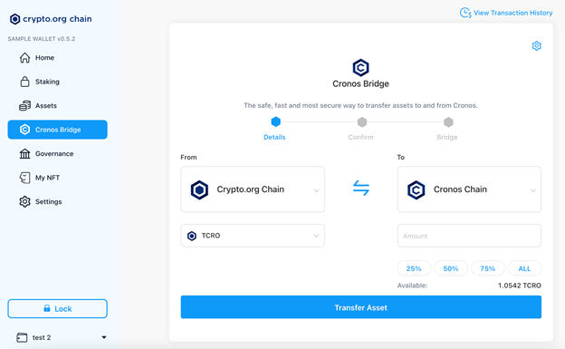

# From Crypto.org Chain (Crypto.org Chain Desktop Wallet)

## Transfer assets from Crypto.org Chain using Crypto.org Chain Desktop Wallet

Crypto.org Chain Desktop Wallet has integrated with the Cronos Bridge to allow all of its wallet users to seamlessly transfer assets over to Cronos straight from the Crypto.org Chain Desktop Wallet. Here’s how you can do so:

### Step-by-step Walkthrough

**Step 1**: Select the Cronos Bridge option on the left hand panel 

**Step 2**: Select “From” Crypto.org Chain as the origination chain and “To” Cronos Chain as the destination chain

Only the `Crypto.org Chain <=> Cronos` route will be available on Day 1. The `Ethereum <=> Cronos` route will not be available till the Cronos Gravity Bridge goes live. As a user of the Crypto.org Chain Desktop Wallet, you will automatically have a Crypto.org Chain wallet address and Cronos Chain wallet address created for you. These wallet addresses will automatically be detected by the Cronos bridge.

**Step 3**: Enter the amount of CRO you want to transfer and click “Transfer Asset”

You will be able to verify the amount that you will receive and your Cronos address after entering the amount of CRO that you want to transfer. Click “Transfer Asset” and enter your Password to proceed.

**Step 4**: Confirm the transaction

You will be given an overview of the bridge transaction, including the network fees that you will have to pay for the transaction.Once you have confirmed the CRO amount and the destination address, click “Confirm” to proceed.

Please note that once you’ve clicked the “Confirm” button, there will be no going back.

**Step 5**: Await for Bridge confirmation

After the transfer is initiated, the CRO will be bridged from the Crypto.org Chain to the Cronos Chain. The bridging process typically takes about a few minutes to complete. Once it’s done, you will see an updated balance in your receiving Cronos address.

Additionally, you will be able to view the Transaction in further details by clicking the transaction hash which directs you to the Crypto.org Chain explorer.And you can always review your latest bridge transfer history by clicking the icon at the top-right corner.

 
