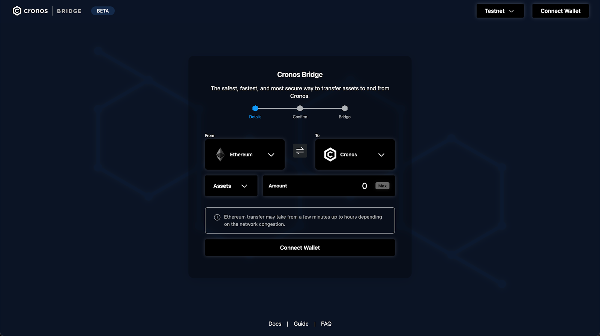
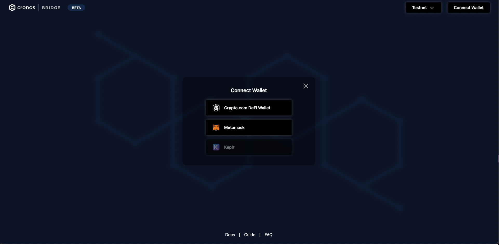
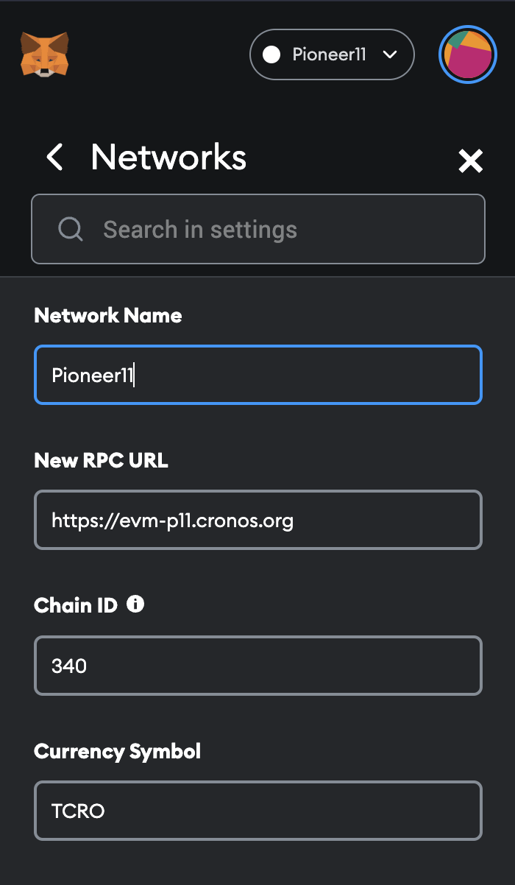
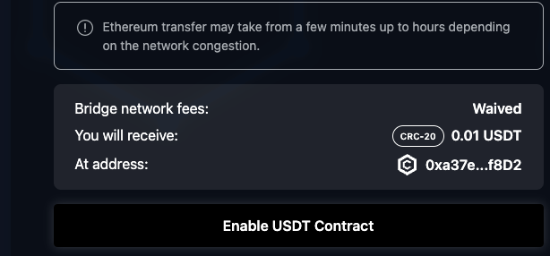
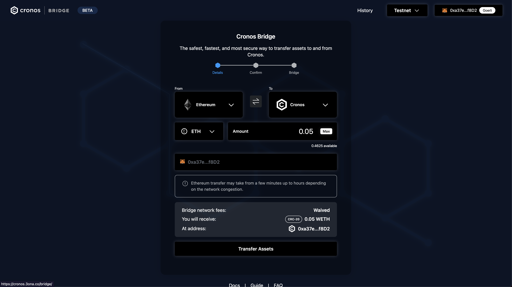
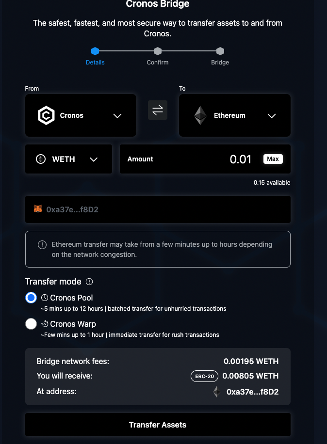
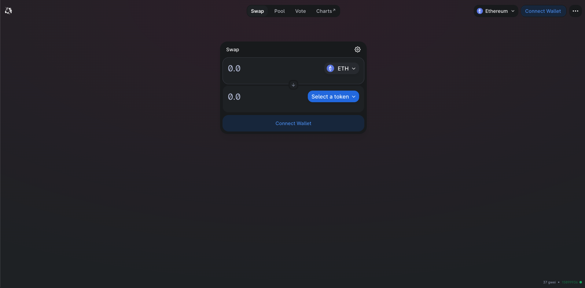
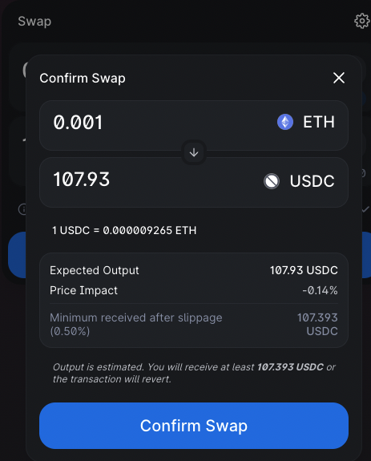

# Via the Gravity Bridge Web App - Testnet only

## Transfer assets between Ethereum testnet and Cronos testnet using the Gravity Bridge Web App

### Introduction

::: danger Risk and disclaimer
Please read the guide carefully and review the project documentation as misuse may cause incorrect transfer or even loss of assets. We recommend transferring a small amount first to get yourself acquainted with the bridge before moving significant amounts. We are **NOT** responsible for any losses incurred while using the bridge! Use at your own risk.
:::

The Gravity Bridge now makes it possible to transfer assets between the Cronos and the Ethereum network. The Gravity Bridge (Beta) for Testnet can be found [here](https://cronos.org/bridge/). Make sure to switch to the Testnet.

The Gravity Bridge is derived from a Cosmos community open-source project, called [PeggyJV gravity bridge](https://github.com/PeggyJV/gravity-bridge). The gravity bridge technology allows the transfer of ERC20 cryptocurrency tokens from and to Ethereum through a mint/lock mechanism. 

This means that:
When a user sends assets from Ethereum to Cronos, the corresponding ERC20 token is locked in a smart contract on the Ethereum side, and minted on the Cronos side in the form of a CRC20 token.
When a user sends assets from Cronos to Ethereum, the corresponding CRC20 token is burned on the Cronos side, and the ERC20 token is released on the Ethereum side.

#### Currently supported tokens from [Goerli Testnet]:
- WETH
- WBTC
- USDC
- USDT
- DAI

| ERC20 | Goerli                                     | Pioneer11                                  | 
| ------|------------------------------------------- | ------------------------------------------ |
|  USDC | 0xD87Ba7A50B2E7E660f678A895E4B72E7CB4CCd9C | 0x8a8DfedBF6650737DFf63c2f455ecC54AcEcF197 |
|  WETH | 0xB4FBF271143F4FBf7B91A5ded31805e42b2208d6 | 0x17774909725bA203B8501C1DEb22F2495584197e |
|  USDT | 0xe802376580c10fE23F027e1E19Ed9D54d4C9311e | 0xA5e7cD85b15586ecb8DA34AcEE42FF83ABcB555b |
|  WBTC | 0xC04B0d3107736C32e19F1c62b2aF67BE61d63a05 | 0x7825cB7feEAD896241f748c89550F3D01AF51e48 |
|  DAI  | 0xdc31Ee1784292379Fbb2964b3B9C4124D8F89C60 | 0x71339a9C403383c3E18712130615d369Ff9a7124 |

#### Currently supported wallets:
- Metamask
- Crypto.com DeFi Wallet

We are constantly working on adding new tokens and chain support. If you have any feedback and issues, please drop us an email at product.bridge@crypto.org.

### How to use the Gravity Bridge [Web Dapp]

#### 1. Connect your wallet
Click the “Connect Wallet" button on the top right to connect your browser extension wallet. Choose one of the supported wallets and look for a popup from your wallet interface or click into the wallet extension to give consent. Note that it might already ask permission to switch network, press "Accept" in that case.

 **Testnet**
If you are using Metamask, make sure to enable test networks, on the Metamask wallet 
Go to settings > Advanced > enable `Show test networks`. Now you should be able to select the Goerli Test Network in the list of networks, which we will be using in this tutorial.

For the Pioneer11 testnet, Go to settings > Networks > Add network 
Add the following network details:

- Network Name: **Pioneer11**
- New RPC URL: **https://evm-p11.cronos.org**
- ChainID: **340**
- Currency symbol: **TCRO**
- Block Explorer URL (Optional): **https://cronos.org/explorer/pioneer11**

#### 2. Select Network and Token
Select the origin chain on the left and the destination chain on the right in the bridge interface. Auto-suggestion may set some parameters. However, a manual check might be needed to match your wallet settings to the selected network. Once the networks are chosen, select the asset you would like to transfer. 
Note that your ERC20 compatible addresses on Ethereum and Cronos are the same.

If you would like to swap any of the other tokens listed, you can head to [Uniswap](https://app.uniswap.org/#/swap?chain=goerli) on Goerli testnet. Refer to [Swap tokens on Uniswap](#swap-tokens-on-uniswap) for an example.

#### 3. Enter the amount
After selecting the network and token, enter and confirm the amount you would like to transfer.
The bridge network fees will be calculated accordingly. You always need to pay the gas fee charged by the source network. Before bridging a large amount, we encourage testing a transfer of a minor amount first to ensure all the settings are correct.

If this is the first time you are swapping this particular token using the Gravity Bridge, you may need to enable the contract such that the Gravity Bridge has access to this token. For example for USDC, click the "enable" button and accept permission in your wallet. Now you can bridge UDSC. 

**From Ethereum (Goerli testnet) to Cronos Gravity Bridge testnet**

Note that there might be additional bridge network fees calculated. During the promotional launch period, the network fee incurred by the bridge from Ethereum to Cronos will be waived. 

For Goerli, you can get some Goerli Eth from one of the Goerli faucets, for example:
- [https://faucets.chain.link/goerli](https://faucets.chain.link/goerli)
- [https://goerlifaucet.com/](https://goerlifaucet.com/)
- check the goerli testnet page for other faucets [https://github.com/eth-clients/goerli](https://github.com/eth-clients/goerli). 

**From Cronos Gravity Bridge testnet to Ethereum (Goerli testnet)**

Note that there might be additional bridge network fees calculated. When bridging from Cronos to Ethereum, you will have two options for bridging, Cronos Pool and Cronos Warp. 
- Cronos Pool are batched transfers which range from ~5 mins up to 12 hours.
- Cronos Warp are immediate transfers ranging from ~few mins to 1 hour.

For Pioneer 11, you can get some TCRO from the [pioneer 11 faucet](https://cronos.org/pioneer11-faucet)

#### 4. Confirm the transaction
Once all transfer settings have been confirmed, click "Transfer Assets", a transaction confirmation page will pop up summarizing the transaction. This will send a transaction request to your wallet; please confirm on your wallet screen to ultimately authorize the transfer.

Please note that after bridging the tokens, they will be converted into the destination blockchain-supported tokens.

#### 5. Bridging assets
After the transaction is confirmed from the wallet, the bridge operation will commence. First, we will initiate and wait for the deposit of the assets on the origin chain. Once the deposit is confirmed, we will initiate the transfer in the destination chain to your desired receiving wallet address. Both transactions will include an external link to view and monitor the transaction on-chain via explorers such as Cronoscan and Etherscan.

Even if you dismiss, quit, or refresh the page, a small popup reminder will be available to indicate an in-progress transaction. A “transfer completed” message will finally confirm that the transaction has been completed successfully. You can see a full record of past transactions tied to your wallet in the History tab.

Thank you for using the Cronos bridge and supporting the Cronos Ecosystem!

###  Appendix

##  Swap tokens on Uniswap

Head to [Uniswap](https://app.uniswap.org/#/swap?chain=goerli) on Goerli testnet. Connect with your wallet and switch to the goerli network. 

If the token you are looking to swap to is not listed, you may need to import the token address yourself, for example for [USDC](https://goerli.etherscan.io/address/0xD87Ba7A50B2E7E660f678A895E4B72E7CB4CCd9C) on Goerli testnet: 

Make sure that this is the correct address for your token before importing! If so, click "import" and finally, confirm the swap.

