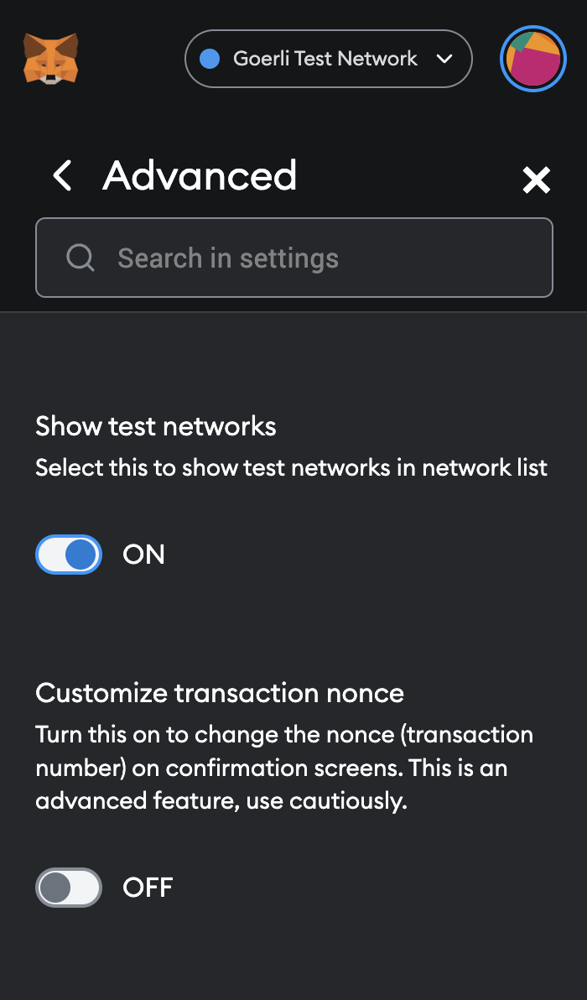
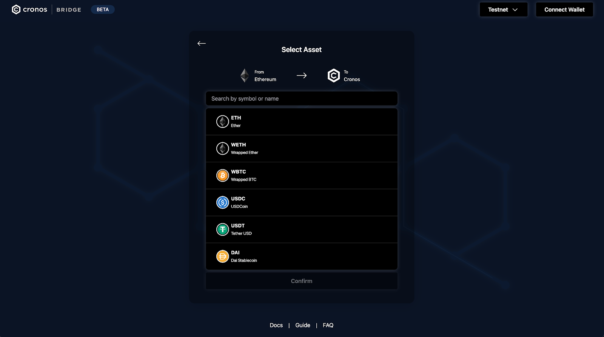
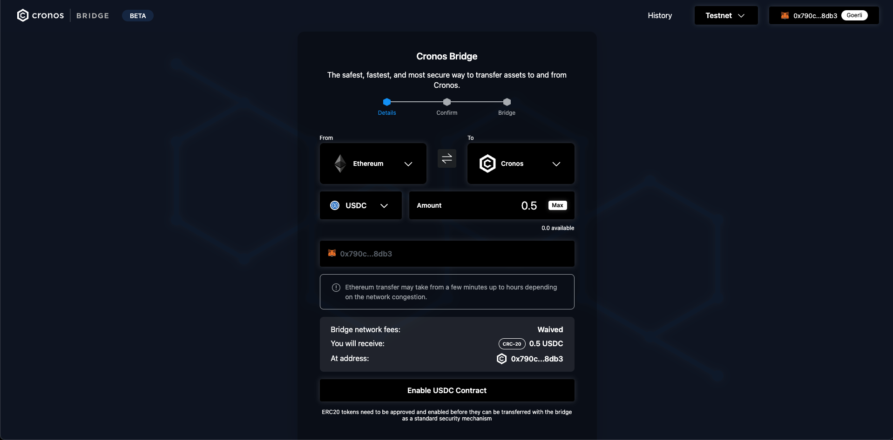
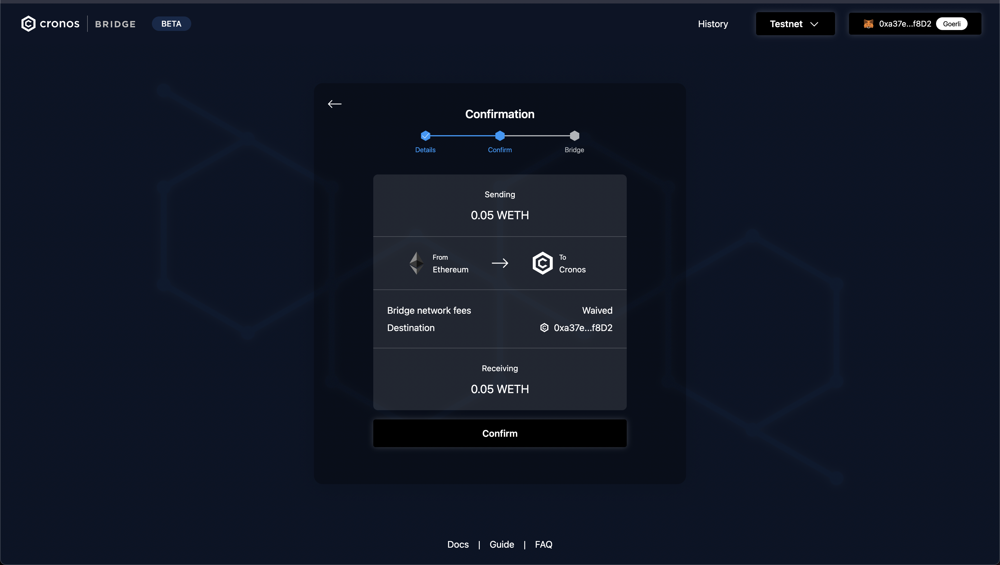
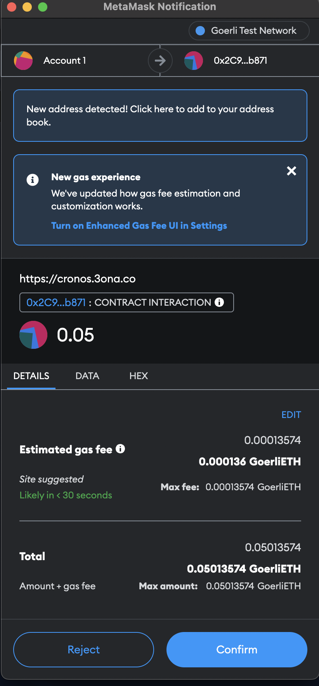
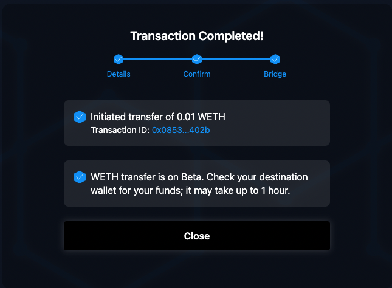
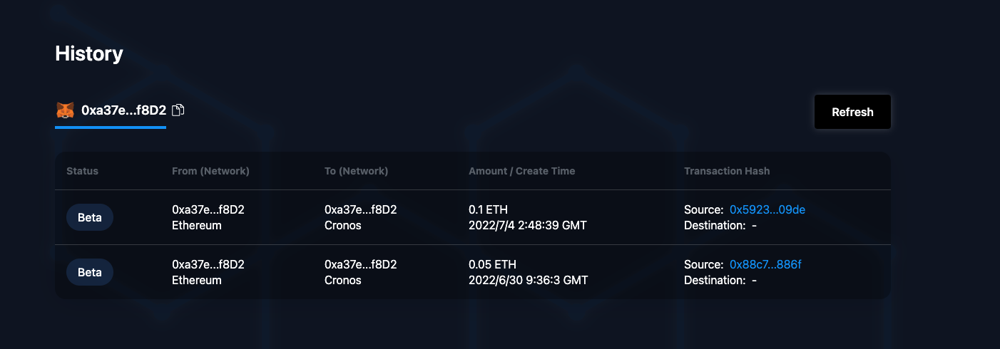
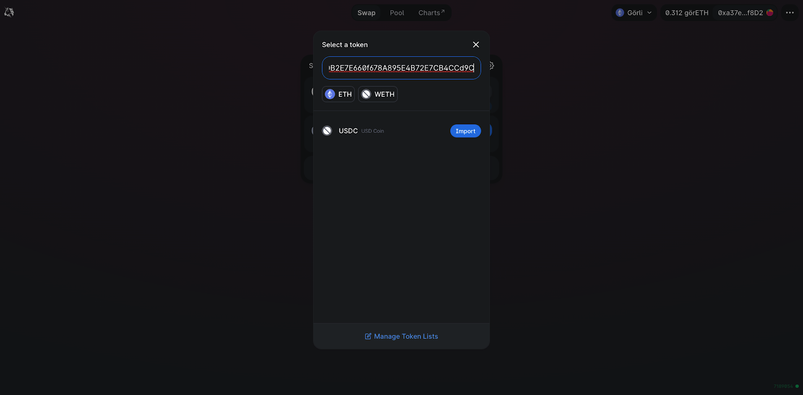
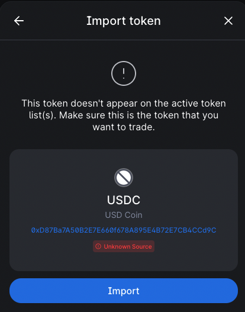

# From Gravity Bridge Web App (Testnet only)

## Transfer assets between Ethereum testnet and Cronos testnet using the Gravity Bridge Web App

### Introduction


IMPORTANT: Please read this guide and review the project documentation carefully as misuse may cause the incorrect transfer or even loss of assets. We recommend transferring a small amount first to get yourself acquainted with the bridge before moving over significant amounts. We are not responsible for any losses incurred while using the bridge.


The Gravity Bridge now makes it possible to transfer assets between the Cronos and the Ethereum networks. The Gravity Bridge (Beta) for Testnet can be found [here](https://cronos.org/bridge/). Make sure to switch to the Testnet.

The Gravity Bridge is derived from a Cosmos community open-source project, called [PeggyJV gravity bridge](https://github.com/PeggyJV/gravity-bridge). The gravity bridge technology allows the transfer of ERC20 tokens to and from Ethereum using a mint/lock mechanism.

Esentially, when a user sends assets from Ethereum to Cronos, the corresponding ERC20 token is locked in a smart contract on Ethereum, and minted on Cronos in the form of a CRC20 token. When a user sends assets from Cronos to Ethereum, the corresponding CRC20 token is burned on Cronos, and the ERC20 token is released on Ethereum.

#### Currently supported tokens from \[Goerli Testnet]:

| ERC20 | Goerli                                     | Pioneer11                                  |
| ----- | ------------------------------------------ | ------------------------------------------ |
| USDC  | 0xD87Ba7A50B2E7E660f678A895E4B72E7CB4CCd9C | 0xE1E19D235D344De08Ab845e78656EB289a32875F |
| WETH  | 0xB4FBF271143F4FBf7B91A5ded31805e42b2208d6 | 0x770b0139024e2C92D2E5dD4eA5DA5B52A32dA33f |
| USDT  | 0xe802376580c10fE23F027e1E19Ed9D54d4C9311e | 0x23Cb66F1f767984520B29441f88FD92E896A2dF7 |
| WBTC  | 0xC04B0d3107736C32e19F1c62b2aF67BE61d63a05 | 0x62ea2B07757FFA30daF475983976cDf7A4A27914 |
| DAI   | 0xdc31Ee1784292379Fbb2964b3B9C4124D8F89C60 | 0xB209F2ACF6783818D0BC5c74487BF052295F82a2 |

#### Currently supported wallets:

* MetaMask
* Crypto.com DeFi Wallet

We are constantly working on adding new tokens and blockchain support. If you have any feedback or concerns, please reach out to us at [product.bridge@crypto.org](mailto:product.bridge@crypto.org).

### How to use the Gravity Bridge \[Web Dapp]

#### Step 1. Connect your wallet

Click “**Connect Wallet**" at the top right to connect a browser extension wallet. Choose one of the supported wallets and look for a popup from your wallet interface. Alternatively, you can access your wallet and grant permission from there. Please note that it might already ask for permission to switch networks. Press "**Accept**" if that's the case.

**Testnet**\
If you are using MetaMask, make sure to enable test networks. On MetaMask, go to settings > Advanced > enable `Show test networks`. Now, you should be able to select the Goerli Test Network in the list of networks, which we will be using in this tutorial.

For the Pioneer11 Testnet, Go to settings > Networks > `Add network`,\
and add the following network details:

* Network Name: **Pioneer11**
* New RPC URL: **https://evm-p11.cronos.org**
* ChainID: **340**
* Currency symbol: **TCRO**
* Block Explorer URL (Optional): **https://cronos.org/explorer/pioneer11**

\*\*\*\*

#### Step 2. Select Network and Token

Select the origin chain on the left and the destination chain on the right in the bridge interface. Auto-suggestion may set some parameters. However, a manual check might be needed to match your wallet settings to the selected network. Once the networks are chosen, select the asset you would like to transfer. Note that your ERC20 compatible addresses on Ethereum and Cronos are the same.

If you would like to swap any other tokens listed, head to [Uniswap](https://app.uniswap.org/#/swap?chain=goerli) on the Goerli Testnet.\
Refer to [Swap tokens on Uniswap](gb-testnet.md#swap-tokens-on-uniswap) for an example.

#### Step 3. Enter the amount

After selecting the network and token, enter and confirm the amount you would like to transfer. The bridge network fees will be calculated accordingly. You always need to pay the gas fee charged by the source network. Before bridging a large amount, we encourage testing a transfer of a minor amount first to ensure all the settings are correct.

If this is the first time you are swapping this particular token using the Gravity Bridge, you may need to enable the contract such that the Gravity Bridge has access to this token. For example for USDC, click the "enable" button and accept permission in your wallet. Now you can bridge UDSC.

**From Ethereum (Goerli testnet) to Cronos Gravity Bridge testnet**

Please note that additional bridge network fees might be charged. During the promotional launch period, network fees incurred by the bridge from Ethereum to Cronos will be waived.

For Goerli, you can obtain some Goerli Eth from one of the Goerli faucets. These include:

* [https://faucets.chain.link/goerli](https://faucets.chain.link/goerli)
* [https://goerlifaucet.com/](https://goerlifaucet.com/)
* Check the goerli testnet page for other faucets [https://github.com/eth-clients/goerli](https://github.com/eth-clients/goerli).

**From Cronos Gravity Bridge testnet to Ethereum (Goerli testnet)**

Please note that additional bridge network feess might be charged. When bridging from Cronos to Ethereum, you will have two options for bridging, **Cronos Pool** and **Cronos Warp**.

* **Cronos Pool** are batched transfers which range from \~5 mins up to 12 hours.
* **Cronos Warp** are immediate transfers ranging from \~few mins to 1 hour.

For Pioneer 11, you can get some TCRO from the [pioneer 11 faucet](https://cronos.org/pioneer11-faucet)

#### Step 4. Confirm the transaction

Once all transfer settings have been confirmed, click "T**ransfer Assets**". A transaction confirmation page will pop up, summarising the transaction. This will then send a transaction request to your wallet. Please confirm the transaction in your wallet to ultimately authorise the transfer.

Please note that after bridging the tokens, they will be converted into tokens that are supported by the destination blockchain.

#### 

#### 5. Bridging assets

After the transaction is confirmed from the wallet, the bridge operation will commence. First, we will initiate and wait for the deposit of the assets on the origin chain. Once the deposit is confirmed, we will initiate the transfer in the destination chain to your desired receiving wallet address. Both transactions will include an external link to view and monitor the transaction on-chain via explorers such as Cronoscan and Etherscan.

Even if you dismiss, quit, or refresh the page, a small popup reminder will be available to indicate an in-progress transaction. A “**transfer completed**” message will finally confirm that the transaction has been completed successfully. You can see a full record of past transactions tied to your wallet in the History tab.

#### Check your transaction status using the Relayer API

If you want to check if your transaction has gone through successfully, you can query the Relayer API, using the following link:

* [Relayer API](https://cronos.org/pioneer11/relayer/api-doc/#/)

**Step 1:** Go to the`/cronos-eth` or `/eth-cronos` GET method and click "**Try it out**"

**Step 2:** When using the bridge, you will get a Transaction Hash, fill this value in the TxHash field.

**Step 3:** Click "**Execute**", if done correctly, you get a 200 response code. the "**isConfirmed**" field will become "**True"** after a couple minutes when the Tx is confirmed.

Thank you for using the Cronos bridge and supporting the Cronos Ecosystem!

### Appendix

## Swap tokens on Uniswap

Head to [Uniswap](https://app.uniswap.org/#/swap?chain=goerli) on the Goerli testnet. Connect with your wallet and switch to the Goerli network.

If the token you are looking to swap is not listed, you may need to manually import the token address. The example below shows [USDC](https://goerli.etherscan.io/address/0xD87Ba7A50B2E7E660f678A895E4B72E7CB4CCd9C) on the Goerli testnet:

Ensure that this is the correct address for your token before importing it! Once you have reviewed the details, click "**Import**" and confirm the token swap.

 
