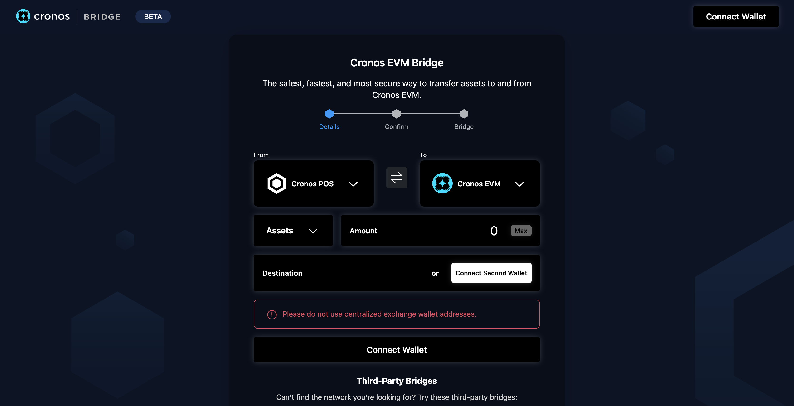

# IBC (Cronos POS Chain, other Cosmos chains)

## Introduction

<figure><figcaption></figcaption></figure>

The Cronos Bridge’s goal is to support the seamless transfer of assets between blockchains to foster interoperability and for users to enjoy the best DApps and earnings no matter the chain.

The Cronos Bridge (Beta) can be found at [https://cronos.com/bridge](https://cronos.com/bridge)

Cronos Bridge is a fully decentralised protocol built on the open-source projects of [IBC](https://ibcprotocol.org/).

Please read this guide and review the project documentation carefully as misuse may cause the incorrect transfer or even loss of assets. We recommend transferring a small amount first to get yourself acquainted with the Bridge before moving over significant amounts.

#### Currently supported networks:

* Cronos POS Chain <=> Cronos (Cronos EVM Chain): CRO token;
* [Cosmos Hub](https://hub.cosmos.network/) <=> Cronos: ATOM token;
* [Akash](https://akash.network/) <=> Cronos: AKT token;
* [IRISnet](https://www.irisnet.org/)<=> Cronos: IRIS token;
* [CANTO](https://www.canto.io/) <=> Cronos: CANTO token;
* [Celestia](https://celestia.org/) <=> Cronos: TIA token;
* [Juno](https://www.junonetwork.io/) <=> Cronos: JUNO token.

#### Currently supported wallets:

* Metamask, Keplr, Crypto.com Onchain Wallet

We are constantly working on adding new tokens and blockchains. If you have any feedback or concerns, please reach out to bridge@cronos.com.

## Via Cronos Bridge Web App

The Cronos Bridge (Beta) can be found at [https://cronos.com/bridge](https://cronos.com/bridge).


[webapp.md](webapp.md)


## Via Crypto.com Onchain Wallet

Crypto.com Onchain Wallet has integrated with Cronos Bridge and provided a front-end UI to allow all users to seamlessly transfer assets over to Cronos straight from the app.

Please visit the [Crypto.com Onchain Wallet page](https://help.crypto.com/en/articles/5645017-cronos-bridge) for details.
