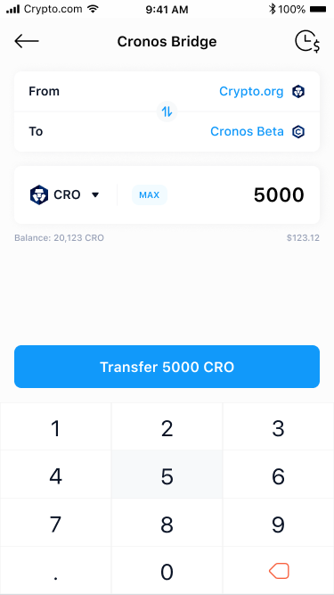

# Crypto.com DeFi Wallet

## Transfer assets from Crypto.org Chain using Crypto.com DeFi Wallet

Crypto.com DeFi Wallet has integrated with Cronos Bridge and provided a front-end UI to allow all users to seamlessly transfer assets over to Cronos straight from the app.&#x20;


For more information on how to setup the Crypto.com DeFi wallet, visit the [Crypto.com Defi wallet help](https://help.crypto.com/en/articles/3957405-getting-started-defi-wallet) page


### Step-by-step walkthrough

**Step 1**: Accessing Cronos Bridge on DeFi Wallet

You can access Cronos Bridge either in DeFi Wallet's homepage or when viewing your CRO balance.

 (2).png>)

**Step 2**: Select “**From**” Crypto.org Chain as the origin chain and “**To**” Cronos as the destination chain.

Only the `Crypto.org Chain <=> Cronos bridge` will be available on Day 1. The `Ethereum <=> Cronos bridge` will not be available until the Cronos Gravity Bridge goes live. As a Crypto.com DeFi Wallet user, you will automatically have a Crypto.org Chain wallet address and Cronos wallet address created for you. These wallet addresses will automatically be detected by the Cronos Bridge.

 (1).png>)

**Step 3**: Enter the amount of tokens you would like to transfer.

Once you have selected a token to transfer (CRO for example), enter the transfer amount. For CRO tokens, your balance on the Crypto.org Chain will be automatically detected.

During the promotional launch period, the network fee incurred by the bridge will be waived. You will still be liable to pay a gas fee directly on your preferred wallet, which is charged by the source network.

**Step 4:** Confirm the transaction

Upon tapping “**Transfer CRO**”, a confirmation page will appear, detailing the Network Fee and Bridge Fee. Click “**Confirm to Transfer**” to proceed.

**Step 5**: Await confirmation

Once you tap "**Confirm to Transfer**", you will be taken to an overview page detailing the status of your transfer. The bridging process typically takes around one minute to complete.

**Step 6**: Bridge transfer complete

A “**Completed**” message will be displayed, confirming that the transaction has been completed successfully. You should now see the corresponding value of CRO that you transferred from your Crypto.org Chain wallet on your Cronos wallet. Click on the transaction IDs for more information regarding the transfer you made.

Alternatively, you can view your transaction history on the top right corner of the DeFi Wallet’s Cronos Bridge landing page. This lets you check the status of any pending transactions or details of past transactions.

