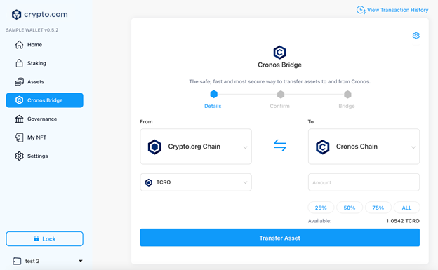
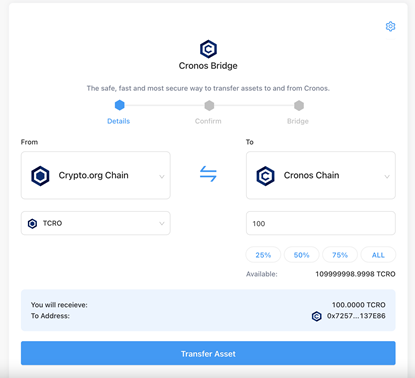

# Crypto.com DeFi Desktop Wallet

## Transfer assets from Crypto.org Chain using Crypto.com DeFi Desktop Wallet

Crypto.com DeFi Desktop Wallet has integrated with Cronos Bridge, allowing all users to seamlessly transfer assets over to Cronos straight from the Crypto.com DeFi Desktop Wallet. Here's how:

### Step-by-step walkthrough

**Step 1**: Select the "**Cronos Bridge**" in the left navigation panel

**Step 2**: Select “**From**” Crypto.org Chain as the origin chain and “**To**” Cronos as the destination chain.

Only the `Crypto.org Chain <=> Cronos bridge` will be available on Day 1. `The Ethereum <=> Cronos bridge` will not be available until the Cronos Gravity Bridge goes live. As a Crypto.com DeFi Desktop Wallet user, you will automatically have a Crypto.org Chain wallet address and Cronos wallet address created for you. These wallet addresses will automatically be detected by the Cronos Bridge.

**Step 3**: Enter the amount of CRO you would like to transfer and click “**Transfer Asset**”.\

You will then be able to verify the amount that you will receive along with your Cronos address after entering the amount of CRO that you want to transfer. Click “**Transfer Asset**” and enter your password to proceed.

**Step 4:** Confirm the transaction

You will be given an overview of the bridge transaction, including the network fees that you will have to pay. Once you have confirmed the CRO amount and destination address, click “**Confirm**” to proceed.


Please note that once you’ve clicked the “Confirm”, the transaction cannot be reversed.


**Step 5**: Await confirmation

After the transfer is initiated, the CRO will be bridged from the Crypto.org Chain to the Cronos Chain. The bridging process typically takes several minutes to complete. Once it’s done, you will see an updated balance in your receiving Cronos address.

Additionally, you will be able to view the transaction in further detail by clicking the transaction hash. This will direct you to the Crypto.org Chain explorer. Alternatively, you can always review your bridge transfer history by clicking the icon at the top-right corner.

