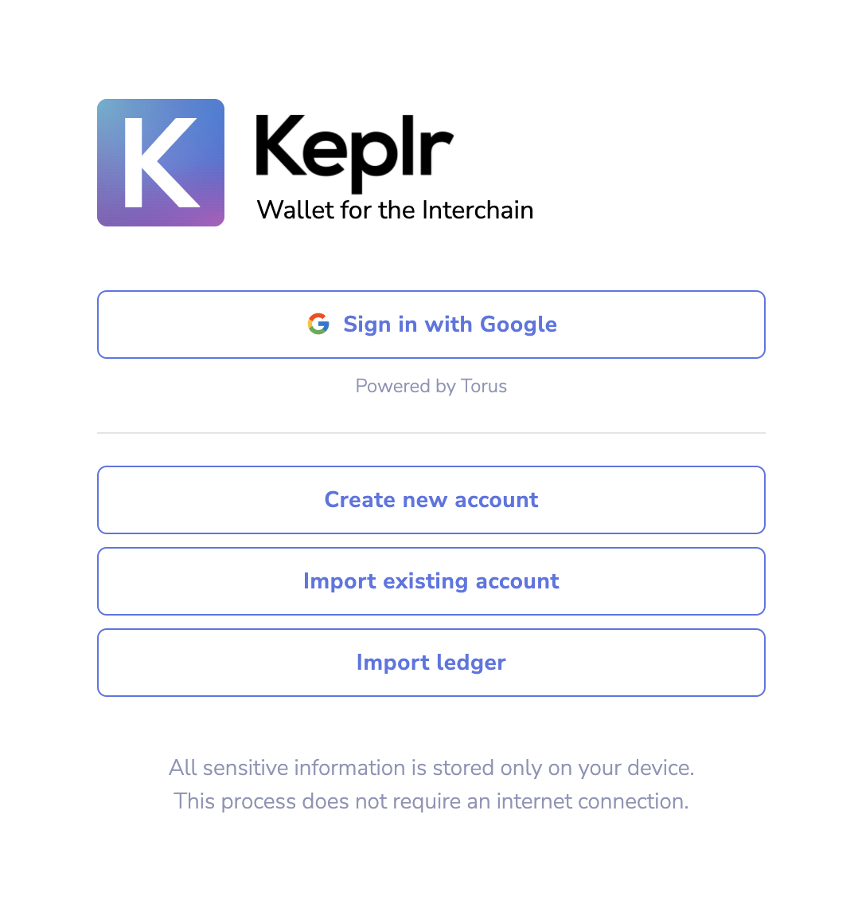
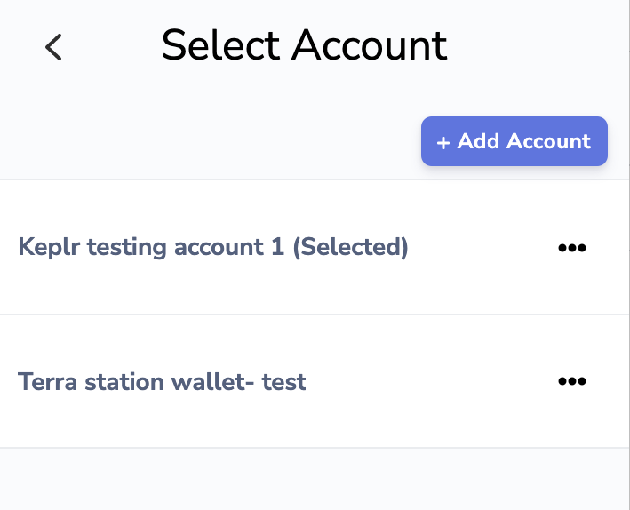
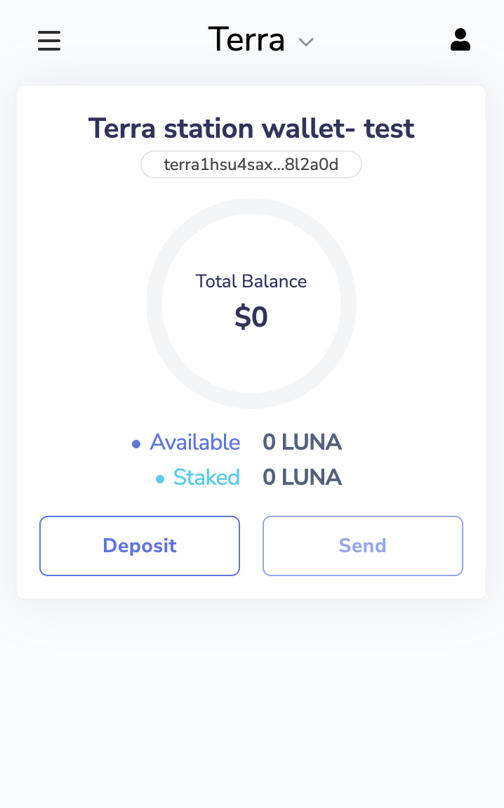

## Add your Terra station wallet to Keplr wallet

1. Create and log in to your Keplr wallet

2. Click the button on the top right corner. Then, click “+ Add Account”

3. Select “import existing account”

4. Input the Mnemonic of your Terra station wallet and name your account, then click "Next"

5. Go back to your Keplr account, click the button on the top right again. You will see your imported Terra station account here.

6. Select your imported Terra station account. Then, click the arrow on the top, and select "Terra".

7. You can now use your Terra station wallet on Keplr!

