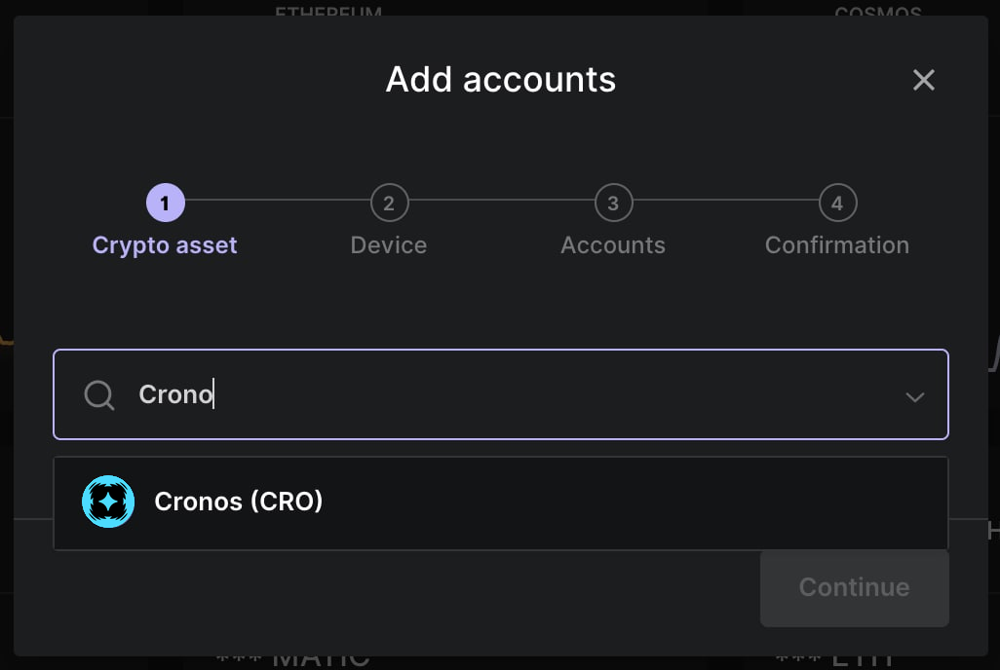
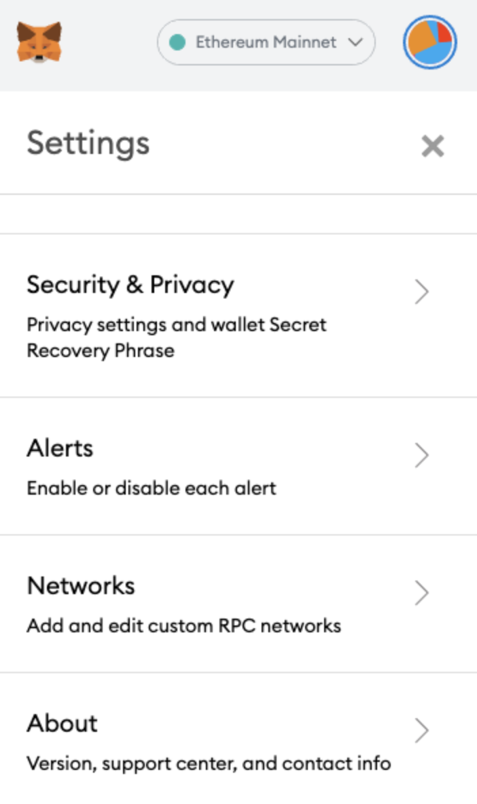
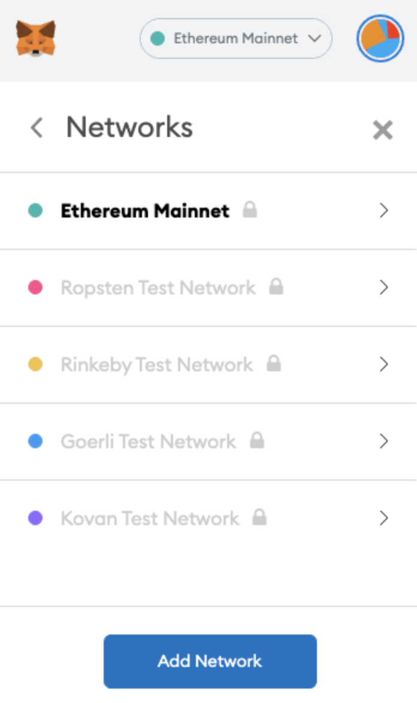

# 🔥 Crypto Wallets

<figure><figcaption></figcaption></figure>

Cronos is supported by more than 30 wallets, including popular providers such as MetaMask, Ruby, and Ledger.

## Crypto.com Onchain Wallet

The [Crypto.com Onchain Wallet](https://crypto.com/onchain) is a self-custodial crypto wallet developed by Crypto.com. It supports Cronos and dozens of Cronos cryptocurrencies natively, as well as all NFTs on the Cronos chain. The wallet is available in 3 user interfaces:

* The mobile wallet, available for iOS and Android (download [here](https://crypto.com/fr/defi-wallet)). The mobile app includes a powerful in-app browser to interact with decentralized applications (DeFi, NFTs and Web3 Gaming).
* The browser extension, available from the Chrome store [here](https://chrome.google.com/webstore/detail/cryptocom-wallet-extensio/hifafgmccdpekplomjjkcfgodnhcellj). The browser extension can run in two possible modes: in Standalone mode (meaning that you can approve transactions in the browser) or in Bridge mode (meaning that the extension is connected to the mobile app, where you approve transactions). We recommend Standalone mode for best performance and richest functionalities.
* The desktop wallet (download [here](https://crypto.com/fr/defi-wallet)), which can run as a standalone application on your computer.

The Onchain Wallet is not just for DeFi. One unique feature of the Crypto.com Onchain Wallet mobile app is the NFT tab, where you can see, transfer, buy and sell all your self-custodial NFTs on Cronos chain.

You can import your accounts from any other self-custodial crypto wallet into the Crypto.com Onchain Wallet by importing your seed phrase under "Import wallet".

## MetaMask

MetaMask can be used to check your cryptocurrency balances on Cronos and to interact with decentralized applications. You can download it [here](https://metamask.io/).

The MetaMask mobile app and browser extension require additional configuration steps to connect to Cronos chain. See [MetaMask configuration](metamask.md) for an easy-to-follow guide.

### MetaMask Custom RPC connection settings

You will need to connect your MetaMask wallet to the Cronos network:

* Click the "**My Account**" button in the top right corner. Then select **"Networks"** in the settings menu.

*   Click "**Add Network**":

    



- **Name**: Cronos
- **New RPC URL:**`https://evm.cronos.com`;
- **Chain ID: 25**
- **Symbol:**`CRO`
- **Block explorer URL:**`https://explorer.cronos.com/`



* **Name:** Cronos testnet
* **New RPC URL:** `https://evm-t3.cronos.com`
* **Chain ID:**`338`
* **Symbol**:`tCRO`
* **Block explorer URL:** `https://explorer.cronos.com/testnet`



* After saving the network configuration, we should be able to see the token in your address.

## Ledger hardware wallet

You can now use your Ledger hardware wallet on Cronos chain.

In the Ledger Live companion app, you can see your CRO holdings on Cronos chain. This can be accomplished by selecting "Add account" and then Cronos (CRO):

<figure><figcaption></figcaption></figure>

In order to experience the fullest range of functionalities, including interactions with dApps, we recommend to connect your Ledger hardware wallet with the Crypto.com Onchain browser extension in Standalone mode. In order to accomplish this, select "Import wallet" in the Crypto.com Onchain browser extension and then select "Connect to Ledger".

## Trezor hardware wallet

You can also use your Trezor hardware wallet on Cronos chain.

Trezor does not connect to Cronos directly, so the easiest way is to pair it with MetaMask, which can be configured for Cronos chain:

1. Add the Cronos network to MetaMask by following the MetaMask configuration guide.
2. In MetaMask, select "Add account or hardware wallet" and then "Trezor".
3. Connect your Trezor device, unlock it, and approve the connection in the Trezor window.
4. Select the accounts you want to import.

Your Trezor accounts will then appear in MetaMask, where you can check your CRO holdings on Cronos chain and interact with decentralized applications. Always confirm the transaction details on the Trezor device screen before approving, and keep your Trezor firmware and Trezor Suite up to date.

## Trust Wallet

Trust Wallet also support Cronos chain and dApps natively. You can download it [here](https://trustwallet.com/).

## Brave Wallet

The crypto wallet developed by Brave Browser can also be used to check your cryptocurrency balances on Cronos and to interact with decentralized applications.

See [Brave Wallet](brave-wallet.md) for an easy-to-follow guide of configuration steps.

## Other wallets and portfolio dashboards

Many other great crypto wallets support Cronos chain cryptocurrencies.

If you are looking for comprehensive portfolio dashboards to view your various cryptocurrencies and DeFi positions on Cronos chain, check out [Debank](https://debank.com/) and [Rabby](https://rabby.io/).
