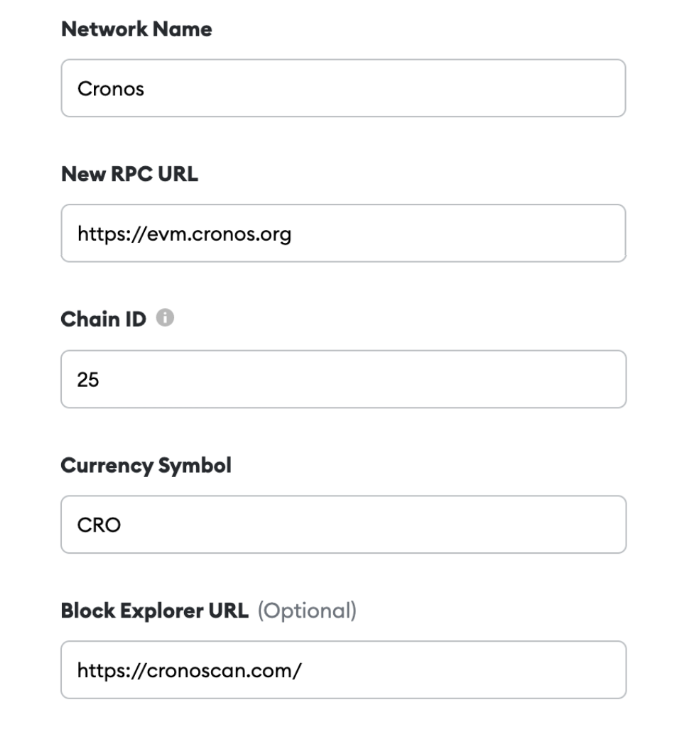
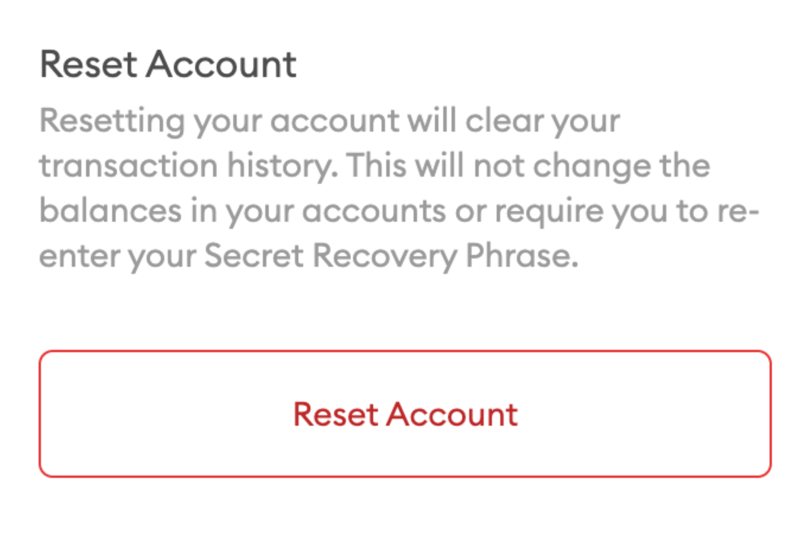

---
meta:
  - name: title
    content: Cronos | Crypto.org EVM Chain | Using MetaMask
  - name: description
    content: >-
      Learn how to use the MetaMask chrome extension to send or receive and
      interact with the Cronos testnet in this technical documentation.
  - name: og:title
    content: Cronos | Crypto.org EVM Chain | Using MetaMask
  - name: og:type
    content: Website
  - name: og:description
    content: >-
      Learn how to use the MetaMask chrome extension to send or receive and
      interact with the Cronos testnet in this technical documentation.
  - name: og:image
    content: https://cronos.org/og-image.png
  - name: twitter:title
    content: Cronos | Crypto.org EVM Chain | Using MetaMask
  - name: twitter:site
    content: '@cryptocom'
  - name: twitter:card
    content: summary_large_image
  - name: twitter:description
    content: >-
      Learn how to use the MetaMask chrome extension to send or receive and
      interact with the Cronos testnet in this technical documentation.
  - name: twitter:image
    content: https://cronos.org/og-image.png
canonicalUrl: https://docs.cronos.org/getting-started/metamask.html
---

# MetaMask

In this guide, you will learn how to use the MetaMask extension on Google Chrome to send and receive tokens, and interact with the Cronos network.

## Connecting with MetaMask

First, you will need to connect your MetaMask wallet to the Cronos network:

* Click the "**My Account**" button in the top right corner. Then select **"Networks"** in the settings menu.


* Click "**Add Network**":




* **Name**: Cronos
* **New RPC URL:**`https://evm.cronos.org`;
* **Chain ID: 25**
* **Symbol:**`CRO`
* **Block explorer URL:**`https://cronoscan.com/`



* **Name:** Cronos testnet
* **New RPC URL:** `https://evm-t3.cronos.org` for
* **Chain ID:**`338`
* **Symbol**:`tCRO`
* **Block explorer URL:** `https://testnet.cronoscan.com/`



* **Name:** Pioneer 11
* **New RPC URL:** `https://evm-p11.cronos.org`
* **Chain ID:**`340`
* **Symbol:**`tCRO`
* **Block explorer URL:**`https://cronos.org/explorer/pioneer11`



&#x20;                                              

* After saving the network configuration, we should be able to see the token in your address.

## Importing private keys to MetaMask

Alternatively, We can export the private keys by using the `unsafe-export-eth-key` command with `cronosd.` For example:

```bash
cronosd keys unsafe-export-eth-key mykey --keyring-backend test
```

It will show your private key and you can copy it for the next step. Click the "**My Account"** button at the top right corner again. Then, select "**Import Account**":


Paste your private key string from the previous step and click "**Import"**.


Once it has been connected, you should see your token balance and you can then begin performing transactions using your MetaMask wallet!

## Address conventions

Please note that the address format in Cronos is in there form of bech32 `crc...` , we can use `cronosd debug addr` to convert an address between hex and bech32. For example:

```bash
$ cronosd keys list --keyring-backend test
  - name: mykey
    type: local
    address: crc19a6r74dvfxjyvjzf3pg9y3y5rhk6rds2c9265n
    pubkey: '{"@type":"/ethermint.crypto.v1alpha1.ethsecp256k1.PubKey","key":"Azy1tg0wZKRdQ7sd9mICzteCstGThiodZtQqlVT9Amlc"}'
    mnemonic: ""

$ cronosd debug addr crc19a6r74dvfxjyvjzf3pg9y3y5rhk6rds2c9265n
    Address: [47 116 63 85 172 73 164 70 72 73 136 80 82 68 148 29 237 161 182 10]
    Address (hex): 2F743F55AC49A446484988505244941DEDA1B60A
    Bech32 Acc: crc19a6r74dvfxjyvjzf3pg9y3y5rhk6rds2c9265n
    Bech32 Val: crcvaloper19a6r74dvfxjyvjzf3pg9y3y5rhk6rds2ph398y

$ cronosd debug addr 2F743F55AC49A446484988505244941DEDA1B60A
  Address: [47 116 63 85 172 73 164 70 72 73 136 80 82 68 148 29 237 161 182 10]
  Address (hex): 2F743F55AC49A446484988505244941DEDA1B60A
  Bech32 Acc: crc19a6r74dvfxjyvjzf3pg9y3y5rhk6rds2c9265n
  Bech32 Val: crcvaloper19a6r74dvfxjyvjzf3pg9y3y5rhk6rds2ph398y
```


Remarks: You will need to add `0x` at the beginning when using the Ethereum HEX address shown as above. For example: `Address (hex): 2F743F55AC49A446484988505244941DEDA1B60A` implies that `0x2F743F55AC49A446484988505244941DEDA1B60A` will be the address in Ethereum.


## Resetting your account on MetaMask

If you come across any issue with your MetaMask account or if you have used your imported account to perform transactions in the legacy testnet, you can reset it by using the `Reset Account` function.

Simply go to `Setting/Advance` and click `Reset Account`:

&#x20;                                               
